# ⚠️ Common CSS Mistakes

Even experienced developers make CSS mistakes. Most styling bugs come from a few common issues such as specificity conflicts, layout misunderstandings, or poor responsive design practices.

Learning these mistakes early can save hours of debugging.

---

# 🎯 Why CSS Mistakes Happen

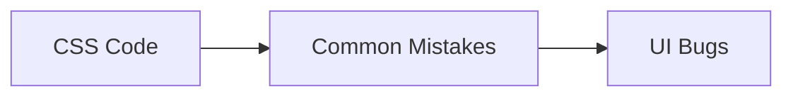

Common causes:

❌ Lack of CSS architecture

❌ Overly complex selectors

❌ Ignoring responsiveness

❌ Poor naming conventions

❌ Misunderstanding Flexbox/Grid

---

# 🚫 Using Too Many !important

One of the most common mistakes.

---

## Bad

```css
.button {
  color: blue !important;
}

.card .button {
  color: red !important;
}

#page .card .button {
  color: green !important;
}
```

Creates specificity wars.

---

## Better

```css
.button {
  color: blue;
}

.button--success {
  color: green;
}
```

---

## Problem Flow

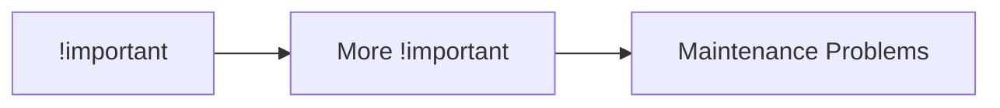

---

# 🚫 Deeply Nested Selectors

---

## Bad

```css
.sidebar ul li a span {
  color: red;
}
```

Problems:

* Hard to read
* Hard to maintain
* High specificity

---

## Better

```css
.sidebar-link {
  color: red;
}
```

---

## Selector Complexity

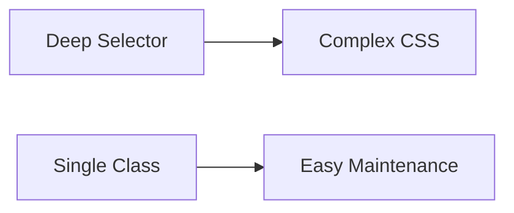

---

# 🚫 Using IDs for Styling

---

## Bad

```css
#header {
  background: black;
}
```

IDs create high specificity.

---

## Better

```css
.header {
  background: black;
}
```

Use classes for styling.

Use IDs for:

* JavaScript hooks
* Anchors
* Unique identifiers

---

# 🚫 Fixed Width Layouts

---

## Bad

```css
.container {
  width: 1200px;
}
```

Breaks on smaller screens.

---

## Better

```css
.container {
  width: 100%;
  max-width: 1200px;
  margin: auto;
}
```

---

## Responsive Flow

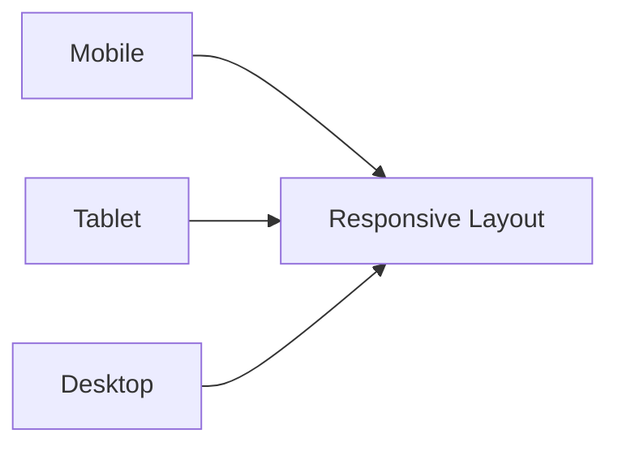

---

# 🚫 Forgetting the Viewport Meta Tag

Without:

```html
<meta
  name="viewport"
  content="width=device-width, initial-scale=1"
/>
```

Mobile browsers may zoom out.

---

## Result

❌ Tiny text

❌ Broken layouts

❌ Poor user experience

---

# 🚫 Using px Everywhere

---

## Bad

```css
h1 {
  font-size: 48px;
}
```

---

## Better

```css
h1 {
  font-size: 3rem;
}
```

---

# Why rem?

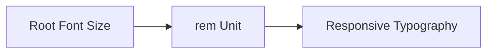

Benefits:

✅ Accessibility

✅ Better scaling

✅ Easier maintenance

---

# 🚫 Ignoring Box Sizing

Default behavior can be confusing.

---

## Problem

```css
.box {
  width: 300px;
  padding: 20px;
}
```

Actual width:

```text
340px
```

---

## Fix

```css
* {
  box-sizing: border-box;
}
```

---

## Box Model

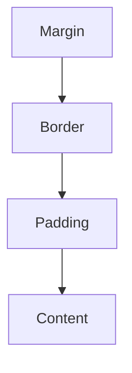

---

# 🚫 Not Using CSS Variables

---

## Bad

```css
.button {
  background: #2563eb;
}

.card {
  border-color: #2563eb;
}

.link {
  color: #2563eb;
}
```

---

## Better

```css
:root {
  --primary-color: #2563eb;
}

.button {
  background: var(--primary-color);
}
```

---

# Variable Benefits

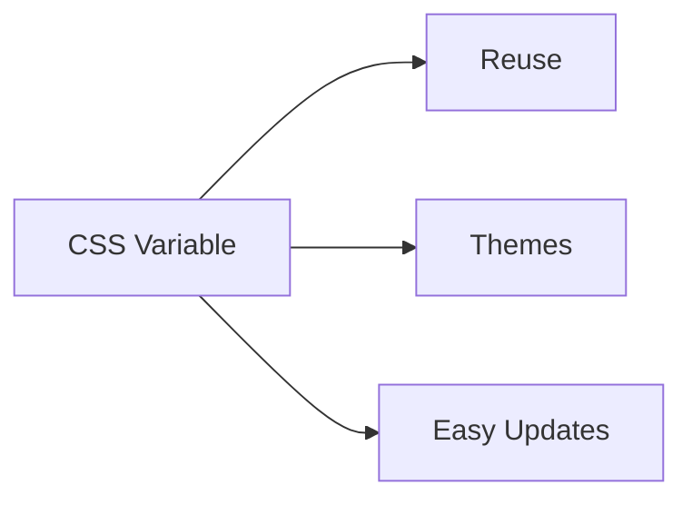

---

# 🚫 Mixing Layout and Component Styles

---

## Bad

```css
.card {
  width: 1200px;
}
```

A component shouldn't control page layout.

---

## Better

```css
.layout {
  max-width: 1200px;
}

.card {
  padding: 1rem;
}
```

Separate concerns.

---

# 🚫 Not Using Flexbox or Grid

Some developers still use:

```css
float: left;
```

for layouts.

---

## Modern Approach

```css
.container {
  display: flex;
}
```

or

```css
.container {
  display: grid;
}
```

---

## Layout Evolution

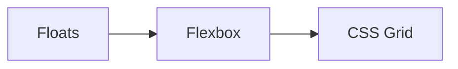

---

# 🚫 Overusing Position Absolute

---

## Bad

```css
.card {
  position: absolute;
  left: 100px;
  top: 50px;
}
```

Creates fragile layouts.

---

## Better

Use:

```css
display: flex;
display: grid;
```

whenever possible.

---

# 🚫 Ignoring Mobile Devices

---

## Bad

Only testing desktop.

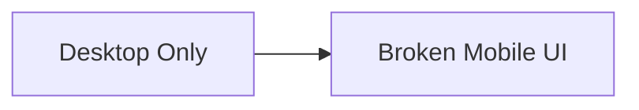

---

## Better

Test:

✅ Mobile

✅ Tablet

✅ Desktop

---

# 🚫 Using Margin for Layout Gaps

---

## Bad

```css
.card {
  margin-right: 20px;
}
```

---

## Better

```css
.container {
  display: flex;
  gap: 20px;
}
```

---

## Gap vs Margin

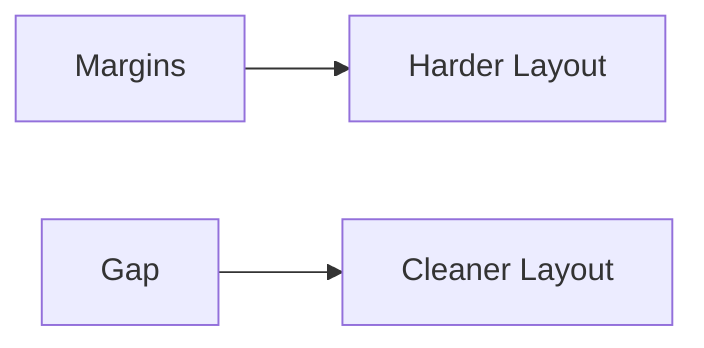

---

# 🚫 Animating Layout Properties

---

## Bad

```css
.card:hover {
  width: 300px;
}
```

Triggers layout recalculations.

---

## Better

```css
.card:hover {
  transform: scale(1.05);
}
```

---

## Performance Comparison

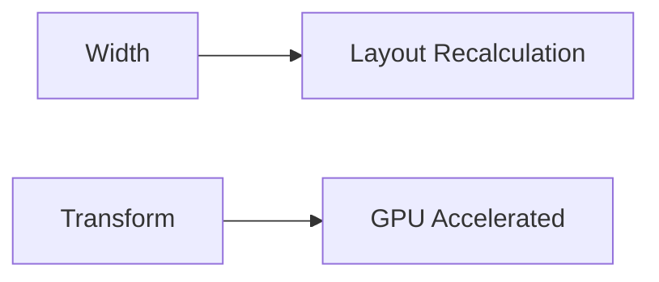

---

# 🚫 Ignoring Accessibility

---

## Bad

```css
button:focus {
  outline: none;
}
```

Removes keyboard focus indicators.

---

## Better

```css
button:focus {
  outline: 2px solid blue;
}
```

---

## Accessibility Flow

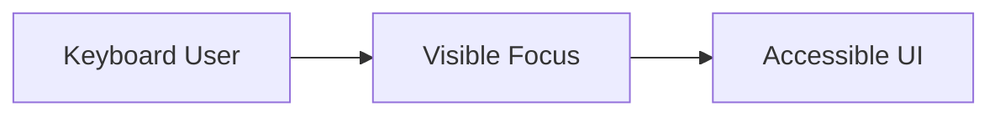

---

# 🚫 Overcomplicated CSS

---

## Bad

```css
#page .container .sidebar ul li a span {
  color: red;
}
```

---

## Better

```css
.sidebar-link {
  color: red;
}
```

Keep CSS simple.

---

# 🚫 Not Organizing CSS

Large projects become difficult to maintain.

---

## Bad

```text
styles.css
5000+ lines
```

---

## Better

```text
styles/

├── base/
├── layout/
├── components/
├── utilities/
└── pages/
```

---

## Organization Structure

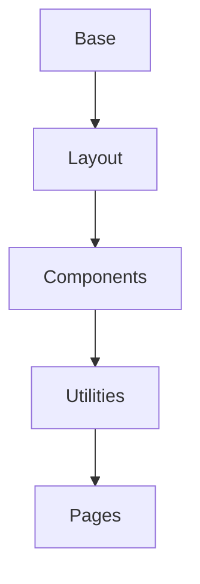

---

# 🚫 Copy-Pasting Styles

---

## Bad

```css
.button1 {
  padding: 10px;
}

.button2 {
  padding: 10px;
}

.button3 {
  padding: 10px;
}
```

---

## Better

```css
.button {
  padding: 10px;
}
```

Reuse styles.

---

# 🚫 Ignoring Browser Support

Some features require verification.

Examples:

* `:has()`
* Container Queries
* View Transitions API

Check support before production use.

---

## Browser Testing Flow

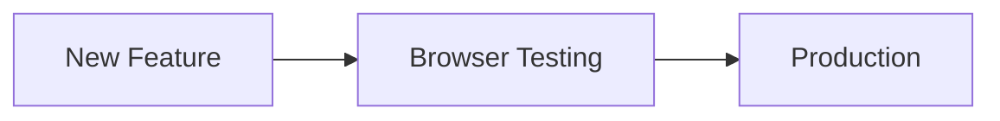

---

# 🧠 Quick Cheat Sheet

❌ Avoid:

```css
!important

#ids

Deep Selectors

Fixed Widths

Float Layouts

Absolute Positioning

Width Animations
```

---

✅ Prefer:

```css
Classes

Flexbox

Grid

CSS Variables

Gap

Transform

Responsive Units

Component-Based CSS
```

---

# ✅ Best Practices

* Use classes instead of IDs.
* Keep selectors simple.
* Avoid `!important`.
* Use Flexbox and Grid.
* Make layouts responsive.
* Use CSS Variables.
* Organize styles properly.
* Test across devices and browsers.
* Optimize animations using transforms.
* Keep accessibility in mind.

---

# 🚀 Key Takeaways

* Most CSS bugs come from a small set of common mistakes.
* Avoid specificity wars and deep selectors.
* Build responsive layouts from the start.
* Use modern CSS features like Flexbox, Grid, Variables, and Gap.
* Organize CSS into reusable, maintainable structures.
* Performance and accessibility should be considered from day one.
