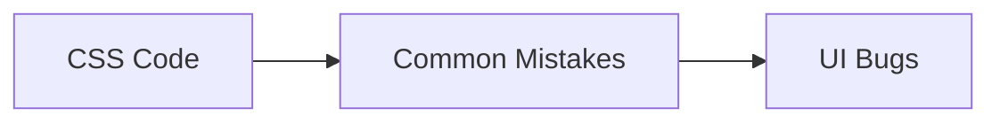
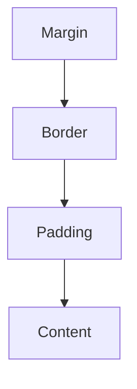

# ⚠ Common CSS Mistakes

Even experienced developers make CSS mistakes. Most styling bugs come from a few
common issues such as specificity conflicts, layout misunderstandings, or poor
responsive design practices.

Learning these mistakes early can save hours of debugging.

---

## Why CSS Mistakes Happen

<!-- Visual flow for ⚠ Common CSS Mistakes. -->


Common causes:

❌ Lack of CSS architecture

❌ Overly complex selectors

❌ Ignoring responsiveness

❌ Poor naming conventions

❌ Misunderstanding Flexbox/Grid

## 🚫 Using Too Many !important

One of the most common mistakes.

## Bad

/* Basic example showing the core idea. */
```css
.button {
  color: blue !important;
}

.card .button {
  color: red !important;
}

#page .card .button {
  color: green !important;
}
```

Creates specificity wars.

## Better

/* Basic example showing the core idea. */
```css
.button {
  color: blue;
}

.button--success {
  color: green;
}
```

## Problem Flow

Important1["!important"]

Important2["More !important"]

Chaos["Maintenance Problems"]

Important1 --> Important2 --> Chaos
// Example demonstrating ⚠ Common CSS Mistakes.
```

## 🚫 Deeply Nested Selectors

```css
.sidebar ul li a span {
  color: red;
}
// Example demonstrating ⚠ Common CSS Mistakes.
```

Problems:

- Hard to read
- Hard to maintain
- High specificity

```css
.sidebar-link {
  color: red;
}
// Example demonstrating ⚠ Common CSS Mistakes.
```

## Selector Complexity

Deep["Deep Selector"]

Complex["Complex CSS"]

Simple["Single Class"]

Maintainable["Easy Maintenance"]

Deep --> Complex

Simple --> Maintainable
```

## 🚫 Using IDs for Styling

/* Basic example showing the core idea. */
```css
#header {
  background: black;
}
```

IDs create high specificity.

/* Basic example showing the core idea. */
```css
.header {
  background: black;
}
```

Use classes for styling.

Use IDs for:

- JavaScript hooks
- Anchors
- Unique identifiers

## 🚫 Fixed Width Layouts

/* Basic example showing the core idea. */
```css
.container {
  width: 1200px;
}
```

Breaks on smaller screens.

/* Basic example showing the core idea. */
```css
.container {
  width: 100%;
  max-width: 1200px;
  margin: auto;
}
```

## Responsive Flow

Mobile["Mobile"]

Tablet["Tablet"]

Desktop["Desktop"]

Responsive["Responsive Layout"]

Mobile --> Responsive
    Tablet --> Responsive
    Desktop --> Responsive
// Example demonstrating ⚠ Common CSS Mistakes.
```

## 🚫 Forgetting the Viewport Meta Tag

Without:

```html
<meta name="viewport" content="width=device-width, initial-scale=1" />
// Example demonstrating ⚠ Common CSS Mistakes.
```

Mobile browsers may zoom out.

## Result

❌ Tiny text

❌ Broken layouts

❌ Poor user experience

## 🚫 Using px Everywhere

```css
h1 {
  font-size: 48px;
}
// Example demonstrating ⚠ Common CSS Mistakes.
```

```css
h1 {
  font-size: 3rem;
}
// Example demonstrating ⚠ Common CSS Mistakes.
```

## Why rem?

Root["Root Font Size"]

Rem["rem Unit"]

Responsive["Responsive Typography"]

Root --> Rem --> Responsive
```

Benefits:

✅ Accessibility

✅ Better scaling

✅ Easier maintenance

## 🚫 Ignoring Box Sizing

Default behavior can be confusing.

## Problem

/* Basic example showing the core idea. */
```css
.box {
  width: 300px;
  padding: 20px;
}
```

Actual width:

// Example demonstrating ⚠ Common CSS Mistakes.
```text
340px
```

## Fix

/* Basic example showing the core idea. */
```css
* {
  box-sizing: border-box;
}
```

## Box Model

<!-- Visual flow for ⚠ Common CSS Mistakes. -->


## 🚫 Not Using CSS Variables

/* Basic example showing the core idea. */
```css
.button {
  background: #2563eb;
}

.card {
  border-color: #2563eb;
}

.link {
  color: #2563eb;
}
```

/* Basic example showing the core idea. */
```css
:root {
  --primary-color: #2563eb;
}

.button {
  background: var(--primary-color);
}
```

## Variable Benefits

Variable["CSS Variable"]

Reuse["Reuse"]

Theme["Themes"]

Maintenance["Easy Updates"]

Variable --> Reuse
    Variable --> Theme
    Variable --> Maintenance
// Example demonstrating ⚠ Common CSS Mistakes.
```

## 🚫 Mixing Layout and Component Styles

```css
.card {
  width: 1200px;
}
// Example demonstrating ⚠ Common CSS Mistakes.
```

A component shouldn't control page layout.

```css
.layout {
  max-width: 1200px;
}

.card {
  padding: 1rem;
}
// Example demonstrating ⚠ Common CSS Mistakes.
```

Separate concerns.

## 🚫 Not Using Flexbox or Grid

Some developers still use:

```css
float: left;
// Example demonstrating ⚠ Common CSS Mistakes.
```

for layouts.

## Modern Approach

```css
.container {
  display: flex;
}
// Example demonstrating ⚠ Common CSS Mistakes.
```

or

```css
.container {
  display: grid;
}
// Example demonstrating ⚠ Common CSS Mistakes.
```

## Layout Evolution

Floats["Floats"]

Flexbox["Flexbox"]

Grid["CSS Grid"]

Floats --> Flexbox --> Grid
```

## 🚫 Overusing Position Absolute

/* Basic example showing the core idea. */
```css
.card {
  position: absolute;
  left: 100px;
  top: 50px;
}
```

Creates fragile layouts.

Use:

/* Basic example showing the core idea. */
```css
display: flex;
display: grid;
```

whenever possible.

## 🚫 Ignoring Mobile Devices

Only testing desktop.

Desktop["Desktop Only"]

Problem["Broken Mobile UI"]

Desktop --> Problem
// Example demonstrating ⚠ Common CSS Mistakes.
```

Test:

✅ Mobile

✅ Tablet

✅ Desktop

## 🚫 Using Margin for Layout Gaps

```css
.card {
  margin-right: 20px;
}
// Example demonstrating ⚠ Common CSS Mistakes.
```

```css
.container {
  display: flex;
  gap: 20px;
}
// Example demonstrating ⚠ Common CSS Mistakes.
```

## Gap vs Margin

Margin["Margins"]

Gap["Gap"]

Margin --> Difficult["Harder Layout"]

Gap --> Cleaner["Cleaner Layout"]
```

## 🚫 Animating Layout Properties

/* Basic example showing the core idea. */
```css
.card:hover {
  width: 300px;
}
```

Triggers layout recalculations.

/* Basic example showing the core idea. */
```css
.card:hover {
  transform: scale(1.05);
}
```

## Performance Comparison

Width["Width"]

Layout["Layout Recalculation"]

Transform["Transform"]

GPU["GPU Accelerated"]

Width --> Layout

Transform --> GPU
// Example demonstrating ⚠ Common CSS Mistakes.
```

## 🚫 Ignoring Accessibility

```css
button:focus {
  outline: none;
}
// Example demonstrating ⚠ Common CSS Mistakes.
```

Removes keyboard focus indicators.

```css
button:focus {
  outline: 2px solid blue;
}
// Example demonstrating ⚠ Common CSS Mistakes.
```

## Accessibility Flow

Keyboard["Keyboard User"]

Focus["Visible Focus"]

Accessible["Accessible UI"]

Keyboard --> Focus --> Accessible
```

## 🚫 Overcomplicated CSS

/* Basic example showing the core idea. */
```css
#page .container .sidebar ul li a span {
  color: red;
}
```

Keep CSS simple.

## 🚫 Not Organizing CSS

Large projects become difficult to maintain.

// Example demonstrating ⚠ Common CSS Mistakes.
```text
styles.css
5000+ lines
```

// Example demonstrating ⚠ Common CSS Mistakes.
```text
styles/

├── base/
├── layout/
├── components/
├── utilities/
└── pages/
```

## Organization Structure

Base

Layout

Components

Utilities

Pages

Base --> Layout
    Layout --> Components
    Components --> Utilities
    Utilities --> Pages
// Example demonstrating ⚠ Common CSS Mistakes.
```

## 🚫 Copy-Pasting Styles

```css
.button1 {
  padding: 10px;
}

.button2 {
  padding: 10px;
}

.button3 {
  padding: 10px;
}
// Example demonstrating ⚠ Common CSS Mistakes.
```

```css
.button {
  padding: 10px;
}
// Example demonstrating ⚠ Common CSS Mistakes.
```

Reuse styles.

## 🚫 Ignoring Browser Support

Some features require verification.

Examples:

- `:has()`
- Container Queries
- View Transitions API

Check support before production use.

## Browser Testing Flow

Feature["New Feature"]

Test["Browser Testing"]

Deploy["Production"]

Feature --> Test --> Deploy
```

## Quick Cheat Sheet

❌ Avoid:

/* Basic example showing the core idea. */
```css
!important

#ids

Deep Selectors

Fixed Widths

Float Layouts

Absolute Positioning

Width Animations
```

✅ Prefer:

/* Basic example showing the core idea. */
```css
Classes

Flexbox

Grid

CSS Variables

Gap

Transform

Responsive Units

Component-Based CSS
```

## ✅ Best Practices

- Use classes instead of IDs.
- Keep selectors simple.
- Avoid `!important`.
- Use Flexbox and Grid.
- Make layouts responsive.
- Use CSS Variables.
- Organize styles properly.
- Test across devices and browsers.
- Optimize animations using transforms.
- Keep accessibility in mind.

## Key Takeaways

- Most CSS bugs come from a small set of common mistakes.
- Avoid specificity wars and deep selectors.
- Build responsive layouts from the start.
- Use modern CSS features like Flexbox, Grid, Variables, and Gap.
- Organize CSS into reusable, maintainable structures.
- Performance and accessibility should be considered from day one.
