# 🏗️ CSS Architecture & Organization

As projects grow, CSS can quickly become difficult to manage.

Without a proper architecture, stylesheets often suffer from:

❌ Duplicate code

❌ Specificity wars

❌ Naming conflicts

❌ Difficult maintenance

❌ Unpredictable styling bugs

CSS Architecture provides a structured way to organize styles and scale projects effectively.

---

# 🎯 Why CSS Architecture Matters

Small projects:

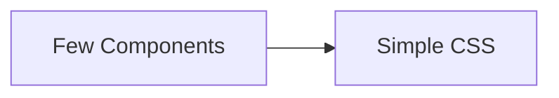

Large projects:

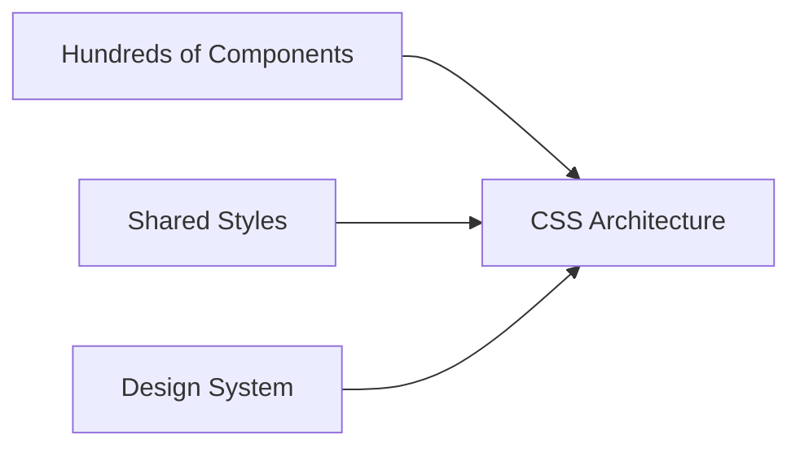

As applications grow, organization becomes essential.

---

# 🧠 Goals of Good CSS Architecture

A good architecture should be:

✅ Scalable

✅ Predictable

✅ Reusable

✅ Maintainable

✅ Easy to Understand

---

# 📂 Recommended CSS Folder Structure

For medium and large projects:

```text
styles/
│
├── base/
│   ├── reset.css
│   ├── typography.css
│
├── layout/
│   ├── header.css
│   ├── footer.css
│
├── components/
│   ├── button.css
│   ├── card.css
│   ├── modal.css
│
├── utilities/
│   ├── spacing.css
│   ├── colors.css
│
├── pages/
│   ├── home.css
│   ├── about.css
│
└── main.css
```

---

# Architecture Layers

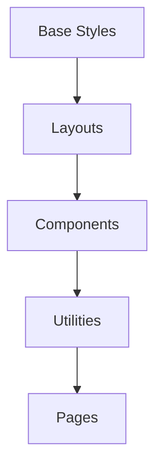

---

# 🎯 Base Styles

Base styles define global defaults.

Example:

```css
/* Base Typography */
body {
  font-family: system-ui, sans-serif;
  line-height: 1.6;
}

h1,
h2,
h3 {
  margin-bottom: 1rem;
}
```

---

# 🎯 Layout Styles

Layout styles define page structure.

Examples:

* Header
* Footer
* Sidebar
* Grid Layouts

```css
.layout {
  display: grid;

  grid-template-columns:
    250px 1fr;
}
```

---

# 🎯 Component Styles

Components are reusable UI pieces.

Examples:

* Buttons
* Cards
* Modals
* Alerts

```css
.card {
  padding: 1rem;

  border-radius: 12px;

  background: white;
}
```

---

# 🎯 Utility Styles

Utility classes do one thing.

Example:

```css
.mt-4 {
  margin-top: 1rem;
}

.text-center {
  text-align: center;
}
```

---

# Utility Concept

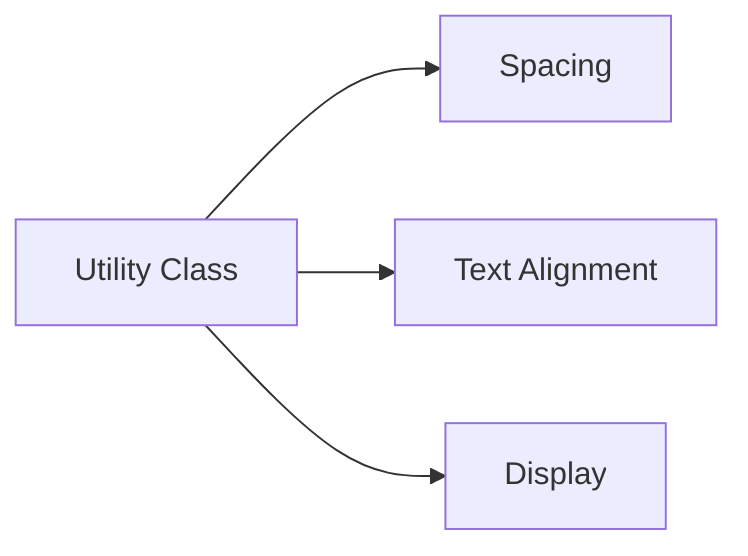

---

# 🎨 BEM Methodology

One of the most popular CSS architectures.

BEM stands for:

```text
Block
Element
Modifier
```

---

# BEM Structure

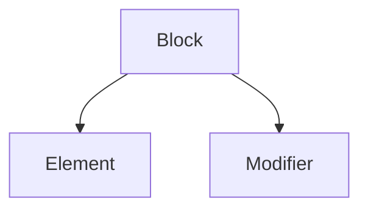

---

# Block

Standalone component.

```css
.card {}
```

---

# Element

Part of a block.

```css
.card__title {}

.card__image {}
```

---

# Modifier

Variation of a block.

```css
.card--featured {}

.card--large {}
```

---

# BEM Example

```html
<div class="card card--featured">
  <h2 class="card__title">
    Product
  </h2>
</div>
```

```css
.card {}

.card__title {}

.card--featured {
  border: 2px solid gold;
}
```

---

# BEM Visualization

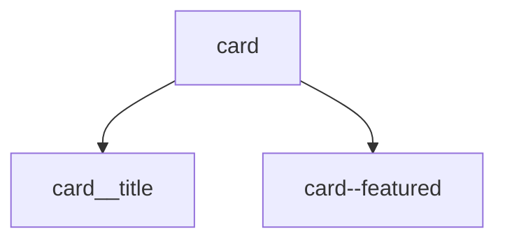

---

# 🎯 SMACSS Architecture

SMACSS stands for:

```text
Scalable
Modular
Architecture
for
CSS
```

Categories:

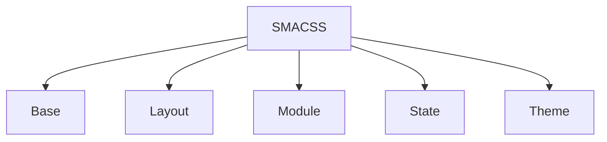

---

# Example

State styles:

```css
.is-active {
  display: block;
}

.is-hidden {
  display: none;
}
```

---

# 🎯 ITCSS

ITCSS stands for:

```text
Inverted Triangle CSS
```

Organizes styles from generic to specific.

---

# ITCSS Pyramid

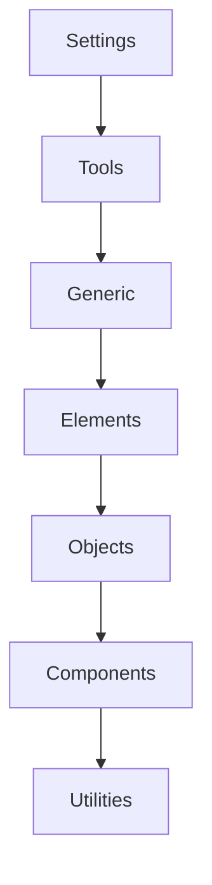

Specificity increases as you move down.

---

# 🎯 CUBE CSS

Modern CSS architecture.

CUBE means:

```text
Composition
Utility
Block
Exception
```

---

# CUBE Flow

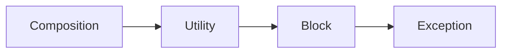

---

# 🎯 Design Tokens

Store design values centrally.

```css
:root {

  --primary-color: #2563eb;

  --spacing-sm: 8px;

  --spacing-md: 16px;

  --radius-md: 12px;
}
```

---

# Design Token Flow

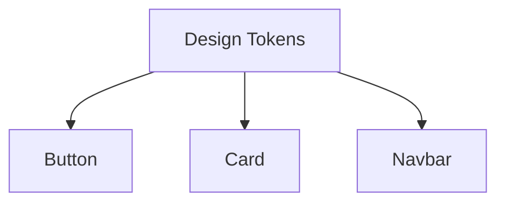

---

# 🎯 CSS Variables for Organization

```css
:root {
  --color-primary: #2563eb;

  --color-danger: #ef4444;
}
```

Usage:

```css
.button {
  background:
    var(--color-primary);
}
```

---

# 🎯 Component-Based CSS

Modern frameworks encourage component-scoped styles.

Examples:

* React Components
* Vue Components
* Angular Components
* Web Components

---

# Component Structure

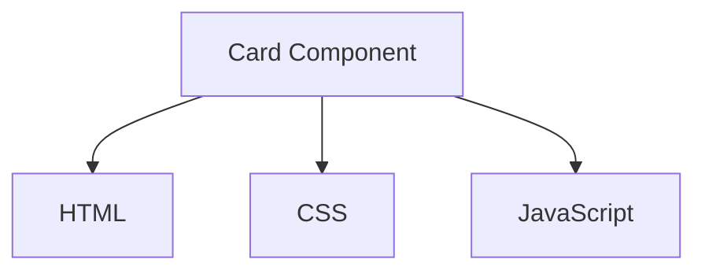

---

# Example

```text
Card/
├── Card.jsx
├── Card.css
└── Card.test.js
```

---

# 🎯 CSS Modules

Avoid global naming conflicts.

```css
.button {
  background: blue;
}
```

Import:

```javascript
// CSS Modules Example
import styles from "./Button.module.css";

<button className={styles.button}>
  Save
</button>;
```

---

# CSS Modules Flow

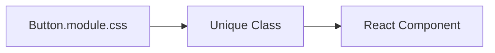

---

# 🎯 Utility-First CSS

Popularized by Tailwind CSS.

Instead of:

```css
.card {
  padding: 1rem;
  border-radius: 8px;
}
```

Use:

```html
<div class="p-4 rounded-lg">
  Content
</div>
```

---

# Utility First Concept

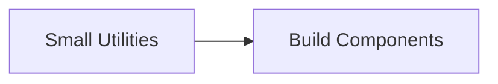

---

# 🎯 Naming Conventions

Good:

```css
.product-card {}

.product-card__title {}

.product-card--featured {}
```

---

Bad:

```css
.box1 {}

.box2 {}

.blue-box {}
```

Names should describe purpose, not appearance.

---

# 🎯 Avoid Deep Selectors

❌

```css
.sidebar ul li a span {
  color: red;
}
```

---

✅

```css
.sidebar-link {
  color: red;
}
```

---

# Selector Complexity

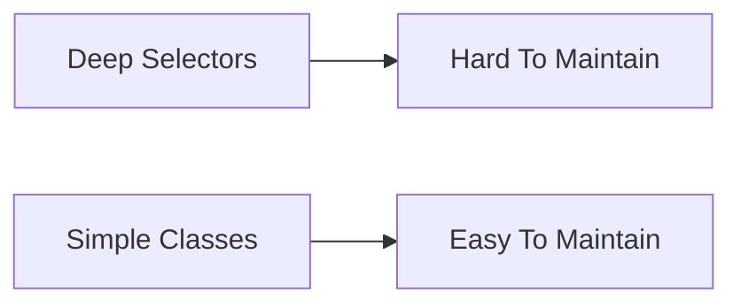

---

# ⚠️ Common Mistakes

---

## Excessive Nesting

❌

```css
.card {
  .header {
    .title {
      .icon {}
    }
  }
}
```

---

## High Specificity

❌

```css
#page .sidebar ul li a {}
```

Prefer classes.

---

## Mixing Layout and Components

Avoid:

```css
.card {
  width: 1200px;
}
```

Layout should live separately.

---

# 🧠 Quick Cheat Sheet

```text
Base Styles
Layout Styles
Component Styles
Utility Styles
Page Styles

BEM:
block
block__element
block--modifier

CSS Variables

Design Tokens

CSS Modules

Utility-First CSS
```

---

# ✅ Best Practices

* Organize CSS into logical folders.
* Use BEM or another naming convention.
* Keep specificity low.
* Prefer reusable components.
* Store design values as variables.
* Avoid deep nesting.
* Separate layout from components.
* Use CSS Modules or scoped styles in component-based apps.

---

# 🚀 Key Takeaways

* CSS Architecture helps projects scale without becoming messy.
* BEM is one of the most widely used naming conventions.
* ITCSS, SMACSS, and CUBE CSS provide structured approaches to organizing styles.
* Design Tokens and CSS Variables improve consistency.
* Component-based CSS is the modern standard in React, Vue, Angular, and other frameworks.
* Well-organized CSS is easier to maintain, debug, and extend.

