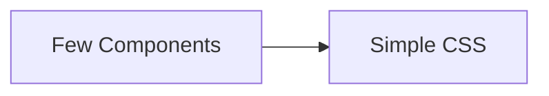
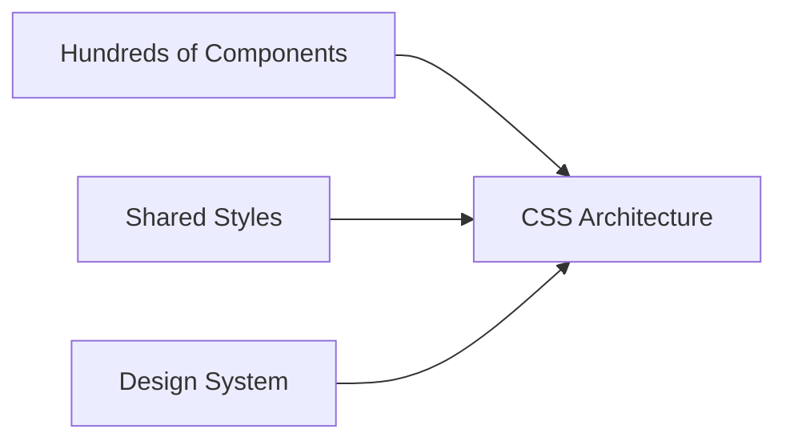
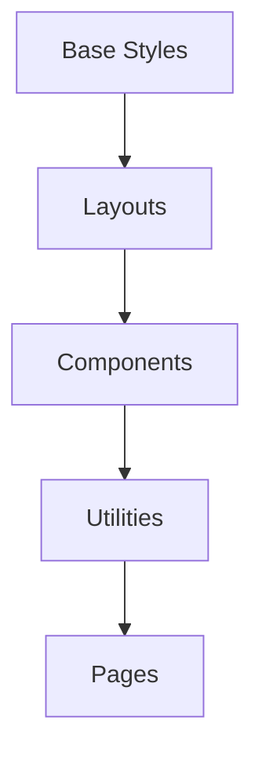
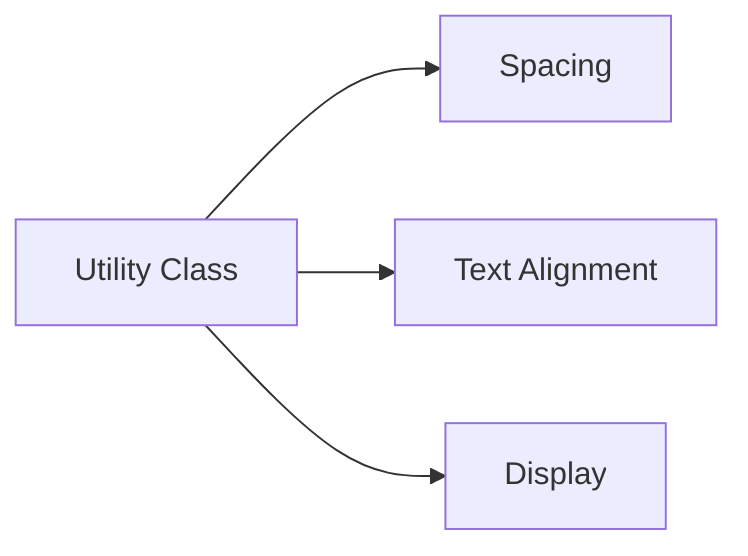

# CSS Architecture & Organization

As projects grow, CSS can quickly become difficult to manage.

Without a proper architecture, stylesheets often suffer from:

❌ Duplicate code

❌ Specificity wars

❌ Naming conflicts

❌ Difficult maintenance

❌ Unpredictable styling bugs

CSS Architecture provides a structured way to organize styles and scale projects
effectively.

---

## Why CSS Architecture Matters

Small projects:

<!-- Visual flow for CSS Architecture & Organization. -->


Large projects:

<!-- Visual flow for CSS Architecture & Organization. -->


As applications grow, organization becomes essential.

## Goals of Good CSS Architecture

A good architecture should be:

✅ Scalable

✅ Predictable

✅ Reusable

✅ Maintainable

✅ Easy to Understand

## 📂 Recommended CSS Folder Structure

For medium and large projects:

// Example demonstrating CSS Architecture & Organization.
```text
styles/
│
├── base/
│   ├── reset.css
│   ├── typography.css
│
├── layout/
│   ├── header.css
│   ├── footer.css
│
├── components/
│   ├── button.css
│   ├── card.css
│   ├── modal.css
│
├── utilities/
│   ├── spacing.css
│   ├── colors.css
│
├── pages/
│   ├── home.css
│   ├── about.css
│
└── main.css
```

## Architecture Layers

<!-- Visual flow for CSS Architecture & Organization. -->


## Base Styles

Base styles define global defaults.

Example:

/* Basic example showing the core idea. */
```css
/* Base Typography */
body {
  font-family: system-ui, sans-serif;
  line-height: 1.6;
}

h1,
h2,
h3 {
  margin-bottom: 1rem;
}
```

## Layout Styles

Layout styles define page structure.

Examples:

- Header
- Footer
- Sidebar
- Grid Layouts

/* Basic example showing the core idea. */
```css
.layout {
  display: grid;

grid-template-columns: 250px 1fr;
}
```

## Component Styles

Components are reusable UI pieces.

- Buttons
- Cards
- Modals
- Alerts

/* Basic example showing the core idea. */
```css
.card {
  padding: 1rem;

border-radius: 12px;

background: white;
}
```

## Utility Styles

Utility classes do one thing.

/* Basic example showing the core idea. */
```css
.mt-4 {
  margin-top: 1rem;
}

.text-center {
  text-align: center;
}
```

## Utility Concept

<!-- Visual flow for CSS Architecture & Organization. -->


## BEM Methodology

One of the most popular CSS architectures.

BEM stands for:

// Example demonstrating CSS Architecture & Organization.
```text
Block
Element
Modifier
```

## BEM Structure

Block["Block"]

Element["Element"]

Modifier["Modifier"]

Block --> Element
    Block --> Modifier
// Example demonstrating CSS Architecture & Organization.
```

## Block

Standalone component.

```css
.card {
}
// Example demonstrating CSS Architecture & Organization.
```

## Element

Part of a block.

```css
.card__title {
}

.card__image {
}
// Example demonstrating CSS Architecture & Organization.
```

## Modifier

Variation of a block.

```css
.card--featured {
}

.card--large {
}
// Example demonstrating CSS Architecture & Organization.
```

## BEM Example

```html
<div class="card card--featured">
  <h2 class="card__title">Product</h2>
</div>
// Example demonstrating CSS Architecture & Organization.
```

```css
.card {
}

.card__title {
}

.card--featured {
  border: 2px solid gold;
}
// Example demonstrating CSS Architecture & Organization.
```

## BEM Visualization

Card["card"]

Title["card__title"]

Featured["card--featured"]

Card --> Title
    Card --> Featured
```

## SMACSS Architecture

SMACSS stands for:

// Example demonstrating CSS Architecture & Organization.
```text
Scalable
Modular
Architecture
for
CSS
```

Categories:

SMACSS

Base
    Layout
    Module
    State
    Theme

SMACSS --> Base
    SMACSS --> Layout
    SMACSS --> Module
    SMACSS --> State
    SMACSS --> Theme
// Example demonstrating CSS Architecture & Organization.
```

## Example

State styles:

```css
.is-active {
  display: block;
}

.is-hidden {
  display: none;
}
// Example demonstrating CSS Architecture & Organization.
```

## ITCSS

ITCSS stands for:

```text
Inverted Triangle CSS
// Example demonstrating CSS Architecture & Organization.
```

Organizes styles from generic to specific.

## ITCSS Pyramid

Settings["Settings"]

Tools["Tools"]

Generic["Generic"]

Elements["Elements"]

Objects["Objects"]

Settings --> Tools
    Tools --> Generic
    Generic --> Elements
    Elements --> Objects
    Objects --> Components
    Components --> Utilities
```

Specificity increases as you move down.

## CUBE CSS

Modern CSS architecture.

CUBE means:

// Example demonstrating CSS Architecture & Organization.
```text
Composition
Utility
Block
Exception
```

## CUBE Flow

Composition

Utility

Block

Exception

Composition --> Utility
    Utility --> Block
    Block --> Exception
// Example demonstrating CSS Architecture & Organization.
```

## Design Tokens

Store design values centrally.

```css
:root {
  --primary-color: #2563eb;

--spacing-sm: 8px;

--spacing-md: 16px;

--radius-md: 12px;
}
// Example demonstrating CSS Architecture & Organization.
```

## Design Token Flow

Tokens["Design Tokens"]

Button["Button"]

Navbar["Navbar"]

Tokens --> Button
    Tokens --> Card
    Tokens --> Navbar
```

## CSS Variables for Organization

/* Basic example showing the core idea. */
```css
:root {
  --color-primary: #2563eb;

--color-danger: #ef4444;
}
```

Usage:

/* Basic example showing the core idea. */
```css
.button {
  background: var(--color-primary);
}
```

## Component-Based CSS

Modern frameworks encourage component-scoped styles.

- React Components
- Vue Components
- Angular Components
- Web Components

## Component Structure

Component["Card Component"]

HTML["HTML"]

CSS["CSS"]

JS["JavaScript"]

Component --> HTML
    Component --> CSS
    Component --> JS
// Example demonstrating CSS Architecture & Organization.
```

```text
Card/
├── Card.jsx
├── Card.css
└── Card.test.js
// Example demonstrating CSS Architecture & Organization.
```

## CSS Modules

Avoid global naming conflicts.

```css
.button {
  background: blue;
}
// Example demonstrating CSS Architecture & Organization.
```

Import:

```javascript
// CSS Modules Example
import styles from './Button.module.css';

<button className={styles.button}>Save</button>;
// Example demonstrating CSS Architecture & Organization.
```

## CSS Modules Flow

CSS["Button.module.css"]

Hash["Unique Class"]

Component["React Component"]

CSS --> Hash
    Hash --> Component
```

## Utility-First CSS

Popularized by Tailwind CSS.

Instead of:

/* Basic example showing the core idea. */
```css
.card {
  padding: 1rem;
  border-radius: 8px;
}
```

Use:

<!-- Basic example showing the core idea. -->
```html
<div class="p-4 rounded-lg">Content</div>
```

## Utility First Concept

Utility["Small Utilities"]

UI["Build Components"]

Utility --> UI
// Example demonstrating CSS Architecture & Organization.
```

## Naming Conventions

Good:

```css
.product-card {
}

.product-card__title {
}

.product-card--featured {
}
// Example demonstrating CSS Architecture & Organization.
```

Bad:

```css
.box1 {
}

.box2 {
}

.blue-box {
}
// Example demonstrating CSS Architecture & Organization.
```

Names should describe purpose, not appearance.

## Avoid Deep Selectors

❌

```css
.sidebar ul li a span {
  color: red;
}
// Example demonstrating CSS Architecture & Organization.
```

✅

```css
.sidebar-link {
  color: red;
}
// Example demonstrating CSS Architecture & Organization.
```

## Selector Complexity

Deep["Deep Selectors"]

Hard["Hard To Maintain"]

Simple["Simple Classes"]

Easy["Easy To Maintain"]

Deep --> Hard
    Simple --> Easy
```

## Excessive Nesting

/* Basic example showing the core idea. */
```css
.card {
  .header {
    .title {
      .icon {
      }
    }
  }
}
```

## High Specificity

/* Basic example showing the core idea. */
```css
#page .sidebar ul li a {
}
```

Prefer classes.

## Mixing Layout and Components

Avoid:

/* Basic example showing the core idea. */
```css
.card {
  width: 1200px;
}
```

Layout should live separately.

## Quick Cheat Sheet

// Example demonstrating CSS Architecture & Organization.
```text
Base Styles
Layout Styles
Component Styles
Utility Styles
Page Styles

BEM:
block
block__element
block--modifier

CSS Variables

Design Tokens

CSS Modules

Utility-First CSS
```

## ✅ Best Practices

- Organize CSS into logical folders.
- Use BEM or another naming convention.
- Keep specificity low.
- Prefer reusable components.
- Store design values as variables.
- Avoid deep nesting.
- Separate layout from components.
- Use CSS Modules or scoped styles in component-based apps.

## Key Takeaways

- CSS Architecture helps projects scale without becoming messy.
- BEM is one of the most widely used naming conventions.
- ITCSS, SMACSS, and CUBE CSS provide structured approaches to organizing
  styles.
- Design Tokens and CSS Variables improve consistency.
- Component-based CSS is the modern standard in React, Vue, Angular, and other
  frameworks.
- Well-organized CSS is easier to maintain, debug, and extend.
