# ⬛ CSS Grid

CSS Grid is a powerful **two-dimensional layout system** that allows you to create layouts using **rows and columns simultaneously**.

Unlike Flexbox, which works in one direction (row or column), Grid can control both directions at the same time, making it perfect for dashboards, galleries, page layouts, and complex responsive designs.

---

# 🎯 Why CSS Grid?

Before Grid, developers used:

* Floats
* Inline-blocks
* Positioning
* Flexbox hacks

Grid provides a cleaner solution.

✅ Create rows and columns easily

✅ Build responsive layouts

✅ Control item placement precisely

✅ Reduce complex CSS

✅ Create modern web layouts

---

# 🏗️ Grid Basics

To create a grid, set `display: grid` on a container.

```html
<!-- Basic Grid Container -->
<div class="container">
  <div class="item">1</div>
  <div class="item">2</div>
  <div class="item">3</div>
  <div class="item">4</div>
</div>
```

```css
/* Create a grid */
.container {
  display: grid;
}
```

---

# 🧠 How Grid Works

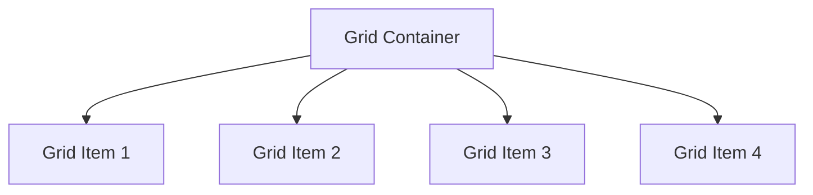

The parent becomes a **Grid Container** and children become **Grid Items**.

---

# 📐 Creating Columns

Use `grid-template-columns`.

```css
/* Three equal columns */
.container {
  display: grid;
  grid-template-columns: 1fr 1fr 1fr;
}
```

---

## Visual Representation

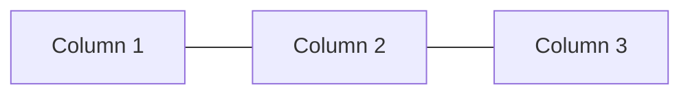

---

# 📏 Understanding fr Unit

`fr` means **fraction of available space**.

```css
.container {
  grid-template-columns: 1fr 1fr 1fr;
}
```

Each column gets equal space.

---

## Unequal Columns

```css
.container {
  grid-template-columns: 1fr 2fr 1fr;
}
```

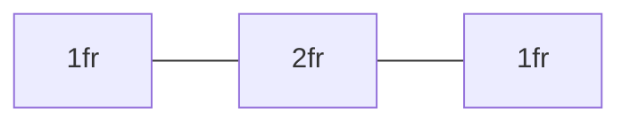

The middle column gets twice the width.

---

# 📐 Creating Rows

```css
.container {
  grid-template-rows: 100px 200px;
}
```

Creates:

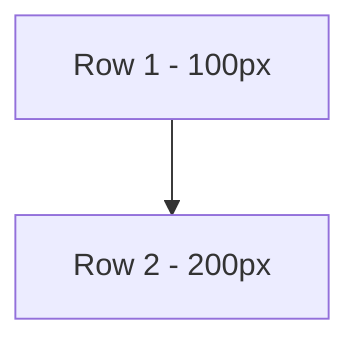

---

# 🧩 Gap

Adds spacing between rows and columns.

```css
.container {
  gap: 20px;
}
```

Equivalent to:

```css
.container {
  row-gap: 20px;
  column-gap: 20px;
}
```

---

# 🔁 Repeat Function

Instead of:

```css
grid-template-columns:
  1fr 1fr 1fr 1fr;
```

Use:

```css
grid-template-columns:
  repeat(4, 1fr);
```

Cleaner and easier to maintain.

---

# 📱 Responsive Grid

One of Grid's most useful features.

```css
.products {
  display: grid;

  grid-template-columns:
    repeat(auto-fit, minmax(250px, 1fr));

  gap: 20px;
}
```

---

## Responsive Behavior

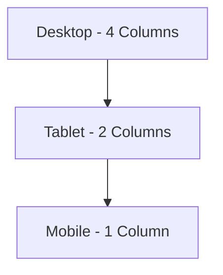

---

# 📦 auto-fit vs auto-fill

## auto-fit

```css
grid-template-columns:
repeat(auto-fit, minmax(250px, 1fr));
```

Empty columns collapse.

Best for most layouts.

---

## auto-fill

```css
grid-template-columns:
repeat(auto-fill, minmax(250px, 1fr));
```

Empty tracks remain.

Useful for advanced layouts.

---

# 📍 Positioning Items

Grid items can span multiple rows and columns.

---

## grid-column

```css
.item {
  grid-column: 1 / 3;
}
```


Item spans columns 1 to 2.

---

## grid-row

```css
.item {
  grid-row: 1 / 3;
}
```

Item spans multiple rows.

---

# Example: Full Width Header

```css
.header {
  grid-column: 1 / 4;
}
```

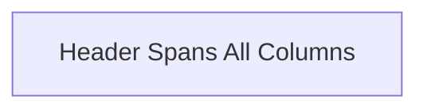

---

# 🎨 Grid Template Areas

Creates readable layouts.

```css
.container {
  display: grid;

  grid-template-areas:
    "header header"
    "sidebar main"
    "footer footer";
}
```

Assign areas:

```css
.header {
  grid-area: header;
}

.sidebar {
  grid-area: sidebar;
}

.main {
  grid-area: main;
}

.footer {
  grid-area: footer;
}
```

---

# Visual Layout

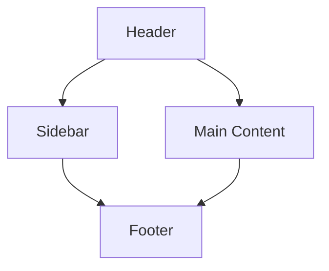

---

# 🎯 Aligning Items

---

## justify-items

Horizontal alignment inside cells.

```css
.container {
  justify-items: center;
}
```

Options:

```css
start
center
end
stretch
```

---

## align-items

Vertical alignment inside cells.

```css
.container {
  align-items: center;
}
```

---

## place-items

Shortcut for both.

```css
.container {
  place-items: center;
}
```

---

# 🎯 Aligning Entire Grid

---

## justify-content

Align grid horizontally.

```css
.container {
  justify-content: center;
}
```

---

## align-content

Align grid vertically.

```css
.container {
  align-content: center;
}
```

---

## place-content

Shorthand.

```css
.container {
  place-content: center;
}
```

---

# 🛒 Real-World Product Grid

```html
<!-- Product Grid -->
<div class="products">
  <div class="card">Product 1</div>
  <div class="card">Product 2</div>
  <div class="card">Product 3</div>
  <div class="card">Product 4</div>
</div>
```

```css
/* Responsive Product Grid */
.products {
  display: grid;

  grid-template-columns:
    repeat(auto-fit, minmax(250px, 1fr));

  gap: 20px;
}
```

---

## Product Grid Layout

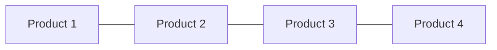

---

# 📊 Dashboard Layout Example

```css
.dashboard {
  display: grid;

  grid-template-columns:
    250px 1fr;

  grid-template-rows:
    80px 1fr;
}
```

---

## Dashboard Structure

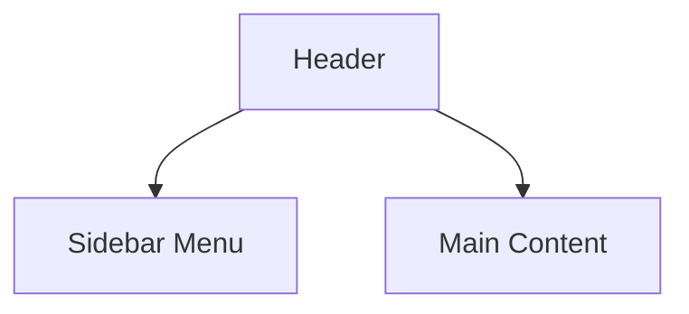

---

# ⚡ Auto Placement

Grid automatically places items.

```css
.container {
  display: grid;

  grid-template-columns:
    repeat(3, 1fr);
}
```

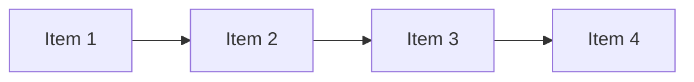

No manual positioning required.

---

# 🔲 Flexbox vs Grid

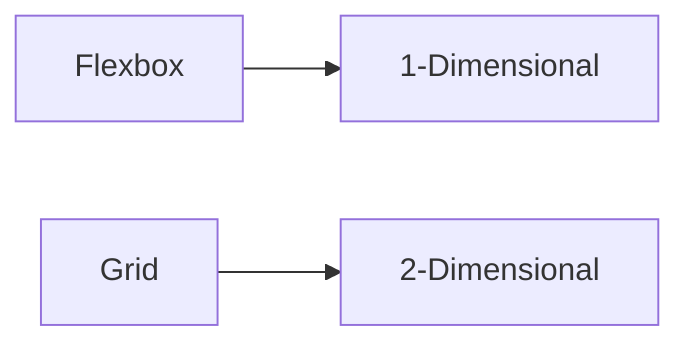

| Feature            | Flexbox | Grid      |
| ------------------ | ------- | --------- |
| Rows               | ❌       | ✅         |
| Columns            | ❌       | ✅         |
| Alignment          | ✅       | ✅         |
| Responsive Layouts | Good    | Excellent |
| Complex Layouts    | Limited | Excellent |

---

# 🎯 When to Use Flexbox

Use Flexbox for:

✅ Navigation bars

✅ Buttons

✅ Toolbars

✅ Form controls

✅ Small UI components

---

# 🎯 When to Use Grid

Use Grid for:

✅ Dashboards

✅ Page layouts

✅ Product galleries

✅ Admin panels

✅ Blog layouts

✅ Landing pages

---

# ⚠️ Common Mistakes

## Fixed Width Columns

❌

```css
grid-template-columns:
300px 300px 300px;
```

✅

```css
grid-template-columns:
repeat(auto-fit, minmax(250px, 1fr));
```

---

## Forgetting Gap

❌

```css
.card {
  margin: 10px;
}
```

✅

```css
.container {
  gap: 20px;
}
```

---

## Using Grid for Simple Centering

❌

```css
display: grid;
place-items: center;
```

For simple layouts, Flexbox may be easier.

---

# 🧠 Quick Cheat Sheet

```css
display: grid;

grid-template-columns:
repeat(3, 1fr);

grid-template-rows:
100px 1fr;

gap: 20px;

grid-column: 1 / 3;

grid-row: 1 / 3;

place-items: center;

place-content: center;

grid-template-areas:
  "header header"
  "sidebar main";
```

---

# ✅ Best Practices

* Use Grid for two-dimensional layouts.
* Prefer `fr` units over fixed widths.
* Use `repeat()` whenever possible.
* Use `auto-fit` + `minmax()` for responsive layouts.
* Combine Grid and Flexbox together.
* Use Grid Template Areas for large layouts.
* Keep layouts mobile-friendly.

---

# 🚀 Key Takeaways

* CSS Grid is a two-dimensional layout system.
* It controls rows and columns simultaneously.
* `fr` units divide available space.
* `repeat()`, `auto-fit()`, and `minmax()` simplify responsive design.
* Grid Template Areas make layouts readable.
* CSS Grid is the preferred solution for modern page layouts.
