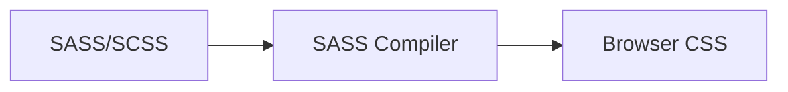
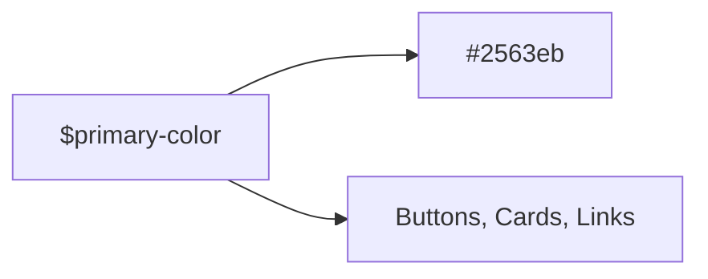
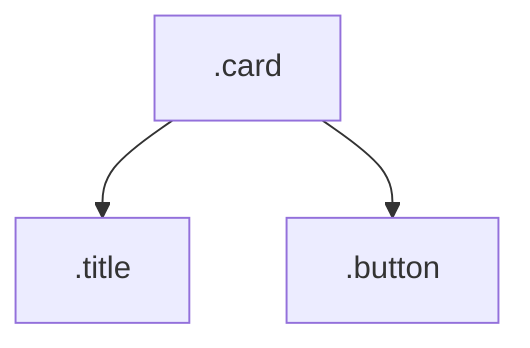
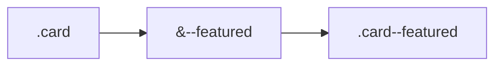
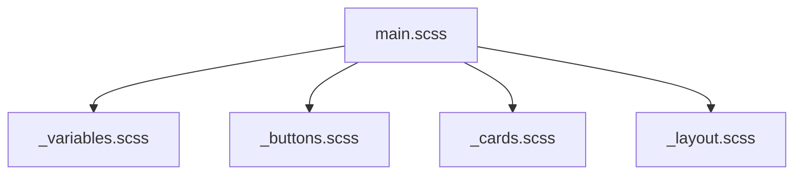
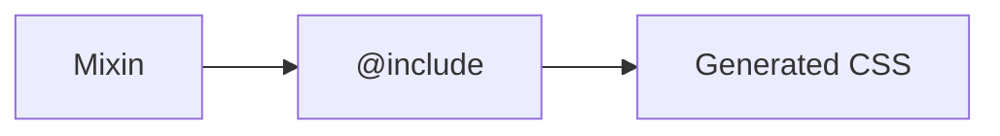
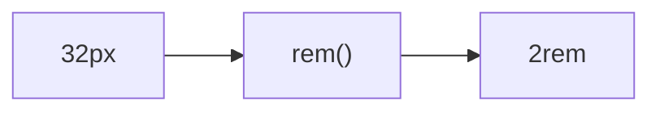
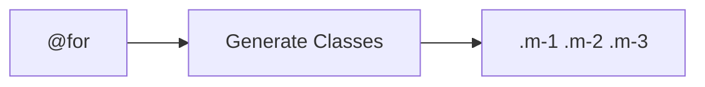
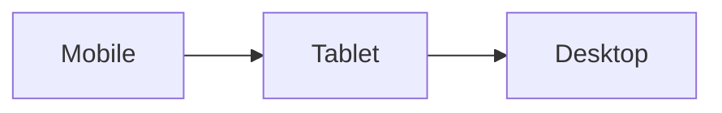

# 🎀 CSS Preprocessors (SASS)

As CSS projects grow, writing plain CSS can become repetitive and difficult to
maintain.

**SASS (Syntactically Awesome Style Sheets)** is a CSS preprocessor that adds
powerful features like:

✅ Variables

✅ Nesting

✅ Mixins

✅ Functions

✅ Modules

✅ Reusable Logic

SASS code is compiled into regular CSS that browsers understand.

---

# 🎯 Why Use SASS?

Without SASS:

```css
.button {
  background: #2563eb;
}

.card {
  border-color: #2563eb;
}

.link {
  color: #2563eb;
}
```

Repeated values make maintenance harder.

With SASS:

```scss
$primary-color: #2563eb;

.button {
  background: $primary-color;
}

.card {
  border-color: $primary-color;
}

.link {
  color: $primary-color;
}
```

Update one value and everything updates.

---

# 🧠 How SASS Works



Browsers cannot read SASS directly.

A compiler converts SASS into CSS.

---

# 📦 SASS vs SCSS

SASS supports two syntaxes.

---

## SASS Syntax

```sass
$primary: blue

.button
  background: $primary
```

No braces or semicolons.

---

## SCSS Syntax ⭐

```scss
$primary: blue;

.button {
  background: $primary;
}
```

Most developers use **SCSS** because it looks like CSS.

---

# 🎨 Variables

Variables store reusable values.

---

## SCSS Variable

```scss
$primary-color: #2563eb;
$border-radius: 12px;
```

Usage:

```scss
.button {
  background: $primary-color;
  border-radius: $border-radius;
}
```

---

## Variable Flow



---

# 🏗️ Nesting

One of the most popular SASS features.

---

## Without Nesting

```css
.card {
}

.card .title {
}

.card .button {
}
```

---

## With Nesting

```scss
.card {
  .title {
    font-size: 20px;
  }

  .button {
    background: blue;
  }
}
```

---

## Nesting Structure



---

# ⚠️ Avoid Deep Nesting

Bad:

```scss
.card {
  .header {
    .title {
      .icon {
      }
    }
  }
}
```

Too much nesting creates difficult CSS.

Recommended:

```scss
.card {
  .title {
  }
}
```

Maximum:

```text
3 Levels
```

---

# 🎯 Parent Selector (&)

Represents the current selector.

---

## Example

```scss
.button {
  &:hover {
    background: red;
  }
}
```

Compiles to:

```css
.button:hover {
  background: red;
}
```

---

## Modifier Example

```scss
.card {
  &--featured {
    border: 2px solid gold;
  }
}
```

Compiles to:

```css
.card--featured {
  border: 2px solid gold;
}
```

---

## Parent Selector Flow



---

# 🧩 Partials

Split SASS into smaller files.

---

## Example Structure

```text
scss/

├── _variables.scss
├── _buttons.scss
├── _cards.scss
├── _layout.scss

└── main.scss
```

Files beginning with `_` are partials.

---

# Importing Partials

```scss
@use 'variables';
@use 'buttons';
@use 'cards';
```

---

# Modular Architecture



---

# 🎯 Mixins

Mixins allow reusable blocks of CSS.

---

## Basic Mixin

```scss
@mixin center {
  display: flex;
  justify-content: center;
  align-items: center;
}
```

Use it:

```scss
.hero {
  @include center;
}
```

Compiled CSS:

```css
.hero {
  display: flex;
  justify-content: center;
  align-items: center;
}
```

---

## Mixin Flow



---

# 🎯 Mixins with Parameters

```scss
@mixin button($bg) {
  background: $bg;

  padding: 10px 20px;

  border-radius: 8px;
}
```

Usage:

```scss
.primary {
  @include button(blue);
}

.success {
  @include button(green);
}
```

---

# 🎯 Functions

Functions return values.

---

## Example

```scss
@function rem($px) {
  @return $px / 16 * 1rem;
}
```

Usage:

```scss
.title {
  font-size: rem(32);
}
```

Result:

```css
.title {
  font-size: 2rem;
}
```

---

# Function Flow



---

# 🎯 Extend

Share styles between selectors.

---

## Example

```scss
.button-base {
  padding: 10px;

  border-radius: 8px;
}
```

```scss
.primary {
  @extend .button-base;
}
```

Compiled CSS merges selectors.

---

# 🎨 SASS Maps

Store structured data.

```scss
$colors: (
  primary: #2563eb,
  success: #22c55e,
  danger: #ef4444,
);
```

Usage:

```scss
.button {
  color: map-get($colors, primary);
}
```

---

# 🎯 Loops

Generate repetitive CSS.

---

## @for Loop

```scss
@for $i from 1 through 5 {
  .m-#{$i} {
    margin: #{$i}rem;
  }
}
```

Produces:

```css
.m-1 { margin: 1rem; }
.m-2 { margin: 2rem; }
.m-3 { margin: 3rem; }
...
```

---

# Loop Generation



---

# 🎯 Conditionals

SASS supports logic.

```scss
@mixin theme($mode) {
  @if $mode == dark {
    background: black;
    color: white;
  } @else {
    background: white;
    color: black;
  }
}
```

---

# 📱 Responsive Mixins

Very common pattern.

```scss
@mixin tablet {
  @media (min-width: 768px) {
    @content;
  }
}
```

Usage:

```scss
.card {
  width: 100%;

  @include tablet {
    width: 50%;
  }
}
```

---

# Responsive Flow



---

# 🎯 Modern SASS @use

Older:

```scss
@import 'variables';
```

Deprecated.

---

Recommended:

```scss
@use 'variables';
```

Access:

```scss
.button {
  color: variables.$primary;
}
```

---

# 🏗️ Real Project Structure

```text
scss/

├── abstracts/
│   ├── _variables.scss
│   ├── _mixins.scss
│   ├── _functions.scss
│
├── base/
│   ├── _reset.scss
│   ├── _typography.scss
│
├── components/
│   ├── _button.scss
│   ├── _card.scss
│
├── layout/
│   ├── _header.scss
│   ├── _footer.scss
│
└── main.scss
```

---

# ⚡ SASS vs Modern CSS

Many SASS features now exist in CSS.

| Feature   | SASS | Modern CSS |
| --------- | ---- | ---------- |
| Variables | ✅   | ✅         |
| Nesting   | ✅   | ✅         |
| Functions | ✅   | Partial    |
| Loops     | ✅   | ❌         |
| Mixins    | ✅   | ❌         |
| Modules   | ✅   | Partial    |

---

# When Should You Use SASS?

Use SASS when:

✅ Large projects

✅ Design systems

✅ Complex component libraries

✅ Reusable mixins/functions

---

Modern CSS alone may be enough for:

✅ Small websites

✅ Landing pages

✅ Simple applications

---

# ⚠️ Common Mistakes

---

## Excessive Nesting

❌

```scss
.card {
  .header {
    .title {
      .icon {
      }
    }
  }
}
```

---

## Too Many Mixins

Not everything needs a mixin.

---

## Continuing to Use @import

❌

```scss
@import 'variables';
```

Use:

```scss
@use 'variables';
```

---

# 🧠 Quick Cheat Sheet

```scss
$primary: blue;

.card {
  .title {
  }
}

&:hover {
}

@mixin center {
}

@include center;

@function rem() {
}

@extend .button;

@for $i from 1 through 5 {
}

@if condition {
}

@use 'variables';
```

---

# ✅ Best Practices

- Prefer SCSS syntax over SASS syntax.
- Use `@use` instead of `@import`.
- Keep nesting shallow.
- Organize files into modules.
- Use variables for design tokens.
- Use mixins for reusable patterns.
- Avoid overengineering small projects.

---

# 🚀 Key Takeaways

- SASS extends CSS with powerful developer-friendly features.
- Variables, nesting, mixins, and functions reduce repetition.
- Partials and modules improve organization.
- Loops and conditionals enable dynamic CSS generation.
- Modern CSS has reduced the need for SASS in some areas, but SASS remains
  valuable for large-scale applications and design systems.
