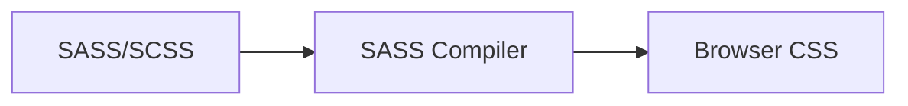

# 🎀 CSS Preprocessors (SASS)

As CSS projects grow, writing plain CSS can become repetitive and difficult to
maintain.

**SASS (Syntactically Awesome Style Sheets)** is a CSS preprocessor that adds
powerful features like:

✅ Variables

✅ Nesting

✅ Mixins

✅ Functions

✅ Modules

✅ Reusable Logic

SASS code is compiled into regular CSS that browsers understand.

---

## Why Use SASS?

Without SASS:

/* Basic example showing the core idea. */
```css
.button {
  background: #2563eb;
}

.card {
  border-color: #2563eb;
}

.link {
  color: #2563eb;
}
```

Repeated values make maintenance harder.

With SASS:

// Example demonstrating 🎀 CSS Preprocessors (SASS).
```scss
$primary-color: #2563eb;

.button {
  background: $primary-color;
}

.card {
  border-color: $primary-color;
}

.link {
  color: $primary-color;
}
```

Update one value and everything updates.

## How SASS Works

<!-- Visual flow for 🎀 CSS Preprocessors (SASS). -->


Browsers cannot read SASS directly.

A compiler converts SASS into CSS.

## SASS vs SCSS

SASS supports two syntaxes.

## SASS Syntax

// Example demonstrating 🎀 CSS Preprocessors (SASS).
```sass
$primary: blue

.button
  background: $primary
```

No braces or semicolons.

## SCSS Syntax ⭐

// Example demonstrating 🎀 CSS Preprocessors (SASS).
```scss
$primary: blue;

.button {
  background: $primary;
}
```

Most developers use **SCSS** because it looks like CSS.

## Variables

Variables store reusable values.

## SCSS Variable

// Example demonstrating 🎀 CSS Preprocessors (SASS).
```scss
$primary-color: #2563eb;
$border-radius: 12px;
```

Usage:

// Example demonstrating 🎀 CSS Preprocessors (SASS).
```scss
.button {
  background: $primary-color;
  border-radius: $border-radius;
}
```

## Variable Flow

Variable["$primary-color"]

Value["#2563eb"]

Components["Buttons, Cards, Links"]

Variable --> Value
    Variable --> Components
// Example demonstrating 🎀 CSS Preprocessors (SASS).
```

## Nesting

One of the most popular SASS features.

## Without Nesting

```css
.card {
}

.card .title {
}

.card .button {
}
// Example demonstrating 🎀 CSS Preprocessors (SASS).
```

## With Nesting

```scss
.card {
  .title {
    font-size: 20px;
  }

.button {
    background: blue;
  }
}
// Example demonstrating 🎀 CSS Preprocessors (SASS).
```

## Nesting Structure

```mermaid
flowchart TB

Card[".card"]

Title[".title"]

Button[".button"]

Card --> Title
    Card --> Button
// Example demonstrating 🎀 CSS Preprocessors (SASS).
```

## ⚠ Avoid Deep Nesting

Bad:

```scss
.card {
  .header {
    .title {
      .icon {
      }
    }
  }
}
// Example demonstrating 🎀 CSS Preprocessors (SASS).
```

Too much nesting creates difficult CSS.

Recommended:

```scss
.card {
  .title {
  }
}
// Example demonstrating 🎀 CSS Preprocessors (SASS).
```

Maximum:

```text
3 Levels
// Example demonstrating 🎀 CSS Preprocessors (SASS).
```

## Parent Selector (&)

Represents the current selector.

## Example

```scss
.button {
  &:hover {
    background: red;
  }
}
// Example demonstrating 🎀 CSS Preprocessors (SASS).
```

Compiles to:

```css
.button:hover {
  background: red;
}
// Example demonstrating 🎀 CSS Preprocessors (SASS).
```

## Modifier Example

```scss
.card {
  &--featured {
    border: 2px solid gold;
  }
}
// Example demonstrating 🎀 CSS Preprocessors (SASS).
```

```css
.card--featured {
  border: 2px solid gold;
}
// Example demonstrating 🎀 CSS Preprocessors (SASS).
```

## Parent Selector Flow

Parent[".card"]

Modifier["&--featured"]

Result[".card--featured"]

Parent --> Modifier --> Result
```

## Partials

Split SASS into smaller files.

## Example Structure

// Example demonstrating 🎀 CSS Preprocessors (SASS).
```text
scss/

├── _variables.scss
├── _buttons.scss
├── _cards.scss
├── _layout.scss

└── main.scss
```

Files beginning with `_` are partials.

## Importing Partials

// Example demonstrating 🎀 CSS Preprocessors (SASS).
```scss
@use 'variables';
@use 'buttons';
@use 'cards';
```

## Modular Architecture

Main["main.scss"]

Variables["_variables.scss"]

Buttons["_buttons.scss"]

Cards["_cards.scss"]

Layout["_layout.scss"]

Main --> Variables
    Main --> Buttons
    Main --> Cards
    Main --> Layout
// Example demonstrating 🎀 CSS Preprocessors (SASS).
```

## Mixins

Mixins allow reusable blocks of CSS.

## Basic Mixin

```scss
@mixin center {
  display: flex;
  justify-content: center;
  align-items: center;
}
// Example demonstrating 🎀 CSS Preprocessors (SASS).
```

Use it:

```scss
.hero {
  @include center;
}
// Example demonstrating 🎀 CSS Preprocessors (SASS).
```

Compiled CSS:

```css
.hero {
  display: flex;
  justify-content: center;
  align-items: center;
}
// Example demonstrating 🎀 CSS Preprocessors (SASS).
```

## Mixin Flow

Mixin["Mixin"]

Include["@include"]

CSS["Generated CSS"]

Mixin --> Include --> CSS
```

## Mixins with Parameters

// Example demonstrating 🎀 CSS Preprocessors (SASS).
```scss
@mixin button($bg) {
  background: $bg;

padding: 10px 20px;

border-radius: 8px;
}
```

// Example demonstrating 🎀 CSS Preprocessors (SASS).
```scss
.primary {
  @include button(blue);
}

.success {
  @include button(green);
}
```

## Functions

Functions return values.

// Example demonstrating 🎀 CSS Preprocessors (SASS).
```scss
@function rem($px) {
  @return $px / 16 * 1rem;
}
```

// Example demonstrating 🎀 CSS Preprocessors (SASS).
```scss
.title {
  font-size: rem(32);
}
```

Result:

/* Basic example showing the core idea. */
```css
.title {
  font-size: 2rem;
}
```

## Function Flow

Input["32px"]

Function["rem()"]

Output["2rem"]

Input --> Function --> Output
// Example demonstrating 🎀 CSS Preprocessors (SASS).
```

## Extend

Share styles between selectors.

```scss
.button-base {
  padding: 10px;

// Example demonstrating 🎀 CSS Preprocessors (SASS).
```scss
.primary {
  @extend .button-base;
}
```

Compiled CSS merges selectors.

## SASS Maps

Store structured data.

// Example demonstrating 🎀 CSS Preprocessors (SASS).
```scss
$colors: (
  primary: #2563eb,
  success: #22c55e,
  danger: #ef4444,
);
```

// Example demonstrating 🎀 CSS Preprocessors (SASS).
```scss
.button {
  color: map-get($colors, primary);
}
```

## Loops

Generate repetitive CSS.

## @for Loop

// Example demonstrating 🎀 CSS Preprocessors (SASS).
```scss
@for $i from 1 through 5 {
  .m-#{$i} {
    margin: #{$i}rem;
  }
}
```

Produces:

/* Basic example showing the core idea. */
```css
.m-1 { margin: 1rem; }
.m-2 { margin: 2rem; }
.m-3 { margin: 3rem; }
...
```

## Loop Generation

Loop["@for"]

Generate["Generate Classes"]

Output[".m-1 .m-2 .m-3"]

Loop --> Generate --> Output
// Example demonstrating 🎀 CSS Preprocessors (SASS).
```

## Conditionals

SASS supports logic.

```scss
@mixin theme($mode) {
  @if $mode == dark {
    background: black;
    color: white;
  } @else {
    background: white;
    color: black;
  }
}
// Example demonstrating 🎀 CSS Preprocessors (SASS).
```

## 📱 Responsive Mixins

Very common pattern.

```scss
@mixin tablet {
  @media (min-width: 768px) {
    @content;
  }
}
// Example demonstrating 🎀 CSS Preprocessors (SASS).
```

```scss
.card {
  width: 100%;

@include tablet {
    width: 50%;
  }
}
// Example demonstrating 🎀 CSS Preprocessors (SASS).
```

## Responsive Flow

Mobile["Mobile"]

Tablet["Tablet"]

Desktop["Desktop"]

Mobile --> Tablet --> Desktop
```

## Modern SASS @use

Older:

// Example demonstrating 🎀 CSS Preprocessors (SASS).
```scss
@import 'variables';
```

Deprecated.

// Example demonstrating 🎀 CSS Preprocessors (SASS).
```scss
@use 'variables';
```

Access:

// Example demonstrating 🎀 CSS Preprocessors (SASS).
```scss
.button {
  color: variables.$primary;
}
```

## Real Project Structure

├── abstracts/
│   ├── _variables.scss
│   ├── _mixins.scss
│   ├── _functions.scss
│
├── base/
│   ├── _reset.scss
│   ├── _typography.scss
│
├── components/
│   ├── _button.scss
│   ├── _card.scss
│
├── layout/
│   ├── _header.scss
│   ├── _footer.scss
│
└── main.scss
// Example demonstrating 🎀 CSS Preprocessors (SASS).
```

## SASS vs Modern CSS

Many SASS features now exist in CSS.

| Feature   | SASS | Modern CSS |
| --------- | ---- | ---------- |
| Variables | ✅   | ✅         |
| Nesting   | ✅   | ✅         |
| Functions | ✅   | Partial    |
| Loops     | ✅   | ❌         |
| Mixins    | ✅   | ❌         |
| Modules   | ✅   | Partial    |

## When Should You Use SASS?

Use SASS when:

✅ Large projects

✅ Design systems

✅ Complex component libraries

✅ Reusable mixins/functions

Modern CSS alone may be enough for:

✅ Small websites

✅ Landing pages

✅ Simple applications

## Excessive Nesting

❌

## Too Many Mixins

Not everything needs a mixin.

## Continuing to Use @import

Use:

## Quick Cheat Sheet

.card {
  .title {
  }
}

&:hover {
}

@mixin center {
}

@include center;

@function rem() {
}

@extend .button;

@for $i from 1 through 5 {
}

@if condition {
}

@use 'variables';
```

## ✅ Best Practices

- Prefer SCSS syntax over SASS syntax.
- Use `@use` instead of `@import`.
- Keep nesting shallow.
- Organize files into modules.
- Use variables for design tokens.
- Use mixins for reusable patterns.
- Avoid overengineering small projects.

## Key Takeaways

- SASS extends CSS with powerful developer-friendly features.
- Variables, nesting, mixins, and functions reduce repetition.
- Partials and modules improve organization.
- Loops and conditionals enable dynamic CSS generation.
- Modern CSS has reduced the need for SASS in some areas, but SASS remains
  valuable for large-scale applications and design systems.
