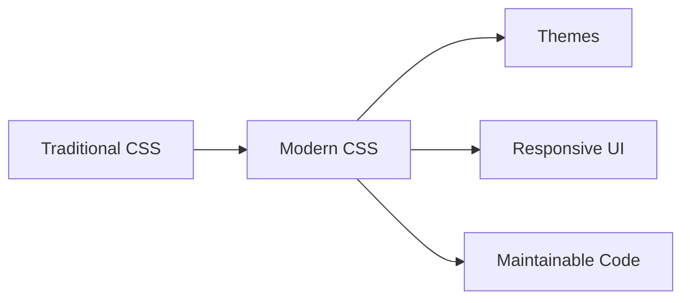
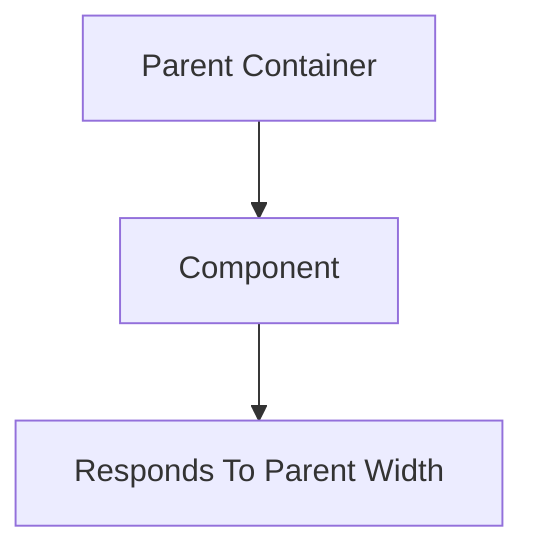

# CSS Variables & Modern Features

Modern CSS has evolved significantly. Features like **CSS Variables**,
**Container Queries**, **Logical Properties**, **Nesting**, and **Modern Color
Functions** help developers write cleaner, more maintainable, and scalable
stylesheets.

---

## Why Modern CSS Matters

Older CSS often led to:

❌ Repeated values

❌ Difficult theme management

❌ Large stylesheets

❌ Poor maintainability

Modern CSS solves these problems.

<!-- Visual flow for CSS Variables & Modern Features. -->


## CSS Variables (Custom Properties)

CSS Variables allow you to store reusable values.

Instead of repeating values:

❌

```css
.button {
  background: #2563eb;
}

.card {
  border-color: #2563eb;
}

.link {
  color: #2563eb;
}
```

✅

```css
:root {
  --primary-color: #2563eb;
}

.button {
  background: var(--primary-color);
}

.card {
  border-color: var(--primary-color);
}

.link {
  color: var(--primary-color);
}
```

## Variable Structure

Variable["--primary-color"]

Value["#2563eb"]

Usage["var(--primary-color)"]

Variable --> Value
    Variable --> Usage
```

```
## 🌍 Global Variables

Store variables in `:root`.

```css
:root {
  --primary: #2563eb;
  --secondary: #10b981;
  --danger: #ef4444;
}
```

Available everywhere.

## Component Variables

Variables can be scoped.

```css
.card {
  --card-padding: 20px;

padding: var(--card-padding);
}
```

Only available inside `.card`.

## Fallback Values

Useful when a variable doesn't exist.

```css
color: var(--text-color, black);
```

If `--text-color` is missing:

```text
black
```

will be used.

## 🌙 Theme Switching

One of the most common use cases.

## Light Theme

```css
:root {
  --bg: white;
  --text: black;
}
```

## Dark Theme

```css
.dark {
  --bg: #121212;
  --text: white;
}
```

## Usage

```css
body {
  background: var(--bg);
  color: var(--text);
}
```

## Theme Flow

Theme["Theme"]

Light["Light Mode"]

Dark["Dark Mode"]

Theme --> Light
    Theme --> Dark
```

```
## calc()

Perform calculations in CSS.

```css
.container {
  width: calc(100% - 40px);
}
```

## Example

```css
.sidebar {
  width: 250px;
}

.main {
  width: calc(100% - 250px);
}
```

## Calculation Flow

Full["100% Width"]

Minus["-250px"]

Result["Remaining Width"]

Full --> Minus --> Result
```

```
## clamp()

Responsive sizing made easy.

```css
font-size: clamp(1rem, 3vw, 2rem);
```

## Structure

```css
clamp(
  minimum,
  preferred,
  maximum
)
```

## Visualization

Min["1rem"]

Preferred["3vw"]

Max["2rem"]

Min --> Preferred --> Max
```

```
## 📱 Container Queries

Media Queries react to screen size.

Container Queries react to parent size.

## Traditional Media Query

```css
@media (min-width: 768px) {
  .card {
    display: flex;
  }
}
```

## Container Query

```css
.card-wrapper {
  container-type: inline-size;
}

@container (min-width: 500px) {
  .card {
    display: flex;
  }
}
```

## Container Query Concept

<!-- Visual flow for CSS Variables & Modern Features. -->


## CSS Nesting

Modern CSS now supports nesting.

## Before

```css
.card {
}

.card .title {
}

.card .button {
}
```

## After

```css
.card {
  .title {
    font-size: 20px;
  }

.button {
    background: blue;
  }
}
```

## Nesting Structure

Card[".card"]

Title[".title"]

Button[".button"]

Card --> Title
    Card --> Button
```

```
## 🌍 Logical Properties

Traditional properties assume left-to-right layouts.

## Traditional

```css
margin-left: 20px;
```

## Logical Property

```css
margin-inline-start: 20px;
```

Automatically adapts for:

- English
- Arabic
- Hebrew
- Japanese

## Logical Property Examples

| Traditional  | Logical              |
| ------------ | -------------------- |
| margin-left  | margin-inline-start  |
| margin-right | margin-inline-end    |
| padding-left | padding-inline-start |
| width        | inline-size          |
| height       | block-size           |

## Modern Color Functions

CSS now supports advanced color systems.

## rgb()

```css
color: rgb(255 0 0);
```

Modern syntax:

```css
color: rgb(255 0 0 / 50%);
```

## hsl()

```css
color: hsl(220deg 90% 56%);
```

## HSL Structure

H["Hue"]

S["Saturation"]

L["Lightness"]

H --> S --> L
```

```
## color-mix()

Mix colors directly in CSS.

```css
background: color-mix(in srgb, blue 70%, white 30%);
```

## Mixing Concept

Blue["Blue"]

White["White"]

Result["Mixed Color"]

Blue --> Result
    White --> Result
```

```
## aspect-ratio

Maintain proportions automatically.

## Square

```css
.card {
  aspect-ratio: 1;
}
```

## Video

```css
.video {
  aspect-ratio: 16 / 9;
}
```

Square["1:1"]

Wide["16:9"]

Portrait["9:16"]

Square --> Wide --> Portrait
```

```
## :is()

Reduce selector repetition.

```css
h1,
h2,
h3 {
  color: navy;
}
```

```css
:is(h1, h2, h3) {
  color: navy;
}
```

## :where()

Like `:is()` but adds zero specificity.

```css
:where(.card .title) {
  margin: 0;
}
```

Great for large projects.

## :has()

The long-awaited parent selector.

```css
.card:has(img) {
  padding: 20px;
}
```

## Concept

Card["Card"]

Image["Contains Image"]

Style["Apply Styles"]

Card --> Image --> Style
```

```
## Scroll-Driven Animations (Modern)

Animate based on scrolling.

```css
.progress {
  animation-timeline: scroll();
}
```

Creates advanced scroll effects without JavaScript.

## Accent Color

Style form controls easily.

```css
input {
  accent-color: #2563eb;
}
```

Changes:

✅ Checkbox color

✅ Radio color

✅ Range slider color

## Backdrop Filter

Creates glassmorphism effects.

```css
.glass {
  backdrop-filter: blur(15px);
}
```

## Glassmorphism Flow

Background["Background"]

Blur["Backdrop Blur"]

Glass["Glass Effect"]

Background --> Blur --> Glass
```

```
## Modern Responsive Card Example

```css
:root {
  --card-padding: 1rem;
  --card-radius: 12px;
}

.card {
  padding: var(--card-padding);

border-radius: var(--card-radius);

width: clamp(250px, 50vw, 400px);

aspect-ratio: 4 / 3;
}
```

Combines:

- Variables
- Clamp
- Aspect Ratio

## Overusing Variables

```css
--margin-small: 3px;
```

Not every value needs a variable.

## Deep Nesting

```css
.card {
  .header {
    .title {
      .icon {
      }
    }
  }
}
```

Hard to maintain.

## Ignoring Browser Support

Always verify support for:

- Container Queries
- :has()
- New Color Functions

## Quick Cheat Sheet

```css
:root {
  --primary: #2563eb;
}

color: var(--primary);

width: calc(100% - 200px);

font-size: clamp(1rem, 3vw, 2rem);

aspect-ratio: 16 / 9;

:is(h1, h2, h3) {
}

:where(.card) {
}

.card:has(img) {
}

container-type: inline-size;

backdrop-filter: blur(10px);

accent-color: #2563eb;
```

## ✅ Best Practices

- Store design tokens in CSS variables.
- Use `clamp()` for responsive typography.
- Prefer logical properties for internationalization.
- Use Container Queries for reusable components.
- Use nesting sparingly.
- Leverage modern selectors like `:is()` and `:has()`.
- Test browser support for newer features.

## Key Takeaways

- CSS Variables make styles reusable and maintainable.
- `calc()` and `clamp()` simplify responsive sizing.
- Container Queries allow components to respond to parent sizes.
- Modern selectors like `:is()`, `:where()`, and `:has()` reduce CSS complexity.
- Features like `aspect-ratio`, `accent-color`, and `backdrop-filter` make
  modern UI development easier.
- Modern CSS reduces the need for JavaScript and CSS preprocessors in many
  cases.
