# 🐛 Debugging Tools & Performance

Writing CSS is only half the job. The other half is **debugging issues** and **optimizing performance**.

Modern browsers provide powerful developer tools that help you inspect elements, analyze layouts, identify rendering issues, and improve website performance.

---

# 🎯 Why Debugging Matters

Common CSS problems:

❌ Styles not applying

❌ Layout breaking

❌ Overflow issues

❌ Specificity conflicts

❌ Slow rendering

❌ Large CSS bundles

---

## Debugging Workflow

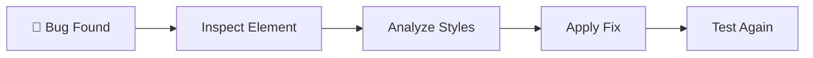

---

# 🛠️ Browser DevTools

Every modern browser includes developer tools.

Popular options:

| Browser | Tool                    |
| ------- | ----------------------- |
| Chrome  | Chrome DevTools         |
| Firefox | Firefox Developer Tools |
| Edge    | Edge DevTools           |
| Safari  | Safari Web Inspector    |

---

# Opening DevTools

### Windows

```text
F12
```

or

```text
Ctrl + Shift + I
```

---

### Mac

```text
Cmd + Option + I
```

---

# 🔍 Inspect Element

The most used debugging feature.

Right-click any element:

```text
Inspect
```

---

## What You Can See

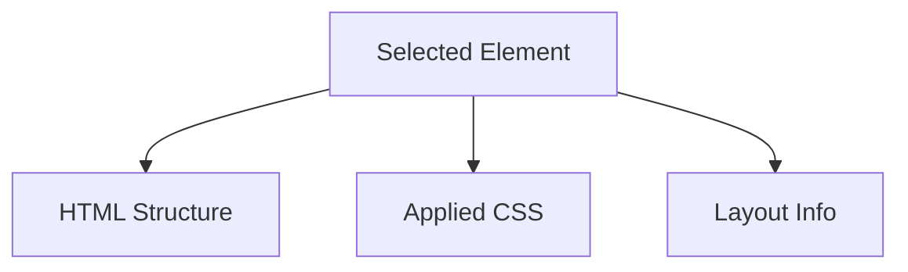

---

# Example

```html
<div class="card">
  Product
</div>
```

Inspecting reveals:

```css
.card {
  padding: 20px;
  background: white;
}
```

You can modify styles live.

---

# 🎨 Styles Panel

Shows:

✅ Applied styles

✅ Overridden styles

✅ Inherited styles

✅ Source file

---

## Specificity Example

```css
.card {
  color: blue;
}

#product {
  color: red;
}
```

DevTools shows:

```text
.card      ❌ overridden
#product   ✅ active
```

---

# CSS Cascade Visualization

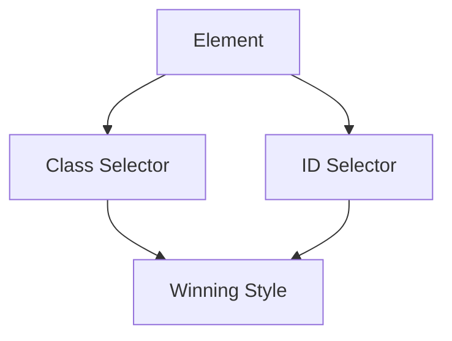

---

# 📦 Box Model Inspector

Visualizes:

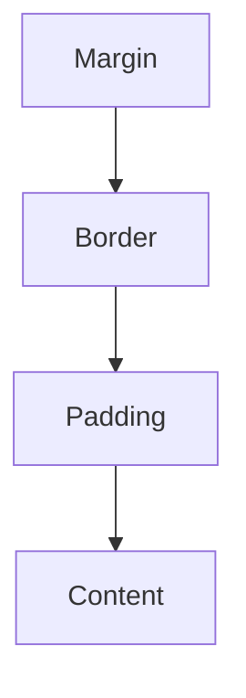

---

Example:

```css
.card {
  margin: 20px;
  padding: 16px;
  border: 1px solid black;
}
```

DevTools visually displays each layer.

---

# 📐 Debugging Flexbox

Chrome DevTools can visualize Flexbox layouts.

Example:

```css
.container {
  display: flex;
}
```

DevTools shows:

* Main Axis
* Cross Axis
* Alignment
* Flex Item Sizes

---

## Flexbox Visualization

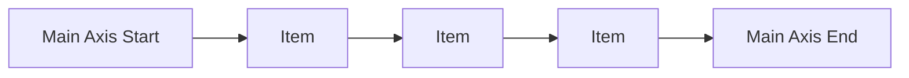

---

# ⬛ Debugging CSS Grid

DevTools can highlight:

* Grid lines
* Grid areas
* Row sizes
* Column sizes

---

## Grid Visualization

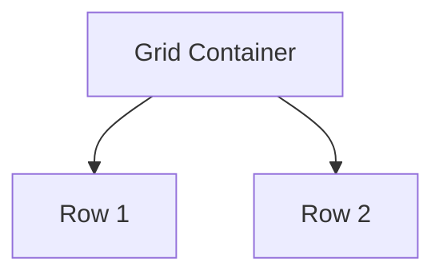

---

# 📱 Device Toolbar

Simulate:

* Mobile
* Tablet
* Desktop

---

## Responsive Testing

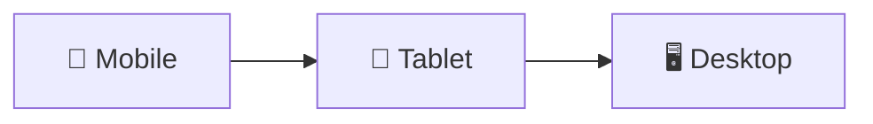

---

# Network Panel

Analyzes:

* CSS files
* Images
* Fonts
* Requests

---

## Performance Bottlenecks

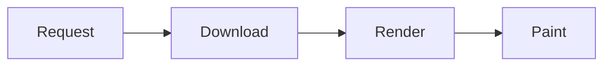

---

# Example

Large CSS file:

```text
styles.css
1.5MB
```

May slow page loading.

---

# 🎯 Lighthouse

Chrome's built-in auditing tool.

Provides scores for:

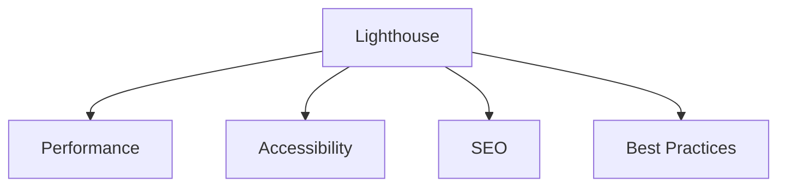

---

# Example Lighthouse Metrics

| Metric | Ideal   |
| ------ | ------- |
| FCP    | < 1.8s  |
| LCP    | < 2.5s  |
| CLS    | < 0.1   |
| INP    | < 200ms |

---

# 🎨 Paint Flashing

Shows what parts of the page repaint.

Useful for finding:

❌ Expensive animations

❌ Layout shifts

❌ Re-render issues

---

# Rendering Process

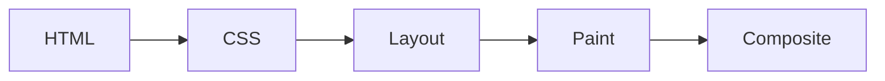

---

# ⚡ CSS Performance Basics

Good CSS improves rendering speed.

---

# Avoid Expensive Selectors

❌

```css
.sidebar ul li a span {
  color: red;
}
```

---

✅

```css
.sidebar-link {
  color: red;
}
```

---

## Selector Complexity

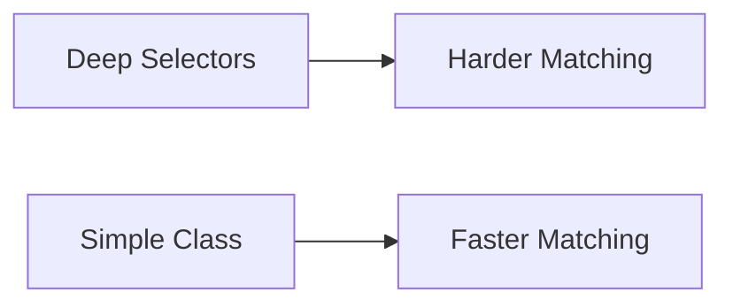

---

# Use Class Selectors

Prefer:

```css
.card {}
```

Instead of:

```css
#page .container ul li a {}
```

---

# 🎯 Reduce Repaints

Prefer animating:

✅ transform

✅ opacity

---

Avoid:

❌ width

❌ height

❌ margin

❌ left

❌ top

---

## Animation Performance

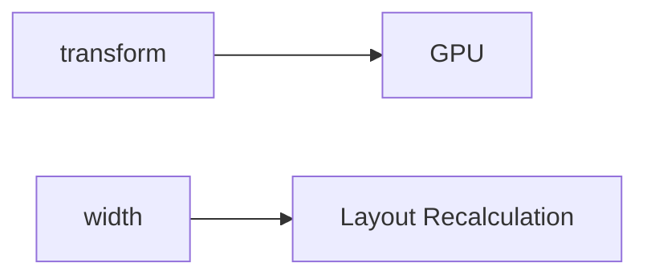

---

# 🎨 Minimize CSS File Size

Remove:

❌ Unused CSS

❌ Duplicate Rules

❌ Old Framework Code

---

# CSS Optimization Flow

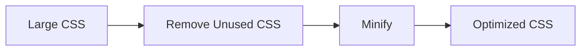

---

# 🗜️ Minification

Before:

```css
.card {
  padding: 20px;
  background: white;
}
```

After:

```css
.card{padding:20px;background:#fff}
```

Smaller file size.

---

# 🎯 Critical CSS

Load important styles first.

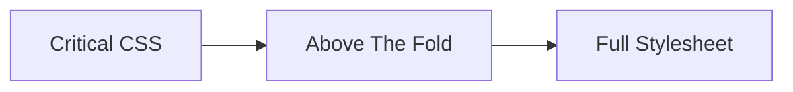

Improves perceived performance.

---

# 🖼️ Optimize Images

Large images affect CSS performance indirectly.

---

❌

```text
4000px Image
```

---

✅

```text
Responsive Image
```

Use:

```html

```

---

# 🎯 Font Performance

Use:

```css
font-display: swap;
```

Example:

```css
@font-face {
  font-family: "Inter";

  src: url("inter.woff2");

  font-display: swap;
}
```

---

# Performance Optimization Flow

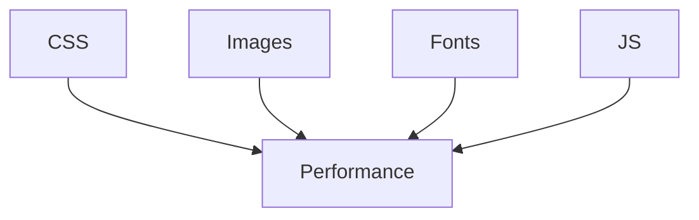

---

# 🎯 Detect Unused CSS

Chrome DevTools → Coverage Tab

Shows:

```text
Used CSS
Unused CSS
```

Helpful for cleanup.

---

# 🚀 CSS Containment

Improve rendering performance.

```css
.card {
  contain: layout;
}
```

Limits layout calculations.

---

# 🎯 will-change

Tell browser an element will animate.

```css
.card {
  will-change: transform;
}
```

Use sparingly.

---

# ⚠️ Common Debugging Techniques

---

## Add Temporary Border

```css
* {
  border: 1px solid red;
}
```

Find layout issues quickly.

---

## Highlight Overflow

```css
body {
  overflow-x: hidden;
}
```

Then inspect large elements.

---

## Find Missing Styles

Use DevTools → Computed Tab.

Shows final applied values.

---

# 🧠 Quick Cheat Sheet

```text
Inspect Element

Styles Panel

Computed Styles

Box Model

Flexbox Inspector

Grid Inspector

Device Toolbar

Network Tab

Lighthouse

Coverage Report
```

---

# ✅ Best Practices

* Use DevTools daily.
* Debug with the Styles panel first.
* Keep selectors simple.
* Optimize CSS bundle size.
* Use Lighthouse regularly.
* Prefer `transform` and `opacity` animations.
* Test responsive layouts on multiple screen sizes.
* Remove unused CSS before production.

---

# 🚀 Key Takeaways

* Browser DevTools are essential for CSS debugging.
* Inspect Element helps identify styling issues quickly.
* Lighthouse provides performance and accessibility audits.
* Simple selectors and optimized CSS improve rendering speed.
* Animating `transform` and `opacity` provides the best performance.
* Regular debugging and profiling lead to faster, more maintainable websites.
