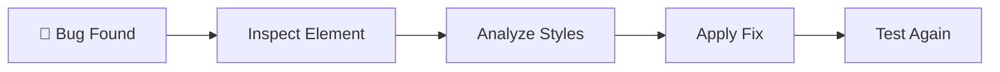
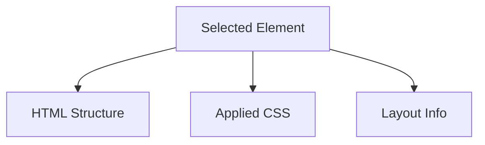

# 🐛 Debugging Tools & Performance

Writing CSS is only half the job. The other half is **debugging issues** and
**optimizing performance**.

Modern browsers provide powerful developer tools that help you inspect elements,
analyze layouts, identify rendering issues, and improve website performance.

---

## Why Debugging Matters

Common CSS problems:

❌ Styles not applying

❌ Layout breaking

❌ Overflow issues

❌ Specificity conflicts

❌ Slow rendering

❌ Large CSS bundles

## Debugging Workflow

<!-- Visual flow for 🐛 Debugging Tools & Performance. -->


## 🛠 Browser DevTools

Every modern browser includes developer tools.

Popular options:

| Browser | Tool                    |
| ------- | ----------------------- |
| Chrome  | Chrome DevTools         |
| Firefox | Firefox Developer Tools |
| Edge    | Edge DevTools           |
| Safari  | Safari Web Inspector    |

### Windows

// Example demonstrating 🐛 Debugging Tools & Performance.
```text
F12
```

or

// Example demonstrating 🐛 Debugging Tools & Performance.
```text
Ctrl + Shift + I
```

### Mac

// Example demonstrating 🐛 Debugging Tools & Performance.
```text
Cmd + Option + I
```

## Inspect Element

The most used debugging feature.

Right-click any element:

// Example demonstrating 🐛 Debugging Tools & Performance.
```text
Inspect
```

## What You Can See

<!-- Visual flow for 🐛 Debugging Tools & Performance. -->


## Example

<!-- Basic example showing the core idea. -->
```html
<div class="card">Product</div>
```

Inspecting reveals:

/* Basic example showing the core idea. */
```css
.card {
  padding: 20px;
  background: white;
}
```

You can modify styles live.

## Styles Panel

Shows:

✅ Applied styles

✅ Overridden styles

✅ Inherited styles

✅ Source file

## Specificity Example

/* Basic example showing the core idea. */
```css
.card {
  color: blue;
}

#product {
  color: red;
}
```

DevTools shows:

// Example demonstrating 🐛 Debugging Tools & Performance.
```text
.card      ❌ overridden
#product   ✅ active
```

## CSS Cascade Visualization

Element["Element"]

Class["Class Selector"]

ID["ID Selector"]

Result["Winning Style"]

Element --> Class
    Element --> ID

Class --> Result
    ID --> Result
// Example demonstrating 🐛 Debugging Tools & Performance.
```

## Box Model Inspector

Visualizes:

Margin

Border

Padding

Content

Margin --> Border
    Border --> Padding
    Padding --> Content
```

Example:

/* Basic example showing the core idea. */
```css
.card {
  margin: 20px;
  padding: 16px;
  border: 1px solid black;
}
```

DevTools visually displays each layer.

## 📐 Debugging Flexbox

Chrome DevTools can visualize Flexbox layouts.

/* Basic example showing the core idea. */
```css
.container {
  display: flex;
}
```

- Main Axis
- Cross Axis
- Alignment
- Flex Item Sizes

## Flexbox Visualization

Start["Main Axis Start"]

Item1["Item"]

Item2["Item"]

Item3["Item"]

End["Main Axis End"]

Start --> Item1 --> Item2 --> Item3 --> End
// Example demonstrating 🐛 Debugging Tools & Performance.
```

## ⬛ Debugging CSS Grid

DevTools can highlight:

- Grid lines
- Grid areas
- Row sizes
- Column sizes

## Grid Visualization

Grid["Grid Container"]

Row1["Row 1"]

Row2["Row 2"]

Grid --> Row1
    Grid --> Row2
```

## 📱 Device Toolbar

Simulate:

- Mobile
- Tablet
- Desktop

## Responsive Testing

Mobile["📱 Mobile"]

Tablet["📲 Tablet"]

Desktop["🖥️ Desktop"]

Mobile --> Tablet --> Desktop
// Example demonstrating 🐛 Debugging Tools & Performance.
```

## Network Panel

Analyzes:

- CSS files
- Images
- Fonts
- Requests

## Performance Bottlenecks

Request["Request"]

Download["Download"]

Render["Render"]

Paint["Paint"]

Request --> Download --> Render --> Paint
```

Large CSS file:

// Example demonstrating 🐛 Debugging Tools & Performance.
```text
styles.css
1.5MB
```

May slow page loading.

## Lighthouse

Chrome's built-in auditing tool.

Provides scores for:

Lighthouse

Performance

Accessibility

SEO

BestPractices["Best Practices"]

Lighthouse --> Performance
    Lighthouse --> Accessibility
    Lighthouse --> SEO
    Lighthouse --> BestPractices
// Example demonstrating 🐛 Debugging Tools & Performance.
```

## Example Lighthouse Metrics

| Metric | Ideal   |
| ------ | ------- |
| FCP    | < 1.8s  |
| LCP    | < 2.5s  |
| CLS    | < 0.1   |
| INP    | < 200ms |

## Paint Flashing

Shows what parts of the page repaint.

Useful for finding:

❌ Expensive animations

❌ Layout shifts

❌ Re-render issues

## Rendering Process

HTML

CSS

Layout

Paint

Composite

HTML --> CSS --> Layout --> Paint --> Composite
```

## CSS Performance Basics

Good CSS improves rendering speed.

## Avoid Expensive Selectors

❌

/* Basic example showing the core idea. */
```css
.sidebar ul li a span {
  color: red;
}
```

✅

/* Basic example showing the core idea. */
```css
.sidebar-link {
  color: red;
}
```

## Selector Complexity

Deep["Deep Selectors"]

Slow["Harder Matching"]

Class["Simple Class"]

Fast["Faster Matching"]

Deep --> Slow
    Class --> Fast
// Example demonstrating 🐛 Debugging Tools & Performance.
```

## Use Class Selectors

Prefer:

```css
.card {
}
// Example demonstrating 🐛 Debugging Tools & Performance.
```

Instead of:

```css
#page .container ul li a {
}
// Example demonstrating 🐛 Debugging Tools & Performance.
```

## Reduce Repaints

Prefer animating:

✅ transform

✅ opacity

Avoid:

❌ width

❌ height

❌ margin

❌ left

❌ top

## Animation Performance

Transform["transform"]

GPU["GPU"]

Width["width"]

Layout["Layout Recalculation"]

Transform --> GPU
    Width --> Layout
```

## Minimize CSS File Size

Remove:

❌ Unused CSS

❌ Duplicate Rules

❌ Old Framework Code

## CSS Optimization Flow

Large["Large CSS"]

Purge["Remove Unused CSS"]

Minify["Minify"]

Small["Optimized CSS"]

Large --> Purge --> Minify --> Small
// Example demonstrating 🐛 Debugging Tools & Performance.
```

## 🗜 Minification

Before:

After:

```css
.card {
  padding: 20px;
  background: #fff;
}
// Example demonstrating 🐛 Debugging Tools & Performance.
```

Smaller file size.

## Critical CSS

Load important styles first.

Critical["Critical CSS"]

AboveFold["Above The Fold"]

Full["Full Stylesheet"]

Critical --> AboveFold
    AboveFold --> Full
```

Improves perceived performance.

## 🖼 Optimize Images

Large images affect CSS performance indirectly.

// Example demonstrating 🐛 Debugging Tools & Performance.
```text
4000px Image
```

// Example demonstrating 🐛 Debugging Tools & Performance.
```text
Responsive Image
```

Use:

<!-- Basic example showing the core idea. -->
```html

```

## Font Performance

/* Basic example showing the core idea. */
```css
font-display: swap;
```

/* Basic example showing the core idea. */
```css
@font-face {
  font-family: 'Inter';

src: url('inter.woff2');

font-display: swap;
}
```

## Performance Optimization Flow

Images

Fonts

JS

CSS --> Performance
    Images --> Performance
    Fonts --> Performance
    JS --> Performance
// Example demonstrating 🐛 Debugging Tools & Performance.
```

## Detect Unused CSS

Chrome DevTools → Coverage Tab

```text
Used CSS
Unused CSS
// Example demonstrating 🐛 Debugging Tools & Performance.
```

Helpful for cleanup.

## CSS Containment

Improve rendering performance.

```css
.card {
  contain: layout;
}
// Example demonstrating 🐛 Debugging Tools & Performance.
```

Limits layout calculations.

## will-change

Tell browser an element will animate.

```css
.card {
  will-change: transform;
}
// Example demonstrating 🐛 Debugging Tools & Performance.
```

Use sparingly.

## Add Temporary Border

```css
* {
  border: 1px solid red;
}
// Example demonstrating 🐛 Debugging Tools & Performance.
```

Find layout issues quickly.

## Highlight Overflow

```css
body {
  overflow-x: hidden;
}
// Example demonstrating 🐛 Debugging Tools & Performance.
```

Then inspect large elements.

## Find Missing Styles

Use DevTools → Computed Tab.

Shows final applied values.

## Quick Cheat Sheet

```text
Inspect Element

Styles Panel

Computed Styles

Box Model

Flexbox Inspector

Grid Inspector

Device Toolbar

Network Tab

Coverage Report
// Example demonstrating 🐛 Debugging Tools & Performance.
```

## ✅ Best Practices

- Use DevTools daily.
- Debug with the Styles panel first.
- Keep selectors simple.
- Optimize CSS bundle size.
- Use Lighthouse regularly.
- Prefer `transform` and `opacity` animations.
- Test responsive layouts on multiple screen sizes.
- Remove unused CSS before production.

## Key Takeaways

- Browser DevTools are essential for CSS debugging.
- Inspect Element helps identify styling issues quickly.
- Lighthouse provides performance and accessibility audits.
- Simple selectors and optimized CSS improve rendering speed.
- Animating `transform` and `opacity` provides the best performance.
- Regular debugging and profiling lead to faster, more maintainable websites.
