# 🎭 CSS Filters & Blend Modes

CSS Filters and Blend Modes allow you to create powerful visual effects directly
in CSS without using image editing software.

You can:

✅ Blur images

✅ Adjust brightness

✅ Create grayscale effects

✅ Add shadows

✅ Blend colors and images

✅ Create modern UI effects

---

# 🎯 What Are CSS Filters?

Filters modify the visual appearance of an element.

Think of filters like Instagram photo effects applied through CSS.

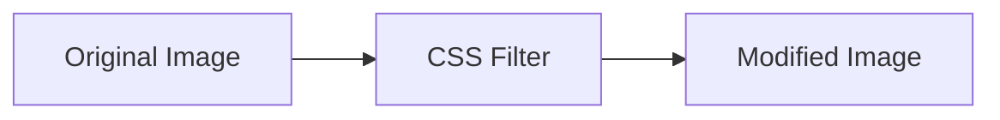

---

# 📦 Filter Syntax

```css
.element {
  filter: value;
}
```

Example:

```css
/* Blur effect */
img {
  filter: blur(5px);
}
```

---

# 🎨 Available CSS Filters

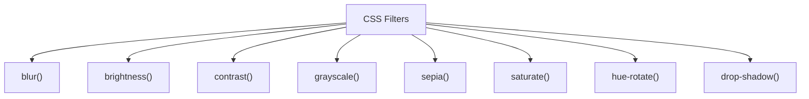

---

# 🌫️ blur()

Blurs an element.

```css
img {
  filter: blur(5px);
}
```

---

## Blur Visualization

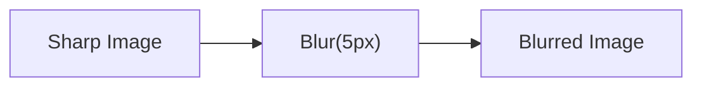

---

# ☀️ brightness()

Adjusts brightness.

---

## Increase Brightness

```css
img {
  filter: brightness(150%);
}
```

---

## Decrease Brightness

```css
img {
  filter: brightness(50%);
}
```

---

## Brightness Levels

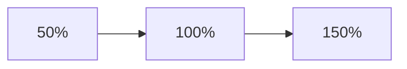

---

# 🎯 contrast()

Controls contrast.

```css
img {
  filter: contrast(200%);
}
```

Higher contrast makes dark colors darker and light colors lighter.

---

# ⚫ grayscale()

Converts image to black and white.

```css
img {
  filter: grayscale(100%);
}
```

---

## Hover Effect

```css
img {
  filter: grayscale(100%);
  transition: filter 0.3s;
}

img:hover {
  filter: grayscale(0%);
}
```

Popular portfolio effect.

---

## Grayscale Flow

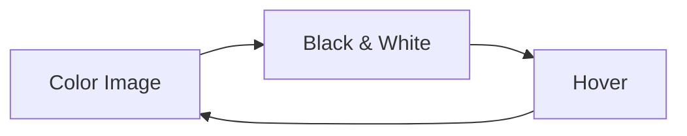

---

# 🟤 sepia()

Creates vintage photo effect.

```css
img {
  filter: sepia(100%);
}
```

---

## Sepia Effect

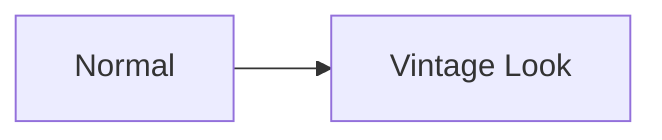

---

# 🌈 saturate()

Controls color intensity.

---

## Increase Saturation

```css
img {
  filter: saturate(200%);
}
```

---

## Decrease Saturation

```css
img {
  filter: saturate(50%);
}
```

---

# 🎨 hue-rotate()

Shifts colors around the color wheel.

```css
img {
  filter: hue-rotate(90deg);
}
```

---

## Hue Rotation Concept

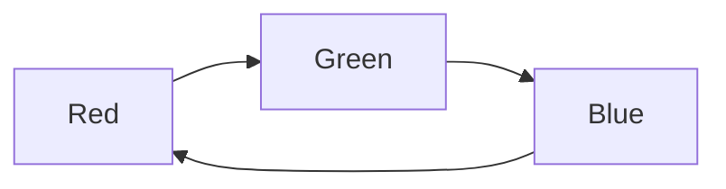

---

# 🌑 invert()

Inverts colors.

```css
img {
  filter: invert(100%);
}
```

---

# Dark Mode Trick

```css
.dark-logo {
  filter: invert(1);
}
```

Useful for logos in dark themes.

---

# 💨 opacity()

Changes transparency.

```css
img {
  filter: opacity(50%);
}
```

---

# 🌟 drop-shadow()

Creates shadows following the element shape.

```css
img {
  filter: drop-shadow(5px 5px 10px rgba(0, 0, 0, 0.3));
}
```

---

# Difference from box-shadow

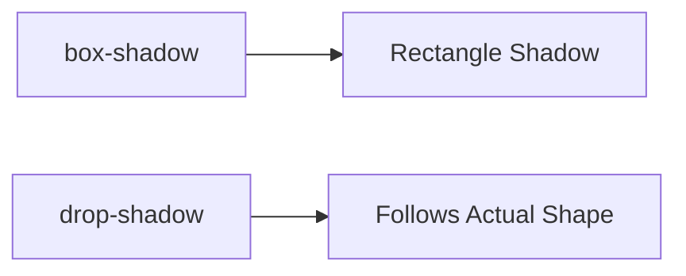

---

# 🎯 Multiple Filters

Filters can be combined.

```css
img {
  filter: brightness(120%) contrast(110%) saturate(150%);
}
```

---

## Processing Flow

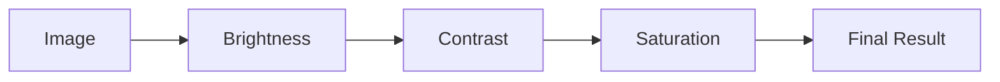

---

# 🎨 Real-World Card Hover Effect

```css
.card img {
  transition: filter 0.3s;
}

.card:hover img {
  filter: brightness(110%) saturate(120%);
}
```

Makes images look more vibrant on hover.

---

# 🎭 What Are Blend Modes?

Blend Modes determine how layers interact visually.

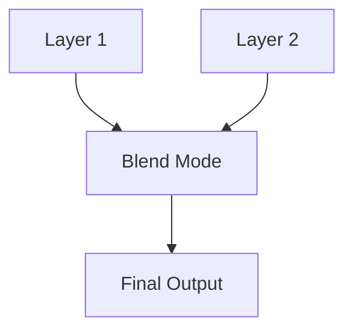

---

# Types of Blend Modes

There are two main CSS properties:

```css
mix-blend-mode
background-blend-mode
```

---

# 🎯 mix-blend-mode

Blends an element with content behind it.

```css
.text {
  mix-blend-mode: multiply;
}
```

---

## Blend Layer Concept

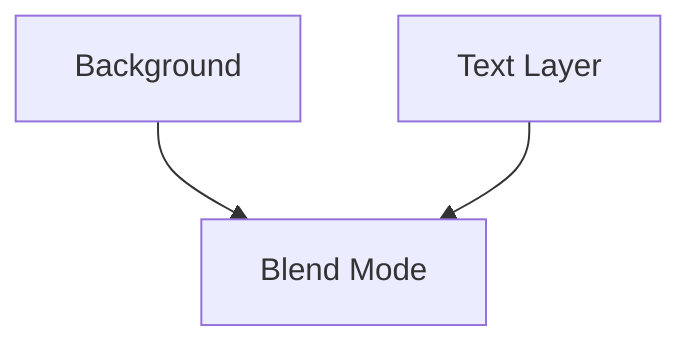

---

# Common Blend Modes

| Blend Mode | Effect               |
| ---------- | -------------------- |
| normal     | Default              |
| multiply   | Darkens              |
| screen     | Lightens             |
| overlay    | High contrast        |
| darken     | Keeps darker colors  |
| lighten    | Keeps lighter colors |
| difference | Inverts overlap      |
| exclusion  | Softer difference    |

---

# multiply

Darkens overlapping areas.

```css
.element {
  mix-blend-mode: multiply;
}
```

---

## Multiply Concept

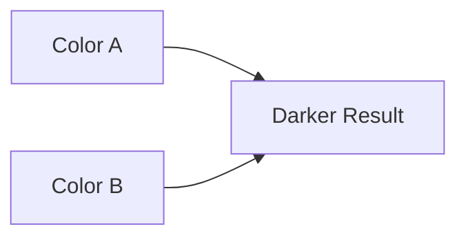

---

# screen

Lightens overlapping areas.

```css
.element {
  mix-blend-mode: screen;
}
```

---

## Screen Concept

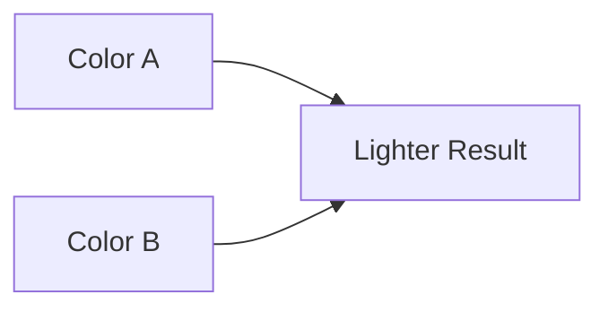

---

# overlay

Combines multiply and screen.

```css
.element {
  mix-blend-mode: overlay;
}
```

Produces vibrant, high-contrast results.

---

# 🎨 background-blend-mode

Blends background layers.

---

## Example

```css
.hero {
  background-image: linear-gradient(rgba(0, 0, 0, 0.5), rgba(0, 0, 0, 0.5)),
    url(hero.jpg);

  background-blend-mode: multiply;
}
```

---

## Background Layer Flow

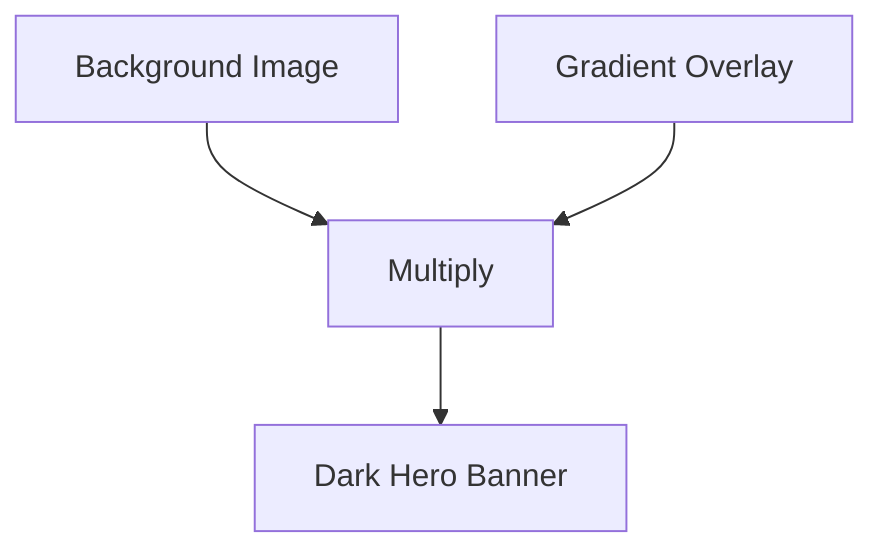

---

# 🌅 Hero Banner Example

```html
<section class="hero">
  <h1>Welcome</h1>
</section>
```

```css
.hero {
  height: 500px;

  background: linear-gradient(rgba(0, 0, 0, 0.5), rgba(0, 0, 0, 0.5)),
    url(hero.jpg);

  background-size: cover;

  background-blend-mode: multiply;
}
```

Very common on landing pages.

---

# 🚀 Glassmorphism Effect

Modern UI trend.

```css
.card {
  backdrop-filter: blur(15px);

  background: rgba(255, 255, 255, 0.15);

  border: 1px solid rgba(255, 255, 255, 0.2);
}
```

---

## Glassmorphism Flow

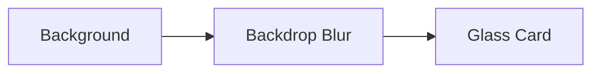

---

# 🌈 Neon Glow Effect

```css
.logo {
  filter: drop-shadow(0 0 10px cyan);
}
```

---

# 🎯 Image Hover Gallery

```css
.gallery img {
  filter: grayscale(100%);

  transition: filter 0.3s, transform 0.3s;
}

.gallery img:hover {
  filter: grayscale(0);

  transform: scale(1.05);
}
```

Creates an engaging gallery experience.

---

# ⚡ Performance Considerations

Filters can be expensive.

Especially:

❌ blur()

❌ backdrop-filter

❌ multiple large shadows

---

## Performance Ranking

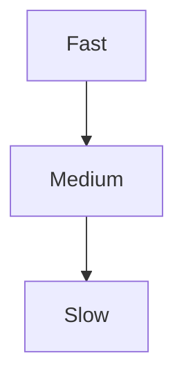

Typical order:

```text
opacity
brightness
contrast
grayscale
drop-shadow
blur
backdrop-filter
```

---

# ⚠️ Common Mistakes

---

## Excessive Blur

❌

```css
filter: blur(50px);
```

May hurt performance.

---

## Too Many Filters

❌

```css
filter: brightness(120%) contrast(130%) saturate(180%) hue-rotate(120deg) blur(5px);
```

Can look unnatural.

---

## Overusing Blend Modes

Not all blend modes behave consistently across designs.

Always test visually.

---

# 🧠 Quick Cheat Sheet

```css
filter: blur(5px);

filter: brightness(120%);

filter: contrast(150%);

filter: grayscale(100%);

filter: sepia(100%);

filter: saturate(200%);

filter: hue-rotate(90deg);

filter: invert(100%);

filter: opacity(50%);

filter: drop-shadow(5px 5px 10px rgba(0, 0, 0, 0.3));

mix-blend-mode: multiply;

background-blend-mode: overlay;

backdrop-filter: blur(15px);
```

---

# ✅ Best Practices

- Use filters sparingly.
- Keep blur values reasonable.
- Combine filters thoughtfully.
- Use `drop-shadow()` for transparent images.
- Use blend modes for creative visual effects.
- Test performance on mobile devices.
- Avoid stacking too many effects.

---

# 🚀 Key Takeaways

- CSS Filters modify the visual appearance of elements.
- Common filters include `blur()`, `grayscale()`, `brightness()`, and
  `drop-shadow()`.
- Blend Modes control how layers interact.
- `mix-blend-mode` affects elements, while `background-blend-mode` affects
  background layers.
- `backdrop-filter` enables modern glassmorphism effects.
- Filters and blend modes can create stunning visuals without external image
  editing tools.
