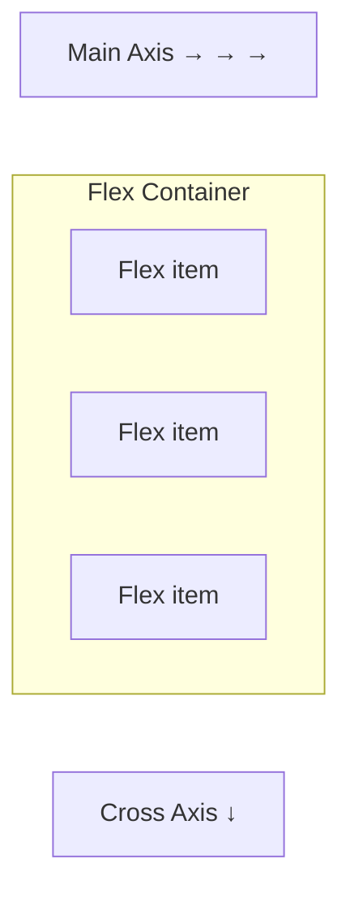

# 🔲 Flexbox

**Flexbox (Flexible Box Layout)** is a one-dimensional layout system that makes it easy to align, distribute, and space items inside a container.

Before Flexbox, creating layouts often required floats, positioning hacks, or complex CSS. Flexbox simplifies all of that.

---

# 🎯 Why Use Flexbox?

Flexbox helps you:

✅ Center elements easily

✅ Create responsive layouts

✅ Distribute space automatically

✅ Align items vertically and horizontally

✅ Reorder elements without changing HTML

---

# 🏗️ Flex Container and Flex Items

To use Flexbox, set a container's display to `flex`.

```html
<div class="container">
  <div class="item">1</div>
  <div class="item">2</div>
  <div class="item">3</div>
</div>
```

```css
/* Create a flex container */
.container {
  display: flex;
}
```

The parent becomes a **flex container**, and its children become **flex items**.

---

# 📏 Main Axis and Cross Axis

Flexbox works using two axes:



By default:

* Main Axis → Horizontal
* Cross Axis → Vertical

---

# ➡️ flex-direction

Controls the direction of flex items.

```css
.container {
  display: flex;
  flex-direction: row;
}
```

---

## row (Default)

```css
.container {
  flex-direction: row;
}
```

```text
1  2  3
```

---

## row-reverse

```css
.container {
  flex-direction: row-reverse;
}
```

```text
3  2  1
```

---

## column

```css
.container {
  flex-direction: column;
}
```

```text
1
2
3
```

---

## column-reverse

```css
.container {
  flex-direction: column-reverse;
}
```

```text
3
2
1
```

---

# 📦 justify-content

Aligns items along the **main axis**.

```css
.container {
  justify-content: center;
}
```

---

## center

```text
     1 2 3
```

---

## flex-start

```text
1 2 3
```

---

## flex-end

```text
          1 2 3
```

---

## space-between

```text
1      2      3
```

---

## space-around

```text
 1    2    3
```

---

## space-evenly

```text
  1   2   3
```

Equal spacing everywhere.

---

# 🎯 align-items

Aligns items on the **cross axis**.

```css
.container {
  align-items: center;
}
```

---

## flex-start

```text
1
2
3
```

(top aligned)

---

## center

```text
   1
   2
   3
```

(vertical center)

---

## flex-end

```text
       1
       2
       3
```

(bottom aligned)

---

## stretch (Default)

Items stretch to fill the container height.

```css
.container {
  align-items: stretch;
}
```

---

# 🎯 Perfect Centering

One of Flexbox's most popular use cases.

```css
/* Center content both horizontally and vertically */
.container {
  display: flex;
  justify-content: center;
  align-items: center;

  height: 100vh;
}
```

---

# 🔄 flex-wrap

Controls whether items wrap onto new lines.

---

## nowrap (Default)

```css
.container {
  flex-wrap: nowrap;
}
```

Items stay on one line.

---

## wrap

```css
.container {
  flex-wrap: wrap;
}
```

Items move to a new line if necessary.

---

## wrap-reverse

```css
.container {
  flex-wrap: wrap-reverse;
}
```

Wraps in reverse order.

---

# 🧩 gap

Adds spacing between flex items.

```css
.container {
  display: flex;
  gap: 20px;
}
```

Better than using margins.

---

# 📈 flex-grow

Controls how items expand.

```css
.item {
  flex-grow: 1;
}
```

Example:

```css
.item1 {
  flex-grow: 1;
}

.item2 {
  flex-grow: 2;
}
```

Result:

```text
Item 2 is twice as wide as Item 1
```

---

# 📉 flex-shrink

Controls how items shrink.

```css
.item {
  flex-shrink: 1;
}
```

Default value is `1`.

---

# 📏 flex-basis

Defines the initial size of an item.

```css
.item {
  flex-basis: 200px;
}
```

---

# 🚀 The flex Shorthand

Instead of:

```css
.item {
  flex-grow: 1;
  flex-shrink: 1;
  flex-basis: 0;
}
```

Use:

```css
.item {
  flex: 1;
}
```

Very common in layouts.

---

# 🔢 order

Changes visual order without changing HTML.

```css
.item1 {
  order: 3;
}

.item2 {
  order: 1;
}

.item3 {
  order: 2;
}
```

Display order:

```text
Item2
Item3
Item1
```

---

# 🎯 align-self

Overrides alignment for a single item.

```css
.item {
  align-self: flex-end;
}
```

Only that item moves.

---

# 🧩 Responsive Navigation Example

```html
<nav class="navbar">
  <div>Logo</div>
  <div>Menu</div>
</nav>
```

```css
/* Responsive navbar using Flexbox */
.navbar {
  display: flex;
  justify-content: space-between;
  align-items: center;
}
```

Result:

```text
Logo                    Menu
```

---

# 🛒 Product Card Layout

```html
<div class="card">
  
  <h3>Product Name</h3>
  <button>Buy Now</button>
</div>
```

```css
/* Vertical card layout */
.card {
  display: flex;
  flex-direction: column;
  gap: 10px;
}
```

---

# 📱 Responsive Row Layout

```css
/* Responsive flex layout */
.container {
  display: flex;
  flex-wrap: wrap;
  gap: 20px;
}

.item {
  flex: 1 1 300px;
}
```

Each item:

* Grows
* Shrinks
* Starts at 300px

---

# 🧠 Quick Cheat Sheet

```css
display: flex;

flex-direction: row;
flex-direction: column;

justify-content: center;
align-items: center;

flex-wrap: wrap;

gap: 20px;

flex: 1;

order: 1;

align-self: center;
```

---

# ⚠️ Common Mistakes

### Forgetting `display: flex`

```css
.container {
  justify-content: center;
}
```

Won't work.

You must use:

```css
.container {
  display: flex;
}
```

---

### Using Margins Instead of Gap

❌

```css
.item {
  margin-right: 20px;
}
```

✅

```css
.container {
  gap: 20px;
}
```

---

### Mixing Up Axes

Remember:

```text
justify-content → Main Axis
align-items     → Cross Axis
```

---

# ✅ Best Practices

* Use Flexbox for one-dimensional layouts.
* Use `gap` instead of margins for spacing.
* Prefer `flex: 1` for equal-width items.
* Use `wrap` for responsive layouts.
* Combine Flexbox with media queries for mobile support.

---

# 🚀 Key Takeaways

* Flexbox is designed for one-dimensional layouts.
* `justify-content` controls the main axis.
* `align-items` controls the cross axis.
* `gap` creates clean spacing.
* `flex-grow`, `flex-shrink`, and `flex-basis` control sizing.
* Flexbox makes alignment and responsiveness much easier.

