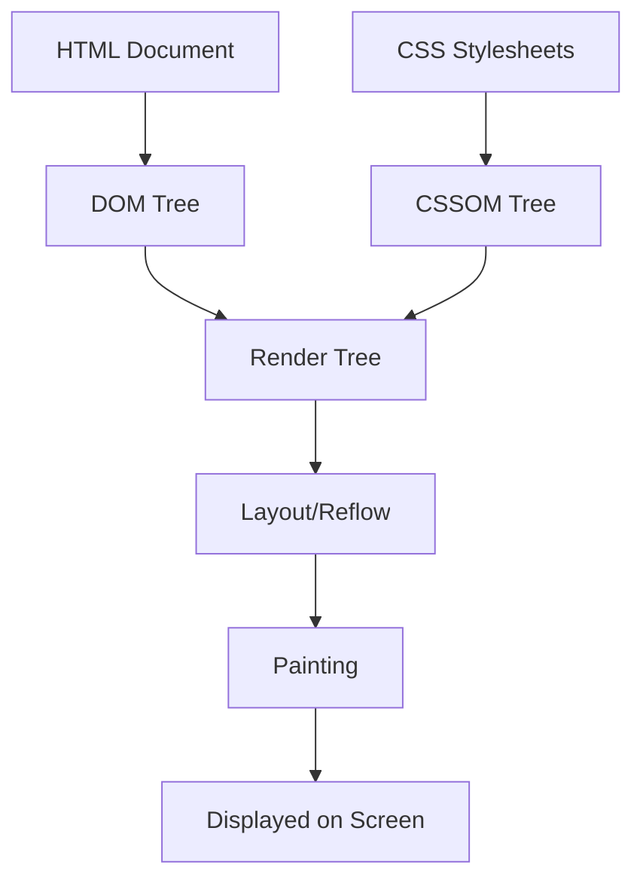

# A Comprehensive Guide to CSS

In the early days of the web, the internet was a sea of black text on gray
backgrounds. **CSS (Cascading Style Sheets)** changed everything. It transformed
the web from a collection of dry documents into a rich, visual medium. Today,
CSS is the language that defines the "look and feel" of every website you visit.

---

### What it is

CSS is a stylesheet language used to describe the presentation of a document
written in HTML. While HTML provides the **structure** (the bones), CSS provides
the **style** (the skin, clothes, and makeup).

### Why it matters

Separation of concerns is the golden rule of web development. By keeping styles
in CSS and structure in HTML, developers can update the entire look of a
1,000-page website by changing just one CSS file. It ensures consistency,
accessibility, and professional aesthetics.

### Where it is used

Everywhere there is a browser. From landing pages and complex web applications
(like Gmail or Facebook) to hybrid mobile apps and even some desktop software
interfaces.

## 2. Core Concepts & Breakdown

To master CSS, you must understand the "Rules of the Game."

### The Box Model

- **Definition:** Every element in CSS is treated as a rectangular box. The
  model consists of four parts: Content, Padding, Border, and Margin.
- **Why it exists:** It allows browsers to calculate the exact space an element
  occupies and how it interacts with its neighbors.
- **Where it is used:** Essential for spacing out text, creating buttons with
  internal breathing room, and defining the distance between sections.

### Specificity and the Cascade

- **Definition:** The "Cascading" in CSS refers to the order of priority. If two
  rules conflict, the browser uses Specificity (a weight system) and Source
  Order to decide which wins.
- **Why it exists:** It prevents chaos. Without it, the browser wouldn't know
  whether to make a button red or blue if both instructions existed.
- **Where it is used:** Managing large stylesheets where global styles (like
  "all buttons are blue") need to be overridden for specific cases (like "the
  delete button is red").

### Flexbox (Flexible Box Layout)

- **Definition:** A one-dimensional layout method for arranging items in rows or
  columns.
- **Why it exists:** Before Flexbox, aligning items vertically or distributing
  space evenly was a nightmare involving "hacks." Flexbox makes alignment
  intuitive.
- **Where it is used:** Navigation bars, centering items perfectly in the middle
  of a screen, and creating responsive sidebars.

### CSS Grid

- **Definition:** A two-dimensional layout system (rows AND columns
  simultaneously).
- **Why it exists:** While Flexbox handles lines, Grid handles the entire page
  layout. It allows for complex "magazine-style" designs that were previously
  impossible.
- **Where it is used:** Full-page layouts, photo galleries, and dashboard
  interfaces.

## 3. Visual Understanding: The Rendering Flow

Understanding how CSS is applied helps in debugging layout shifts.

<!-- Visual flow for A Comprehensive Guide to CSS. -->


## 4. Practical Examples

Let's look at how we build a modern, responsive card component.

### The Code (React/JSX Style)

// Example demonstrating A Comprehensive Guide to CSS.
```jsx
// Card.js
const Card = () => {
  return (
    <div className="card-container">
      <div className="card">
        <h2 className="card-title">CSS Mastery</h2>
        <p className="card-text">Learn how to style the web with precision.</p>
        <button className="card-btn">Get Started</button>
      </div>
    </div>
  );
};

/* CSS Styles */
/*
.card-container {
  display: flex;             /* 1. Flexbox for centering */
  justify-content: center;
  align-items: center;
  min-height: 300px;
}

.card {
  width: 300px;
  padding: 20px;             /* 2. Box Model: Inner space */
  border-radius: 12px;
  box-shadow: 0 4px 15px rgba(0,0,0,0.1);
  transition: transform 0.3s; /* 3. Animation for interactivity */
}

.card:hover {
  transform: translateY(-5px); /* 4. State change */
}

.card-btn {
  background-color: #007bff;
  color: white;
  border: none;
  padding: 10px 20px;
  cursor: pointer;
}
*/
```

### Explanation & Best Practices

- **Step 1:** We use `display: flex` on the container to center the card. This
  is much cleaner than using margins.
- **Step 2:** `padding` provides breathing room for the text so it doesn't touch
  the borders.
- **Step 3:** `transition` and `transform` add "polish." Small movements make a
  UI feel alive.
- **Best Practice:** Always use **Classes** (`.card`) instead of **IDs**
  (`#card`) for styling. Classes are reusable; IDs are too specific and cause
  "specificity wars."
- **Common Mistake:** Using fixed widths (e.g., `width: 500px`). This breaks on
  mobile. Use `max-width: 100%` or `clamp()` instead.

## 5. Tools & Ecosystem

| Tool                | What it is                 | Why it is used                                                                                       |
| :------------------ | :------------------------- | :--------------------------------------------------------------------------------------------------- |
| **Sass / SCSS**     | A CSS Preprocessor         | Adds variables, nesting, and functions to CSS to make code more maintainable.                        |
| **Tailwind CSS**    | A Utility-first framework  | Allows you to style elements by applying pre-defined classes directly in HTML. Fast for prototyping. |
| **PostCSS**         | A JS-based CSS transformer | Automatically adds "vendor prefixes" (like `-webkit-`) so your CSS works in older browsers.          |
| **Chrome DevTools** | Browser debugging tool     | Essential for inspecting elements, changing colors in real-time, and debugging the Box Model.        |

## 6. Performance & Optimization

Large CSS files slow down the "Time to First Paint." If your CSS is messy, the
user stares at a white screen longer.

- **Critical CSS:** Identify the styles needed for the "above-the-fold" content
  and load them first.
- **Minification:** Use tools to remove whitespace and comments from your
  production CSS files.
- **Avoid `@import`:** Using `@import` inside a CSS file creates a "waterfall"
  effect, delaying the download of secondary files. Link them in HTML instead.

## 7. Actionable Tips for Developers

1.  **Mobile First:** Write your styles for mobile screens first, then use Media
    Queries to add complexity for desktop. It’s easier to add styles than to
    subtract them.
2.  **Use CSS Variables:** Define colors like `--primary-blue: #007bff;`. If the
    branding changes, you only change one line of code.
3.  **Learn Flexbox deeply:** 90% of your daily layout tasks can be solved with
    a solid understanding of Flexbox.
4.  **Check Browser Support:** Use [CanIUse.com](https://caniuse.com) before
    using a brand-new CSS feature to ensure your users aren't seeing a broken
    site.

## 8. Conclusion

CSS is more than just colors and fonts; it is a powerful engine for layout,
animation, and user experience. By mastering the **Box Model**, the **Cascade**,
and modern tools like **Flexbox** and **Grid**, you move from "making things
look okay" to "building professional-grade interfaces."

**What to learn next?** Explore **CSS Animations** to add motion, or dive into
**Tailwind CSS** to speed up your professional workflow. The web is your
canvas—start painting!

## Quick Reference

| Area | Revision point |
|---|---|
| Definition | State exactly what the topic means. |
| Mechanism | Explain the steps that produce the result. |
| Example | Use a small realistic case. |
| Pitfalls | Know common mistakes and boundary cases. |
