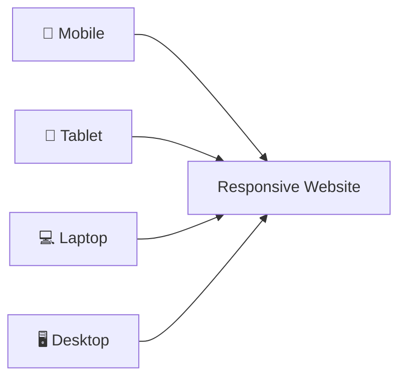
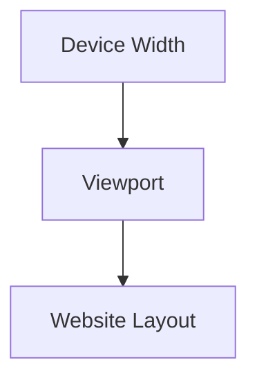
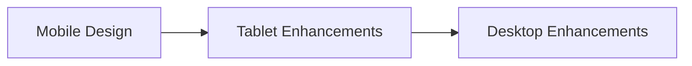
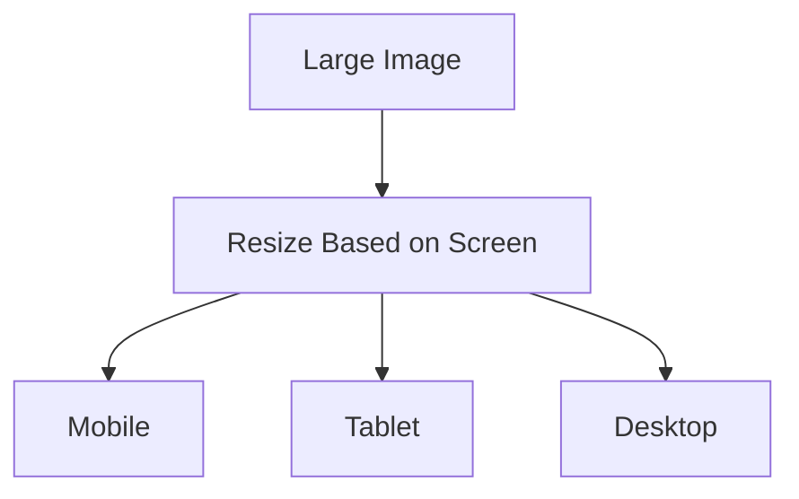
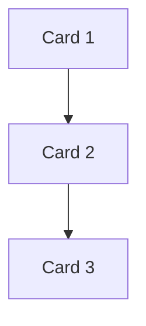
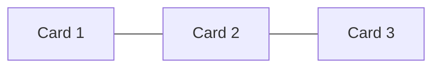
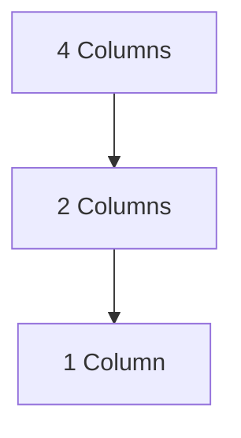
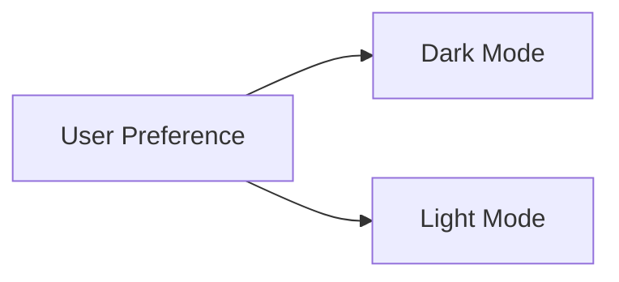

# 📱 Responsive Design & Media Queries

Modern websites must look great on **phones, tablets, laptops, desktops, TVs,
and even foldable devices**.

Responsive Design is the practice of creating websites that automatically adapt
to different screen sizes and devices.

---

## What is Responsive Design?

Responsive Design allows a single website to adjust its layout, typography,
images, and spacing based on the screen size.

Instead of creating separate websites:

❌ Mobile Website

❌ Tablet Website

❌ Desktop Website

You create:

✅ One Responsive Website

## 🌍 Why Responsive Design Matters

Today users browse from many devices.

<!-- Visual flow for 📱 Responsive Design & Media Queries. -->


Benefits:

✅ Better User Experience

✅ Faster Development

✅ Easier Maintenance

✅ Improved SEO

✅ Higher Conversion Rates

## 📐 The Viewport Meta Tag

The first step of responsive design.

```html
<!-- Responsive viewport -->
<meta name="viewport" content="width=device-width, initial-scale=1.0" />
```

## What It Does

<!-- Visual flow for 📱 Responsive Design & Media Queries. -->


Without this tag:

❌ Mobile browsers may zoom out

❌ Layouts appear tiny

## What Are Media Queries?

Media Queries allow CSS to apply different styles based on screen size.

```css
/* Media Query Example */
@media (max-width: 768px) {
  body {
    background: lightblue;
  }
}
```

When screen width becomes 768px or smaller, the styles are applied.

## 📏 Common Breakpoints

There are no official breakpoints, but these are widely used.

| Device  | Width           |
| ------- | --------------- |
| Mobile  | < 768px         |
| Tablet  | 768px - 1024px  |
| Laptop  | 1024px - 1440px |
| Desktop | 1440px+         |

## 📱 Mobile First Approach

Modern development prefers **Mobile First**.

Start with mobile styles.

Then enhance for larger screens.

## Mobile First Flow

<!-- Visual flow for 📱 Responsive Design & Media Queries. -->


## Example

```css
/* Mobile styles */
.card {
  width: 100%;
}

/* Tablet */
@media (min-width: 768px) {
  .card {
    width: 50%;
  }
}

/* Desktop */
@media (min-width: 1024px) {
  .card {
    width: 33.33%;
  }
}
```

## max-width

Applies styles below a certain size.

```css
@media (max-width: 768px) {
  body {
    background: pink;
  }
}
```

Meaning:

```text
768px and below
```

## min-width

Applies styles above a size.

```css
@media (min-width: 768px) {
  body {
    background: lightgreen;
  }
}
```

```text
768px and above
```

## Responsive Containers

Avoid fixed widths.

❌

```css
.container {
  width: 1200px;
}
```

✅

```css
.container {
  width: 100%;
  max-width: 1200px;
  margin: auto;
}
```

## 🖼 Responsive Images

Images should scale automatically.

```css
img {
  max-width: 100%;
  height: auto;
}
```

## Responsive Image Flow

<!-- Visual flow for 📱 Responsive Design & Media Queries. -->


## 🔲 Responsive Flexbox Layout

```css
.container {
  display: flex;
  flex-wrap: wrap;
  gap: 20px;
}
```

## Mobile Layout

<!-- Visual flow for 📱 Responsive Design & Media Queries. -->


## Desktop Layout

<!-- Visual flow for 📱 Responsive Design & Media Queries. -->


## ⬛ Responsive Grid Layout

The most common modern pattern.

```css
.products {
  display: grid;

grid-template-columns: repeat(auto-fit, minmax(250px, 1fr));

gap: 20px;
}
```

## How It Behaves

<!-- Visual flow for 📱 Responsive Design & Media Queries. -->


## Orientation Queries

Detect portrait and landscape mode.

## Portrait

```css
@media (orientation: portrait) {
  body {
    background: white;
  }
}
```

## Landscape

```css
@media (orientation: landscape) {
  body {
    background: lightgray;
  }
}
```

## 🌙 Dark Mode Support

Modern browsers support color scheme detection.

```css
@media (prefers-color-scheme: dark) {
  body {
    background: #121212;
    color: white;
  }
}
```

## Dark Mode Flow

<!-- Visual flow for 📱 Responsive Design & Media Queries. -->


## Responsive Typography

Avoid fixed font sizes.

```css
h1 {
  font-size: 40px;
}
```

```css
h1 {
  font-size: clamp(2rem, 5vw, 4rem);
}
```

## Understanding clamp()

```css
clamp(
  minimum,
  preferred,
  maximum
)
```

Example:

```css
font-size: clamp(1rem, 3vw, 2rem);
```

## %

```css
width: 50%;
```

Based on parent size.

## vw

Viewport width.

```css
width: 50vw;
```

50% of screen width.

## vh

Viewport height.

```css
height: 100vh;
```

Full screen height.

## rem

Relative to root font size.

```css
padding: 2rem;
```

Recommended for typography.

## Responsive Navigation Example

```html
<nav class="navbar">
  <div>Logo</div>
  <ul>
    <li>Home</li>
    <li>About</li>
    <li>Contact</li>
  </ul>
</nav>
```

```css
.navbar {
  display: flex;
  justify-content: space-between;
}
```

### Mobile Navigation

```css
@media (max-width: 768px) {
  .navbar {
    flex-direction: column;
  }
}
```

## Navigation Flow

Desktop["Horizontal Menu"]

Mobile["Vertical Menu"]

Desktop --> Mobile
```

```
## Container Queries (Modern CSS)

Media Queries respond to viewport size.

Container Queries respond to parent size.

```css
.card-container {
  container-type: inline-size;
}

@container (min-width: 500px) {
  .card {
    display: flex;
  }
}
```

## Container Query Concept

Parent["Parent Container"]

Child["Child Component"]

Parent --> Child

Note["Child reacts to parent size"]

Child --> Note
```


```
## Huge Images

```css
img {
  width: 2000px;
}
```

## Too Many Breakpoints

```css
500px
550px
600px
650px
700px
```

Use meaningful breakpoints.

## Ignoring Mobile

Mobile traffic is often higher than desktop traffic.

Always test on mobile.

## Quick Cheat Sheet

```css
/* Mobile First */
@media (min-width: 768px) {
}

/* Desktop First */
@media (max-width: 768px) {
}

/* Dark Mode */
@media (prefers-color-scheme: dark) {
}

/* Landscape */
@media (orientation: landscape) {
}

/* Responsive Grid */
grid-template-columns: repeat(auto-fit, minmax(250px, 1fr));

/* Responsive Text */
font-size: clamp(1rem, 3vw, 2rem);
```

## ✅ Best Practices

- Use Mobile First development.
- Use CSS Grid and Flexbox.
- Avoid fixed widths.
- Use responsive images.
- Use `clamp()` for typography.
- Prefer modern units (`rem`, `vw`, `vh`).
- Support dark mode when possible.
- Test on real devices.

## Key Takeaways

- Responsive Design ensures websites work on all devices.
- Media Queries apply styles based on screen size.
- Mobile First is the preferred approach.
- Grid and Flexbox make responsive layouts easier.
- `clamp()`, `vw`, `vh`, and Container Queries are powerful modern tools.
- A responsive website improves user experience and SEO.
