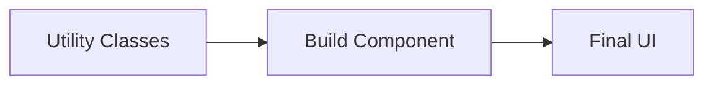
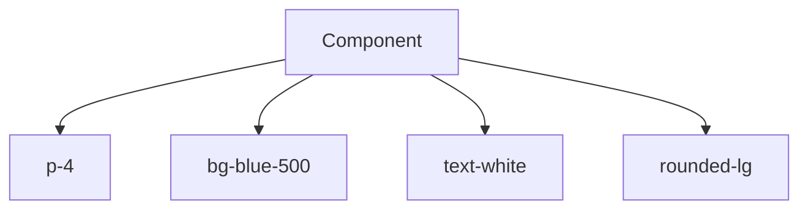

# 🌬 Tailwind CSS Introduction

**Tailwind CSS** is a utility-first CSS framework that lets you build modern
user interfaces directly in your HTML using small, reusable utility classes.

Instead of writing custom CSS for every component, you compose designs using
predefined classes.

---

## Why Tailwind CSS?

Traditional CSS:

<!-- Basic example showing the core idea. -->
```html
<div class="card">Product Card</div>
```

/* Basic example showing the core idea. */
```css
.card {
  padding: 1rem;
  background: white;
  border-radius: 12px;
  box-shadow: 0 4px 10px rgba(0, 0, 0, 0.1);
}
```

Tailwind CSS:

<!-- Basic example showing the core idea. -->
```html
<div class="p-4 bg-white rounded-xl shadow">Product Card</div>
```

No separate CSS file required.

## How Tailwind Works

<!-- Visual flow for 🌬 Tailwind CSS Introduction. -->


## Using Vite (Recommended)

Create a project:

# Basic example showing the core idea.
```bash
npm create vite@latest
```

Install Tailwind:

# Basic example showing the core idea.
```bash
npm install tailwindcss @tailwindcss/vite
```

Configure Vite:

// Basic example showing the core idea.
```javascript
// vite.config.js
import { defineConfig } from 'vite';
import tailwindcss from '@tailwindcss/vite';

export default defineConfig({
  plugins: [tailwindcss()],
});
```

Import Tailwind:

/* Basic example showing the core idea. */
```css
/* src/index.css */
@import 'tailwindcss';
```

## Utility Classes

Tailwind provides small utility classes.

Example:

<!-- Basic example showing the core idea. -->
```html
<div
  class="
    p-4
    bg-blue-500
    text-white
    rounded-lg
  "
>
  Hello Tailwind
</div>
```

## Utility Class Breakdown

<!-- Visual flow for 🌬 Tailwind CSS Introduction. -->


## Colors

Tailwind ships with a rich color palette.

<!-- Basic example showing the core idea. -->
```html
<div class="bg-blue-500">Blue</div>

<div class="bg-red-500">Red</div>

<div class="bg-green-500">Green</div>
```

## Color Scale

Light["100"]

Medium["500"]

Dark["900"]

Light --> Medium --> Dark
// Example demonstrating 🌬 Tailwind CSS Introduction.
```

```html
bg-blue-100 bg-blue-500 bg-blue-900
// Example demonstrating 🌬 Tailwind CSS Introduction.
```

## 📏 Spacing

Spacing utilities use a scale.

```html
<div class="p-4">Padding</div>

<div class="m-4">Margin</div>
// Example demonstrating 🌬 Tailwind CSS Introduction.
```

## Common Spacing Values

| Class | Value |
| ----- | ----- |
| p-1   | 4px   |
| p-2   | 8px   |
| p-4   | 16px  |
| p-6   | 24px  |
| p-8   | 32px  |

## 🔤 Typography

Font size:

```html
<h1 class="text-4xl">Heading</h1>
// Example demonstrating 🌬 Tailwind CSS Introduction.
```

Font weight:

```html
<p class="font-bold">Bold Text</p>
// Example demonstrating 🌬 Tailwind CSS Introduction.
```

Text alignment:

```html
<p class="text-center">Centered Text</p>
// Example demonstrating 🌬 Tailwind CSS Introduction.
```

## Typography Structure

Typography

Size["Text Size"]

Weight["Font Weight"]

Align["Alignment"]

Typography --> Size
    Typography --> Weight
    Typography --> Align
```

## Width & Height

<!-- Basic example showing the core idea. -->
```html
<div class="w-full">Full Width</div>

<div class="h-screen">Full Height</div>
```

## Common Utilities

<!-- Basic example showing the core idea. -->
```html
w-full w-1/2 w-1/3 h-screen h-full
```

## Flexbox Utilities

Tailwind makes Flexbox easy.

<!-- Basic example showing the core idea. -->
```html
<div
  class="
    flex
    justify-center
    items-center
  "
>
  Centered Content
</div>
```

## Flexbox Structure

Flex["flex"]

Justify["justify-center"]

Align["items-center"]

Flex --> Justify
    Flex --> Align
// Example demonstrating 🌬 Tailwind CSS Introduction.
```

## ⬛ Grid Utilities

```html
<div
  class="
    grid
    grid-cols-3
    gap-4
  "
>
  <div>1</div>
  <div>2</div>
  <div>3</div>
</div>
// Example demonstrating 🌬 Tailwind CSS Introduction.
```

## Grid Layout

A["Col 1"]

B["Col 2"]

C["Col 3"]

A --- B --- C
```

## 📱 Responsive Design

Tailwind uses mobile-first breakpoints.

| Prefix | Screen Size |
| ------ | ----------- |
| sm:    | ≥ 640px     |
| md:    | ≥ 768px     |
| lg:    | ≥ 1024px    |
| xl:    | ≥ 1280px    |
| 2xl:   | ≥ 1536px    |

## Example

<!-- Basic example showing the core idea. -->
```html
<div
  class="
    w-full
    md:w-1/2
    lg:w-1/3
  "
>
  Card
</div>
```

## Responsive Flow

Mobile["Mobile"]

Tablet["Tablet"]

Desktop["Desktop"]

Mobile --> Tablet --> Desktop
// Example demonstrating 🌬 Tailwind CSS Introduction.
```

## 🌙 Dark Mode

Enable dark mode easily.

```html
<div
  class="
    bg-white
    dark:bg-gray-900
    text-black
    dark:text-white
  "
>
  Content
</div>
// Example demonstrating 🌬 Tailwind CSS Introduction.
```

## Dark Mode Structure

Theme["Theme"]

Light["Light"]

Dark["Dark"]

Theme --> Light
    Theme --> Dark
```

## ✨ Hover Effects

<!-- Basic example showing the core idea. -->
```html
<button
  class="
    bg-blue-500
    hover:bg-blue-700
    text-white
    px-4
    py-2
  "
>
  Click Me
</button>
```

## State Variants

Button

Hover["hover:"]

Focus["focus:"]

Active["active:"]

Disabled["disabled:"]

Button --> Hover
    Button --> Focus
    Button --> Active
    Button --> Disabled
// Example demonstrating 🌬 Tailwind CSS Introduction.
```

## Building a Card Component

```html
<div
  class="
    max-w-sm
    rounded-xl
    shadow-lg
    p-6
    bg-white
  "
>
  <h2 class="text-xl font-bold">Product</h2>

<p class="text-gray-600">Product description.</p>

<button
    class="
      mt-4
      bg-blue-500
      text-white
      px-4
      py-2
      rounded
    "
  >
    Buy Now
  </button>
</div>
// Example demonstrating 🌬 Tailwind CSS Introduction.
```

## Component Composition

Card

Header

Description

Card --> Header
    Card --> Description
    Card --> Button
```

## Customizing Tailwind

Tailwind can be extended.

/* Basic example showing the core idea. */
```css
@theme {
  --color-brand: #2563eb;
}
```

Usage:

<!-- Basic example showing the core idea. -->
```html
<div class="bg-brand">Brand Color</div>
```

## 🔥 Common Utility Categories

| Category   | Examples        |
| ---------- | --------------- |
| Layout     | flex, grid      |
| Spacing    | p-4, m-4        |
| Colors     | bg-blue-500     |
| Typography | text-xl         |
| Borders    | border, rounded |
| Effects    | shadow-lg       |
| Transforms | scale-110       |
| Animation  | animate-spin    |

## Common Tailwind Animations

Spinner:

<!-- Basic example showing the core idea. -->
```html
<div class="animate-spin">🔄</div>
```

Pulse:

<!-- Basic example showing the core idea. -->
```html
<div class="animate-pulse">Loading...</div>
```

Bounce:

<!-- Basic example showing the core idea. -->
```html
<div class="animate-bounce">⬇️</div>
```

## Animation Flow

Spin["animate-spin"]

Pulse["animate-pulse"]

Bounce["animate-bounce"]
// Example demonstrating 🌬 Tailwind CSS Introduction.
```

## Advantages of Tailwind

Tailwind

Fast["Fast Development"]

Reusable["Reusable"]

Responsive["Responsive"]

Consistent["Consistent Design"]

Tailwind --> Fast
    Tailwind --> Reusable
    Tailwind --> Responsive
    Tailwind --> Consistent
```

Benefits:

✅ Rapid development

✅ Consistent design system

✅ Responsive by default

✅ No naming conflicts

✅ Smaller CSS bundles

### Huge Class Lists

❌

<!-- Basic example showing the core idea. -->
```html
<div
  class="p-4 m-4 bg-blue-500 text-white rounded shadow border flex items-center justify-between"
></div>
```

Extract reusable components when needed.

### Ignoring Components

Don't put every utility directly into pages.

Create reusable UI components.

### Using Tailwind for Everything

Sometimes plain CSS is simpler.

Use the right tool for the job.

## Quick Cheat Sheet

<!-- Basic example showing the core idea. -->
```html
flex grid p-4 m-4 bg-blue-500 text-white rounded-lg shadow-lg hover:bg-blue-700
md:w-1/2 dark:bg-gray-900 animate-spin
```

## ✅ Best Practices

- Use utility classes consistently.
- Create reusable components.
- Follow mobile-first design.
- Use responsive prefixes (`md:`, `lg:`).
- Use dark mode utilities.
- Avoid excessively long class lists.
- Combine Tailwind with component-based frameworks like React.

## Key Takeaways

- Tailwind CSS is a utility-first CSS framework.
- It enables rapid UI development without writing much custom CSS.
- Responsive design, dark mode, and animations are built-in.
- Utility classes can be combined to build complex components.
- Tailwind works exceptionally well with React, Next.js, Vue, and modern
  frontend frameworks.
