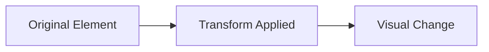
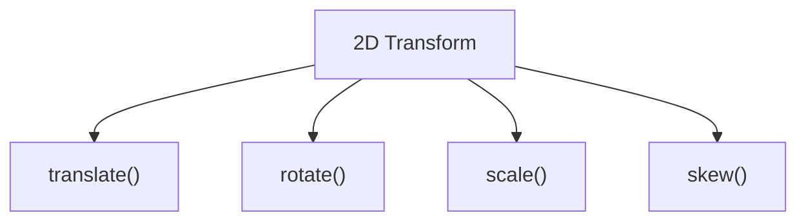

# 2D & 3D Transforms

CSS Transforms allow you to **move, rotate, scale, skew, and manipulate
elements** without affecting the document layout.

Transforms are one of the most powerful features in modern CSS and are commonly
used for:

✅ Hover Effects

✅ Card Animations

✅ Image Galleries

✅ Interactive UI Components

✅ 3D Effects

---

## What Are CSS Transforms?

Transforms change an element's appearance and position visually.

Unlike margins or positioning:

- Layout remains unchanged
- Nearby elements don't move
- GPU acceleration improves performance

## How Transforms Work

<!-- Visual flow for 2D & 3D Transforms. -->


## Transform Syntax

/* Basic example showing the core idea. */
```css
.element {
  transform: value;
}
```

Example:

/* Basic example showing the core idea. */
```css
.box {
  transform: translateX(100px);
}
```

## 2D Transform Functions

CSS provides several 2D transform functions:

<!-- Visual flow for 2D & 3D Transforms. -->


## 📍 translate()

Moves an element.

## translateX()

Move horizontally.

### Visualization

A["Start"]
    B["Move Right 100px"]

A --> B
// Example demonstrating 2D & 3D Transforms.
```

## translateY()

Move vertically.

```css
.box {
  transform: translateY(50px);
}
// Example demonstrating 2D & 3D Transforms.
```

A["Start"]

B["Move Down 50px"]

## translate()

Move both directions.

```css
.box {
  transform: translate(100px, 50px);
}
// Example demonstrating 2D & 3D Transforms.
```

## rotate()

Rotates an element.

## Rotate 45 Degrees

```css
.box {
  transform: rotate(45deg);
}
// Example demonstrating 2D & 3D Transforms.
```

## Rotate 180 Degrees

```css
.box {
  transform: rotate(180deg);
}
// Example demonstrating 2D & 3D Transforms.
```

### Rotation Concept

A["0°"]

B["45°"]

C["90°"]

D["180°"]

A --> B --> C --> D
```

## 📏 scale()

Changes size.

## Enlarge

/* Basic example showing the core idea. */
```css
.box {
  transform: scale(1.5);
}
```

150% size.

## Shrink

/* Basic example showing the core idea. */
```css
.box {
  transform: scale(0.8);
}
```

80% size.

### Scale Visualization

Small["Scale 0.8"]

Normal["Scale 1"]

Large["Scale 1.5"]

Small --> Normal --> Large
// Example demonstrating 2D & 3D Transforms.
```

## scaleX()

```css
.box {
  transform: scaleX(2);
}
// Example demonstrating 2D & 3D Transforms.
```

Width doubles.

## scaleY()

```css
.box {
  transform: scaleY(2);
}
// Example demonstrating 2D & 3D Transforms.
```

Height doubles.

## 📐 skew()

Tilts an element.

## Skew X

```css
.box {
  transform: skewX(20deg);
}
// Example demonstrating 2D & 3D Transforms.
```

## Skew Y

```css
.box {
  transform: skewY(20deg);
}
// Example demonstrating 2D & 3D Transforms.
```

### Skew Concept

Normal["Rectangle"]

Skewed["Parallelogram"]

Normal --> Skewed
```

## Combining Multiple Transforms

Multiple transforms can be combined.

/* Basic example showing the core idea. */
```css
.card {
  transform: translateY(-10px) scale(1.05) rotate(2deg);
}
```

Execution order:

Translate["Translate"]

Scale["Scale"]

Rotate["Rotate"]

Translate --> Scale --> Rotate
// Example demonstrating 2D & 3D Transforms.
```

## Hover Card Effect

```css
.card {
  transition: transform 0.3s ease;
}

.card:hover {
  transform: translateY(-10px) scale(1.03);
}
// Example demonstrating 2D & 3D Transforms.
```

Popular in:

- E-commerce sites
- Dashboards
- Portfolio websites

## transform-origin

Controls the pivot point.

Default:

```css
transform-origin: center;
// Example demonstrating 2D & 3D Transforms.
```

## Top Left

```css
transform-origin: top left;
// Example demonstrating 2D & 3D Transforms.
```

## Bottom Right

```css
transform-origin: bottom right;
// Example demonstrating 2D & 3D Transforms.
```

### Origin Example

Center["Center Origin"]

Corner["Corner Origin"]

Center --> Corner
```

Rotation changes depending on origin.

## 🌟 3D Transforms

CSS can create realistic 3D effects.

## Types of 3D Transforms

ThreeD["3D Transforms"]

X["rotateX()"]

Y["rotateY()"]

Z["rotateZ()"]

Perspective["perspective()"]

ThreeD --> X
    ThreeD --> Y
    ThreeD --> Z
    ThreeD --> Perspective
// Example demonstrating 2D & 3D Transforms.
```

## rotateX()

Rotates around horizontal axis.

```css
.box {
  transform: rotateX(45deg);
}
// Example demonstrating 2D & 3D Transforms.
```

Top["Top Edge"]

Bottom["Bottom Edge"]

Top --> Bottom
```

## rotateY()

Rotates around vertical axis.

/* Basic example showing the core idea. */
```css
.box {
  transform: rotateY(45deg);
}
```

Left["Left Edge"]

Right["Right Edge"]

Left --> Right
// Example demonstrating 2D & 3D Transforms.
```

## rotateZ()

Equivalent to normal rotation.

```css
.box {
  transform: rotateZ(45deg);
}
// Example demonstrating 2D & 3D Transforms.
```

## perspective()

Creates depth.

Without perspective:

Looks flat.

With perspective:

```css
.container {
  perspective: 1000px;
}
// Example demonstrating 2D & 3D Transforms.
```

Creates realistic depth.

### Perspective Concept

Flat["Flat Element"]

Perspective["Perspective Applied"]

Depth["3D Depth"]

Flat --> Perspective --> Depth
```

## 🎴 3D Flip Card

Popular interview question and real-world pattern.

## HTML

<!-- Basic example showing the core idea. -->
```html
<!-- Flip Card -->
<div class="card">
  <div class="card-inner">
    <div class="front">Front</div>

<div class="back">Back</div>
  </div>
</div>
```

## CSS

/* Basic example showing the core idea. */
```css
.card {
  perspective: 1000px;
}

.card-inner {
  transition: transform 0.6s;

transform-style: preserve-3d;
}

.card:hover .card-inner {
  transform: rotateY(180deg);
}
```

## Flip Animation Flow

Front["Front Side"]

Rotate["rotateY(180deg)"]

Back["Back Side"]

Front --> Rotate --> Back
// Example demonstrating 2D & 3D Transforms.
```

## transform-style

Required for nested 3D elements.

```css
.card-inner {
  transform-style: preserve-3d;
}
// Example demonstrating 2D & 3D Transforms.
```

## backface-visibility

Controls visibility of the backside.

```css
.front,
.back {
  backface-visibility: hidden;
}
// Example demonstrating 2D & 3D Transforms.
```

Prevents mirrored content.

## Zoom Image on Hover

```css
img {
  transition: transform 0.3s;
}

img:hover {
  transform: scale(1.1);
}
// Example demonstrating 2D & 3D Transforms.
```

## Floating Button

```css
.button:hover {
  transform: translateY(-5px);
}
// Example demonstrating 2D & 3D Transforms.
```

## Rotating Icon

```css
.icon:hover {
  transform: rotate(180deg);
}
// Example demonstrating 2D & 3D Transforms.
```

## 3D Product Card

```css
.card:hover {
  transform: perspective(1000px) rotateY(10deg);
}
// Example demonstrating 2D & 3D Transforms.
```

## Performance Benefits

Transforms are GPU accelerated.

## Best Properties to Animate

✅ transform

✅ opacity

## Avoid Animating

❌ width

❌ height

❌ top

❌ left

❌ margin

### Performance Flow

Good["Transform & Opacity"]

GPU["GPU Accelerated"]

Bad["Layout Properties"]

CPU["Recalculate Layout"]

Good --> GPU

Bad --> CPU
```

## Forgetting transition

❌

/* Basic example showing the core idea. */
```css
.card:hover {
  transform: scale(1.1);
}
```

Instant jump.

✅

/* Basic example showing the core idea. */
```css
.card {
  transition: transform 0.3s;
}
```

## Extreme Rotations

/* Basic example showing the core idea. */
```css
rotate(720deg)
```

Can feel distracting.

## Overusing 3D Effects

Too many 3D transforms can hurt usability.

Use them sparingly.

## Quick Cheat Sheet

/* Basic example showing the core idea. */
```css
transform: translateX(100px);

transform: translateY(50px);

transform: rotate(45deg);

transform: scale(1.2);

transform: skew(20deg);

transform: translateY(-10px) scale(1.05);

perspective: 1000px;

transform: rotateY(180deg);

transform-style: preserve-3d;

backface-visibility: hidden;
```

## ✅ Best Practices

- Use transforms for movement and scaling.
- Always combine transforms with transitions.
- Use `transform` instead of changing layout properties.
- Keep animations subtle.
- Use perspective for realistic 3D effects.
- Test 3D transforms on mobile devices.
- Avoid excessive rotation and motion.

## Key Takeaways

- CSS Transforms visually modify elements without affecting layout.
- `translate()`, `rotate()`, `scale()`, and `skew()` are core 2D transforms.
- `rotateX()`, `rotateY()`, and `perspective()` enable 3D effects.
- Transforms are GPU accelerated and highly performant.
- Transform-based animations are preferred over layout-changing properties.
- 3D flip cards are a common real-world use case.
