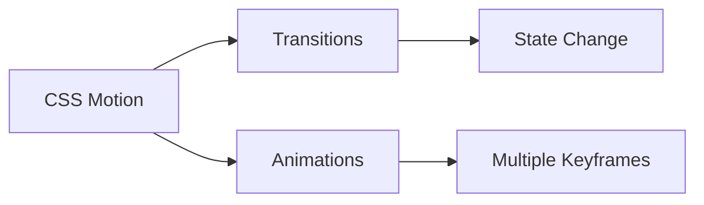
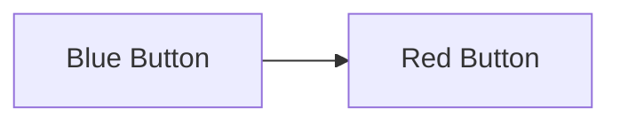
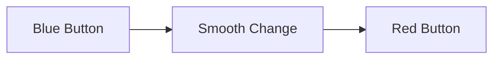
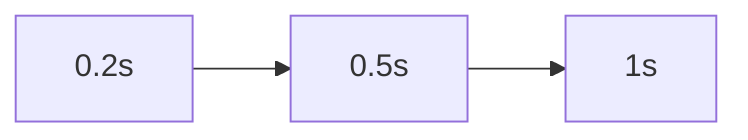
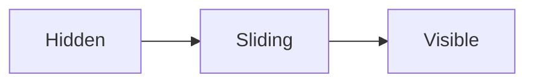
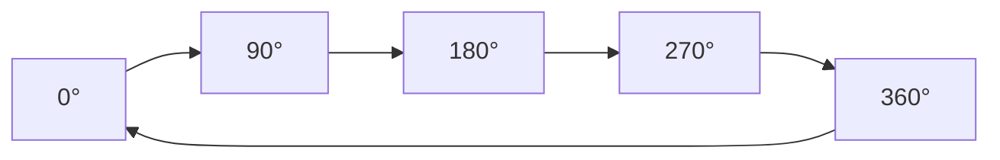

# ✨ Transitions & Animations

Modern websites feel interactive because elements can **move, fade, scale,
rotate, and animate smoothly**.

CSS provides two powerful tools:

1. **Transitions** → Animate changes between states.
2. **Animations** → Create complex multi-step movements.

---

## Why Use Animations?

Animations help users understand what's happening on a page.

✅ Improve User Experience

✅ Provide Visual Feedback

✅ Make Interfaces Feel Modern

✅ Guide User Attention

✅ Create Engaging Interactions

## Transitions vs Animations

<!-- Visual flow for ✨ Transitions & Animations. -->


| Feature            | Transition | Animation |
| ------------------ | ---------- | --------- |
| Triggered by Event | ✅         | ❌        |
| Multiple Steps     | ❌         | ✅        |
| Auto Play          | ❌         | ✅        |
| Hover Effects      | ✅         | ❌        |
| Complex Motion     | ❌         | ✅        |

## CSS Transitions

A transition smoothly changes property values.

Without transition:

<!-- Visual flow for ✨ Transitions & Animations. -->


Instant change.

With transition:

<!-- Visual flow for ✨ Transitions & Animations. -->


Smooth change.

## Basic Transition Syntax

```css
/* Smooth transition */
button {
  transition: property duration;
}
```

Example:

```css
/* Background color transition */
button {
  background: blue;
  transition: background 0.3s;
}

button:hover {
  background: red;
}
```

## Transition Properties

```css
transition: property duration timing-function delay;
```

```css
.card {
  transition: transform 0.4s ease 0.1s;
}
```

## transition-property

Specify what should animate.

```css
.card {
  transition-property: transform;
}
```

Multiple properties:

```css
.card {
  transition-property: transform, background-color;
}
```

## ⏱ transition-duration

Controls speed.

```css
.card {
  transition-duration: 0.5s;
}
```

## Duration Comparison

<!-- Visual flow for ✨ Transitions & Animations. -->


## transition-timing-function

Controls animation speed curve.

## linear

Constant speed.

```css
transition-timing-function: linear;
```

<!-- Visual flow for ✨ Transitions & Animations. -->
```mermaid
xychart-beta
    title "Linear"
    x-axis [Start, End]
    y-axis "Speed" 0 --> 10
    line [5,5]
```

## ease (Default)

Starts slow, speeds up, slows down.

```css
transition-timing-function: ease;
```

## ease-in

Slow start.

```css
transition-timing-function: ease-in;
```

## ease-out

Slow end.

```css
transition-timing-function: ease-out;
```

## ease-in-out

Slow start and end.

```css
transition-timing-function: ease-in-out;
```

## ⌛ transition-delay

Wait before animation starts.

```css
.card {
  transition-delay: 0.5s;
}
```

## Scale Effect

```css
.card {
  transition: transform 0.3s;
}

.card:hover {
  transform: scale(1.05);
}
```

## Lift Effect

.card:hover {
  transform: translateY(-10px);
}
```

```
## Rotate Effect

```css
.icon {
  transition: transform 0.3s;
}

.icon:hover {
  transform: rotate(180deg);
}
```

## CSS Animations

Animations can run automatically without user interaction.

## How Animations Work

Keyframes["Keyframes"]

Start["Start State"]

Middle["Middle State"]

End["End State"]

Keyframes --> Start
    Keyframes --> Middle
    Keyframes --> End
```

```
## Step 1: Create Keyframes

```css
@keyframes fadeIn {
  from {
    opacity: 0;
  }

to {
    opacity: 1;
  }
}
```

## Step 2: Apply Animation

```css
.box {
  animation: fadeIn 1s;
}
```

## animation Property

```css
animation: name duration timing-function delay iteration-count direction
  fill-mode;
```

```css
.card {
  animation: slideIn 1s ease-out 0s 1;
}
```

## Fade In Animation

to {
    opacity: 1;
  }
}

.box {
  animation: fadeIn 1s;
}
```

```
## ➡ Slide In Animation

```css
@keyframes slideIn {
  from {
    transform: translateX(-100px);
    opacity: 0;
  }

to {
    transform: translateX(0);
    opacity: 1;
  }
}
```

## Animation Flow



## Infinite Animation

```css
.spinner {
  animation: spin 1s linear infinite;
}
```

```css
@keyframes spin {
  from {
    transform: rotate(0deg);
  }

to {
    transform: rotate(360deg);
  }
}
```

## Spinner Animation



## animation-iteration-count

Controls repetition.

```css
animation-iteration-count: 3;
```

Runs 3 times.

```css
animation-iteration-count: infinite;
```

Runs forever.

## normal

```css
animation-direction: normal;
```

Forward.

## reverse

```css
animation-direction: reverse;
```

Backward.

## alternate

```css
animation-direction: alternate;
```

Forward then backward.

## 🎭 animation-fill-mode

Determines final state.

## forwards

Keeps last keyframe.

```css
animation-fill-mode: forwards;
```

## backwards

Uses starting keyframe before animation starts.

```css
animation-fill-mode: backwards;
```

## Loading Skeleton Animation

```css
@keyframes shimmer {
  0% {
    background-position: -200px;
  }

100% {
    background-position: 200px;
  }
}
```

```css
.skeleton {
  animation: shimmer 1.5s infinite;
}
```

## 🛒 Product Card Hover Example

```html
<!-- Product Card -->
<div class="card">Product</div>
```

```css
.card {
  transition: transform 0.3s, box-shadow 0.3s;
}

.card:hover {
  transform: translateY(-8px);

box-shadow: 0 10px 20px rgba(0, 0, 0, 0.15);
}
```

## Button Ripple Style Effect

```css
button {
  transition: transform 0.2s;
}

button:active {
  transform: scale(0.95);
}
```

Provides instant click feedback.

## Performance Tips

Animate:

✅ transform

✅ opacity

These use GPU acceleration.

Avoid Animating:

❌ width

❌ height

❌ top

❌ left

❌ margin

These trigger layout recalculations.

## Performance Flow

Good["Transform & Opacity"]
    GPU["GPU Accelerated"]

Bad["Width & Height"]
    CPU["Layout Recalculation"]

Good --> GPU
    Bad --> CPU
```

```
## ♿ Accessibility

Some users prefer reduced motion.

```css
@media (prefers-reduced-motion: reduce) {
  * {
    animation: none;
    transition: none;
  }
}
```

Always support accessibility.

## Quick Cheat Sheet

```css
transition: all 0.3s ease;

transform: scale(1.1);

transform: rotate(180deg);

transform: translateY(-10px);

@keyframes fadeIn {
}

animation: fadeIn 1s ease;

animation-iteration-count: infinite;

animation-direction: alternate;

animation-fill-mode: forwards;
```

## ✅ Best Practices

- Keep animations subtle.
- Use transitions for hover effects.
- Use keyframes for complex motion.
- Prefer `transform` and `opacity`.
- Avoid excessive animation.
- Respect `prefers-reduced-motion`.
- Keep durations between 200ms–500ms for UI interactions.

## Key Takeaways

- Transitions animate property changes between states.
- Animations use keyframes for complex motion.
- `transform` and `opacity` provide the best performance.
- Timing functions control motion feel.
- Accessibility should always be considered.
- Well-designed animations improve user experience without becoming distracting.
