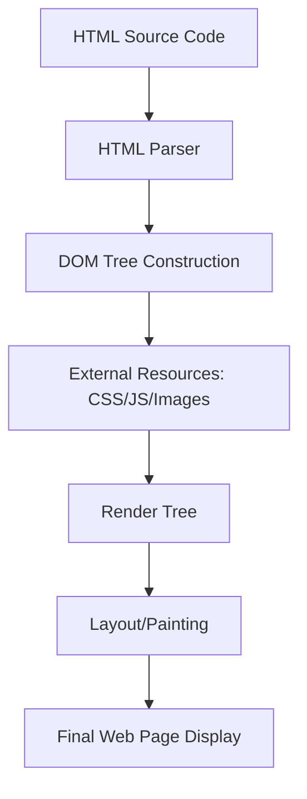

# The Skeleton of the Web: A Deep Dive into HTML

In the world of web development, if JavaScript is the brain and CSS is the skin,
then **HTML** is the skeleton. Without it, the internet as we know it would be a
chaotic soup of unorganized data.

---

## 1. Introduction

**HTML (HyperText Markup Language)** is the standard markup language used to
create the structure of web pages. It isn't a programming language; rather, it
is a system of "tags" that tells a web browser how to display content.

- **Why it matters:** HTML provides the **semantic meaning** and
  **accessibility** foundation for every site. Even the most complex React or
  Vue applications eventually render down to HTML so the browser can understand
  them.
- **Where it is used:** It is used everywhere—from simple personal blogs to
  massive enterprise platforms like Amazon and Google. If you are viewing a page
  in a browser, you are looking at HTML.

## 2. Core Concepts & Breakdown

To master HTML, you must understand its three pillars: Elements, Attributes, and
the Document Object Model (DOM).

### A. Elements and Tags

- **What it is:** The building blocks of HTML. An element usually consists of an
  opening tag (e.g., `<h1>`), content, and a closing tag (e.g., `</h1>`).
- **Why it exists:** It identifies the type of content so the browser knows how
  to treat it (e.g., a "paragraph" vs. a "link").
- **Where it is used:** Every piece of text, image, or button on a page is
  wrapped in an element.

### B. Attributes

- **What it is:** Key-value pairs located inside the opening tag (e.g.,
  `href="https://google.com"`).
- **Why it exists:** They provide additional information or "metadata" about an
  element, such as where a link should go or the source of an image.
- **Where it is used:** Used heavily for linking (`<a>`), displaying images
  (``), and identifying elements for styling (`class` or `id`).

### C. Semantic HTML

- **What it is:** Using tags that describe their meaning (e.g., `<header>`,
  `<footer>`, `<article>`) rather than generic containers like `<div>`.
- **Why it exists:** It helps Search Engines (SEO) understand the content and
  allows Screen Readers to navigate the page for users with visual impairments.
- **Where it is used:** Professional development environments where SEO and
  accessibility are top priorities.

## 3. Visual Understanding: The HTML Lifecycle

When you enter a URL, the browser doesn't just "show" the file. It goes through
a process of parsing the HTML into a tree structure called the DOM.

<!-- Visual flow for The Skeleton of the Web: A Deep Dive into HTML. -->


## 4. Practical Examples

Let’s look at a modern, real-world structure. Note how we use semantic tags to
define the areas of the page.

```html
<!DOCTYPE html>
<html lang="en">
  <head>
    <meta charset="UTF-8" />
    <title>Product Page</title>
  </head>
  <body>
    <header>
      <h1>TechGear Store</h1>
      <nav>
        <ul>
          <li><a href="/home">Home</a></li>
          <li><a href="/shop">Shop</a></li>
        </ul>
      </nav>
    </header>

<main>
      <article class="product-card">
        <h2>Wireless Headphones</h2>
        
        <p>Experience studio-quality sound anywhere.</p>
        <button type="button" onclick="alert('Added!')">Add to Cart</button>
      </article>
    </main>

<footer>
      <p>&copy; 2026 TechGear Inc.</p>
    </footer>
  </body>
</html>
```

### Breakdown:

1.  **`<!DOCTYPE html>`**: Tells the browser this is an HTML5 document.
2.  **`<meta charset="UTF-8">`**: Ensures the page displays special characters
    correctly.
3.  **``**: The `alt` attribute is crucial. It describes the
    image if it fails to load or for screen readers.
4.  **`<nav>` and `<article>`**: These tell the browser exactly what the
    content's purpose is.

## 5. Tools & Ecosystem

- **VS Code (Editor):** The industry standard for writing HTML. It provides
  "Emmet" shortcuts to write code faster.
- **Prettier (Formatter):** A tool that automatically cleans up your HTML
  nesting so it’s readable.
- **Lighthouse (Audit Tool):** Built into Chrome, it checks your HTML for
  accessibility and SEO best practices.

## 6. Performance & Optimization

HTML might seem "light," but poor structure can slow down a site.

- **Critical Path:** Place your CSS `<link>` tags in the `<head>` and your JS
  `<script>` tags at the end of the `<body>` (or use `defer`). This prevents
  "render-blocking," where the page stays white while scripts load.
- **Image Sizing:** Always provide `width` and `height` attributes to prevent
  "Layout Shift," where the page jumps around as images load.

## 7. Actionable Tips for Developers

1.  **Stop "Div-itis":** Don't use `<div>` for everything. If it's a button, use
    `<button>`. If it's a section, use `<section>`.
2.  **Validate your Code:** Use the [W3C Validator](https://validator.w3.org/)
    to find unclosed tags or illegal attributes.
3.  **Prioritize Accessibility:** Always use `alt` tags for images and `labels`
    for form inputs. It’s not just ethical; it’s better for business and SEO.

## 8. Conclusion

HTML is the silent engine of the web. While it may not have the logic of
JavaScript or the flair of CSS, it provides the essential meaning and structure
that makes the web accessible and searchable. Mastery of HTML isn't about
memorizing tags; it's about understanding **structure** and **semantics**.

**Key Takeaways:**

- HTML defines structure, not style.
- Semantics are vital for SEO and Accessibility.
- The DOM is the browser's way of mapping your HTML.

**What to learn next?** I recommend diving into **CSS Layouts (Flexbox and
Grid)** to start styling your newly structured HTML.

Would you like me to create a guide on CSS Layouts to follow up on this
structure?

## Quick Reference

| Area | Revision point |
|---|---|
| Definition | State exactly what the topic means. |
| Mechanism | Explain the steps that produce the result. |
| Example | Use a small realistic case. |
| Pitfalls | Know common mistakes and boundary cases. |
