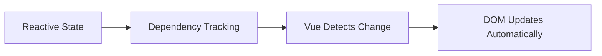

# Reactivity Fundamentals

## What is Reactivity?

Reactivity means:

```txt
When data changes → UI updates automatically
```

Vue tracks data changes and updates only the affected parts of the DOM.

---

## Example

```vue
<template>
  <h1>{{ count }}</h1>

<button @click="count++">Increment</button>
</template>

<script setup>
import { ref } from 'vue';

const count = ref(0);
</script>
```

When `count` changes:

```txt
0 → 1 → 2
```

Vue automatically updates the UI.

## How Vue Reactivity Works

<!-- Visual flow for Reactivity Fundamentals. -->


## Core Reactivity APIs

| API             | Purpose                    |
| --------------- | -------------------------- |
| `ref()`         | Reactive primitive values  |
| `reactive()`    | Reactive objects           |
| `computed()`    | Derived reactive values    |
| `watch()`       | Watch state changes        |
| `watchEffect()` | Auto reactive side effects |

## 1. ref()

Used for:

- numbers
- strings
- booleans
- arrays
- objects
- primitive reactive state

## Syntax

```js
const state = ref(value);
```

```vue
<script setup>
import { ref } from 'vue';

```
## Accessing ref Values

Inside JavaScript:

```js
count.value;
```

Inside template:

```vue
{{ count }}
```

Vue automatically unwraps refs in templates.

<button @click="increment">Add</button>
</template>

```javascript
const count = ref(0);

const increment = () => {
  count.value++;
};
</script>
```

## Why `.value` Exists

`ref()` returns a reactive wrapper object.

```js
console.log(count);
```

Output:

```js
{
  value: 0;
}
```

Vue tracks changes through `.value`.

## Reactive Arrays

```js
const users = ref([]);
```

## Update Array

```js
users.value.push({
  id: 1,
  name: 'John',
});
```

## Reactive Objects with ref

```js
const user = ref({
  name: 'John',
  age: 25,
});
```

Access:

```js
user.value.name;
```

## 2. reactive()

Used for reactive objects.

```js
const state = reactive({});
```

```vue
<script setup>
import { reactive } from 'vue';

const user = reactive({
  name: 'John',
  age: 25,
});
</script>
```

## Accessing Values

No `.value` needed.

```js
user.name;
```

## Update Values

```js
user.age++;
```

## reactive vs ref

| ref                     | reactive          |
| ----------------------- | ----------------- |
| Best for primitives     | Best for objects  |
| Requires `.value` in JS | Direct access     |
| Can hold anything       | Object types only |

## Recommended Practice

| Use Case         | Recommended          |
| ---------------- | -------------------- |
| Primitive values | `ref()`              |
| Complex objects  | `reactive()`         |
| Forms            | Usually `reactive()` |
| Arrays           | `ref()`              |

## 3. computed()

Used for derived/calculated reactive values.

## Why Use computed?

Instead of recalculating every render:

```vue
{{ firstName + lastName }}
```

Use computed.

```vue
<template>
  <h1>{{ fullName }}</h1>
</template>

<script setup>
import { computed, ref } from 'vue';

const firstName = ref('John');
const lastName = ref('Doe');

const fullName = computed(() => {
  return `${firstName.value} ${lastName.value}`;
});
</script>
```

## Benefits of computed

| Benefit           | Description           |
| ----------------- | --------------------- |
| Cached            | Better performance    |
| Reactive          | Updates automatically |
| Cleaner templates | Less logic in HTML    |

## Computed is Cached

Runs only when dependencies change.

## Bad Example

```vue
{{ users.filter((user) => user.active) }}
```

## Better

```js
const activeUsers = computed(() => {
  return users.value.filter((user) => user.active);
});
```

## 4. watch()

Used to observe state changes.

```js
watch(source, callback);
```

```vue
<script setup>
import { ref, watch } from 'vue';

const search = ref('');

watch(search, (newValue, oldValue) => {
  console.log(newValue);
});
</script>
```

## Common Use Cases

| Use Case           | Example        |
| ------------------ | -------------- |
| API calls          | Search input   |
| Local storage sync | Save settings  |
| Form validation    | Input tracking |
| Analytics          | Track changes  |

## Watch Multiple Values

```js
watch([firstName, lastName], () => {
  console.log('Changed');
});
```

## Immediate Watch

Runs immediately.

```js
watch(search, fetchUsers, {
  immediate: true,
});
```

## Deep Watch

Used for nested objects.

```js
watch(user, () => {}, {
  deep: true,
});
```

## 5. watchEffect()

Automatically tracks dependencies.

```vue
<script setup>
import { ref, watchEffect } from 'vue';

watchEffect(() => {
  console.log(count.value);
});
</script>
```

## Difference Between watch and watchEffect

| watch                       | watchEffect              |
| --------------------------- | ------------------------ |
| Explicit dependencies       | Auto dependency tracking |
| More control                | Simpler                  |
| Better for specific sources | Better for quick effects |

## 6. Reactive DOM Updates

Vue batches DOM updates for performance.

```js
count.value++;
count.value++;
count.value++;
```

Vue avoids unnecessary renders.

## nextTick()

Wait for DOM updates to complete.

```js
import { nextTick } from 'vue';

await nextTick();
```

## Use Cases

- DOM measurements
- Focus inputs
- Scroll handling

## 7. Template Reactivity

Reactive state automatically updates templates.

```vue
<template>
  <p>{{ count }}</p>
</template>
```

```txt
Template re-renders automatically
```

## 8. Reactive Forms Example

```vue
<template>
  <form>
    <input v-model="form.name" />

<input v-model="form.email" />

<p>{{ form.name }}</p>
  </form>
</template>

<script setup>
import { reactive } from 'vue';

const form = reactive({
  name: '',
  email: '',
});
</script>
```

## 9. Real World Example

```vue
<template>
  <section>
    <input v-model="search" placeholder="Search users" />

<ul>
      <li v-for="user in filteredUsers" :key="user.id">
        {{ user.name }}
      </li>
    </ul>
  </section>
</template>

const users = ref([
  { id: 1, name: 'John' },
  { id: 2, name: 'Jane' },
  { id: 3, name: 'Alex' },
]);

const filteredUsers = computed(() => {
  return users.value.filter((user) =>
    user.name.toLowerCase().includes(search.value.toLowerCase())
  );
});
</script>
```

## Forgetting `.value`

❌ Wrong

```js
count++;
```

✅ Correct

```js
count.value++;
```

## Too Much Logic in Templates

❌ Bad

```vue
{{ users.filter((user) => user.active).length }}
```

✅ Better

## Using watch Instead of computed

Use:

| Use            | API      |
| -------------- | -------- |
| Derived values | computed |
| Side effects   | watch    |

## Prefer `ref()` for Most State

Simpler and more flexible.

## Use computed for Derived State

Avoid recalculating inside templates.

## Keep watch for Side Effects Only

Examples:

- API requests
- Local storage
- Timers

## Avoid Deep Nested Reactive State

Large nested objects become hard to maintain.

## Extract Logic into Composables

Reusable reactive logic.

```js
export function useCounter() {
  const count = ref(0);

const increment = () => {
    count.value++;
  };

return {
    count,
    increment,
  };
}
```

## Quick Summary

| API             | Main Purpose             |
| --------------- | ------------------------ |
| `ref()`         | Primitive reactive state |
| `reactive()`    | Reactive objects         |
| `computed()`    | Derived state            |
| `watch()`       | Watch changes            |
| `watchEffect()` | Auto reactive effects    |
| `nextTick()`    | Wait for DOM update      |

## Most Important Things to Master

1. `ref()`
2. `reactive()`
3. `computed()`
4. `watch()`
5. `v-model`
6. Composition API patterns

## Quick Reference

| Area | Revision point |
|---|---|
| Definition | State exactly what the topic means. |
| Mechanism | Explain the steps that produce the result. |
| Example | Use a small realistic case. |
| Pitfalls | Know common mistakes and boundary cases. |
