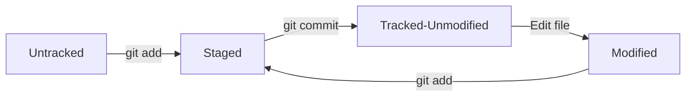

# 🧱 Git Basics

Now that you understand the core concepts, it is time to look at how Git works
in action. Tracking a project involves moving files smoothly through the three
states we discussed earlier. 🛠️

---

## The 4 Lifecycle Stages of a File

Inside your working directory, every single file falls into one of two major
categories: **Untracked** or **Tracked**. Tracked files are further broken down
into three distinct stages.

<!-- Visual flow for 🧱 Git Basics. -->


- **Untracked:** Files that Git sees in your project folder but isn't watching.
  New files always start here.
- **Staged (Staging Area):** Files you have marked to be included in your next
  permanent snapshot.
- **Modified:** Files you have changed since your last snapshot, but haven't
  added to the staging area yet.
- **Unmodified:** Files that match your last saved snapshot exactly.

## The Core Local Workflow

Every day as a developer, you will repeat a simple 3-step cycle to save your
progress locally. Think of it like taking a photo:

1. **Modify:** You write code, add images, or edit files in your project
   directory.
2. **Stage:** You pick which changes are ready for the photo by adding them to
   the staging area.
3. **Commit:** You snap the photo, permanently saving that bundle of changes
   into your local history database.

## Checking Status

Because files change stages constantly as you type, you need a way to check
where everything stands. Git provides a command that gives you a quick
bird's-eye view of your repository.

It tells you exactly which files are modified, which are staged, and which are
completely untracked so you never feel lost. 🗺️

```bash
// Check the status of your working directory and staging area
git status

```
## Quick Reference

| Area | Revision point |
|---|---|
| Definition | State exactly what the topic means. |
| Mechanism | Explain the steps that produce the result. |
| Example | Use a small realistic case. |
| Pitfalls | Know common mistakes and boundary cases. |

## Decision Guide

Connect the definition to a practical decision: what problem does the concept solve, what assumptions does it make, and what evidence tells you it is working? This turns a memorised sentence into a usable mental model.

## Compare Related Ideas

When two concepts look similar, compare their purpose, inputs, guarantees, lifecycle, and trade-offs. A short comparison is often more useful for revision than another paragraph repeating the same definition.

## Self-Check

After reading an example, change one input and predict the result before running it. Then explain what changed and why. This exposes gaps in understanding and gives you a quick test without needing a separate exercise set.

## Practical Decision

A concept becomes easier to revise when it is tied to a decision you may actually make. Identify the problem, the available choices, and the condition that makes one choice appropriate. Then state one case where the concept should not be used. That negative example is useful because it marks the boundary of the idea and reduces confusion with related concepts.
