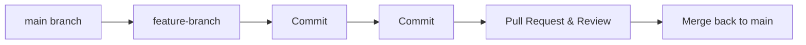
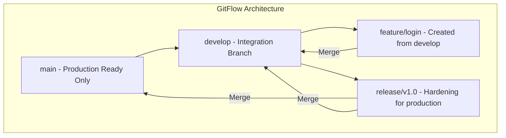

# 🗺️ Branching Strategies

When working on a software project alone, you can push code directly to the
`main` branch whenever you want. But when a team of five, ten, or fifty
developers works in the same repository, unorganized changes lead to broken
features and merge conflicts.

A **branching strategy** is a set of rules that defines when branches are
created, how they are named, and how code flows back into production.

### What is a Branching Strategy?

Think of a branching strategy as the **traffic laws for your codebase**. Without
lanes, traffic lights, or merge signs, cars would constantly crash into each
other. A branching strategy sets up clear highway lanes so features can speed
along without colliding with the live application.

---

### The 3 Most Popular Workflows

Different teams have different shipping speeds. Let's look at the three
industry-standard strategies to find the right fit for your workflow.

#### 1. GitHub Flow (Best for continuous delivery)

This is the simplest and most modern approach. It is perfect for startups or web
apps where you want to deploy features to production multiple times a day.



- **How it works:** You create a branch from `main`, make your changes, open a
  Pull Request (PR), get feedback, and merge straight back into `main`.
- **Rule:** The `main` branch must _always_ be stable and deployable at any
  second.

#### 2. GitFlow (Best for structured releases)

This is a traditional, robust strategy ideal for enterprise software, mobile
apps, or projects that follow strict versioned releases (like `v1.2.0`).



- **How it works:** It uses two long-running branches: `main` (stores official
  release history) and `develop` (where features are integrated). You also use
  short-lived `feature/`, `release/`, and `hotfix/` branches.
- **Rule:** Developers never interact with `main` directly; changes pass through
  several staging environments first.

#### 3. Trunk-Based Development (Best for high-velocity engineering)

Used by tech giants like Google and Meta, this strategy focuses on speed and
avoiding massive merge conflicts.

```bash
// Example: Keep changes small and merge to main multiple times a day
git checkout main
git pull
git checkout -b short-lived-fix
# ...make a tiny change...
git add . && git commit -m "fix: update button padding"
git push origin short-lived-fix
# Merge immediately after passing automated checks!

```

- **How it works:** All developers work on a single central branch (the "trunk"
  or `main`). They create tiny branches that last only a few hours, merging
  their code back into the trunk multiple times a day.
- **Rule:** Features under construction are hidden behind **feature flags**
  (toggles in code) so unfinished logic doesn't break production.

---

### Comparison Matrix

| Strategy        | Complexity | Best For                        | Release Frequency               |
| --------------- | ---------- | ------------------------------- | ------------------------------- |
| **GitHub Flow** | Low        | Startups, SaaS, Web Apps        | Multiple times a day            |
| **GitFlow**     | High       | Mobile Apps, Enterprise Systems | Scheduled (e.g., every 2 weeks) |
| **Trunk-Based** | Medium     | Experienced Teams, CI/CD        | Continuously                    |

---

### 💡 ReviseStack Team Takeaway

There is no "perfect" strategy. If your team builds web software and deploys
frequently, stick to **GitHub Flow** to avoid unnecessary overhead. If you
manage downloadable apps with strict release schedules, adopt **GitFlow**.

---
