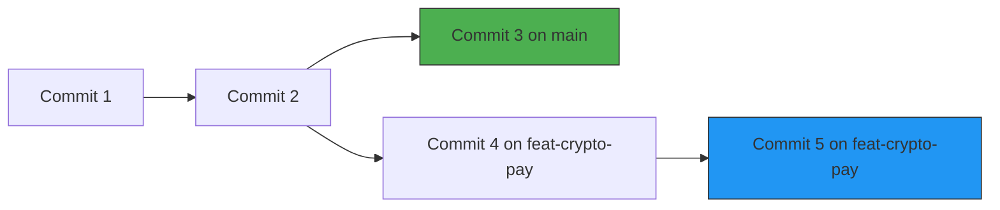

# 🌿 Branching

In Git, a **branch** is simply a lightweight pointer to a specific commit.
Branching is Git's most powerful feature because it allows you to step away from
the main codebase and work on new features or bug fixes in complete isolation.
🧪

---

## Why Use Branches?

Imagine you are building an online store, and the site is live and running
perfectly on the `main` branch. Now, you want to build an experimental
cryptocurrency payment feature.

If you write this code directly on `main` and break something, your production
website goes down immediately. 💥

By creating a separate branch called `feat-crypto-pay`, you can experiment
safely. The live site on `main` remains untouched and working for users. Once
your new feature is fully tested and stable, you can safely merge it back into
the main timeline.

<!-- Visual flow for 🌿 Branching. -->


## 🛠 Branching Commands in Action

Managing branches inside your local repository requires just a few
straightforward commands:

```bash
// List all local branches (the one with an asterisk * is your current branch)
git branch

```bash
// Create a new branch named 'feat-login' (but don't switch to it yet)
git branch feat-login

```bash
// Switch your working directory over to your new branch
git checkout feat-login

> 💡 **The Modern Shortcut:** You can create a new branch and switch to it
> instantly in a single command by running: `git checkout -b feat-login` (or
> `git switch -c feat-login` in newer Git versions).

```
## 🏃‍♂ A Real Feature-Branch Sequence

Let's look at how a clean feature-branch workflow runs inside your terminal:

```bash
// 1. Make sure you are on main and have the latest changes
git checkout main

// 2. Create and switch to a new branch for a sidebar feature
git checkout -b feat-sidebar

// 3. Create or modify files for the sidebar
echo "<aside>Sidebar</aside>" > sidebar.html

// 4. Stage and save your progress on this isolated branch
git add sidebar.html
git commit -m "feat: add sidebar structural layout"

// 5. Jump back to main - sidebar.html completely vanishes from your folder!
git checkout main

When you hop back to `main`, your project directory snaps back to exactly how it
looked before you started the sidebar. Your experimental work is safely tucked
away in its own isolated timeline. 🛡️

```
## Quick Reference

| Area | Revision point |
|---|---|
| Definition | State exactly what the topic means. |
| Mechanism | Explain the steps that produce the result. |
| Example | Use a small realistic case. |
| Pitfalls | Know common mistakes and boundary cases. |

## Decision Guide

Connect the definition to a practical decision: what problem does the concept solve, what assumptions does it make, and what evidence tells you it is working? This turns a memorised sentence into a usable mental model.

## Compare Related Ideas

When two concepts look similar, compare their purpose, inputs, guarantees, lifecycle, and trade-offs. A short comparison is often more useful for revision than another paragraph repeating the same definition.

## Self-Check

After reading an example, change one input and predict the result before running it. Then explain what changed and why. This exposes gaps in understanding and gives you a quick test without needing a separate exercise set.

## Practical Decision

A concept becomes easier to revise when it is tied to a decision you may actually make. Identify the problem, the available choices, and the condition that makes one choice appropriate. Then state one case where the concept should not be used. That negative example is useful because it marks the boundary of the idea and reduces confusion with related concepts.
