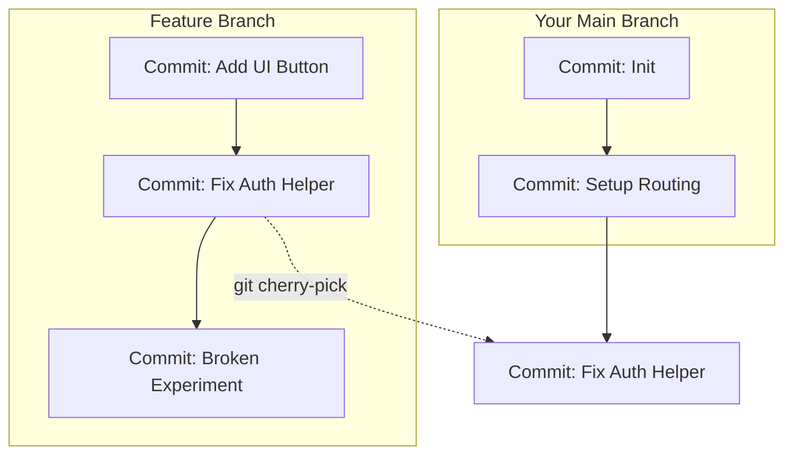

# 🍒 Cherry Pick

Imagine your coworker builds an amazing utility function on their experimental
feature branch. You desperately need that exact feature in your own branch right
now. However, their branch also contains dozens of other unfinished changes that
would break your code if you merged the whole thing.

Instead of merging their entire branch, you can use **Git Cherry Pick** to grab
that single, specific commit and bring it over to your workspace.

### What is Git Cherry Pick?

Think of a Git repository as a **bunch of grapes**. Merging a branch means
taking the entire cluster, stems and all. **Cherry-picking** means reaching in,
plucking one perfect, ripe grape off the stem, and popping it into your own bowl
while leaving the rest of the cluster untouched.

<!-- Visual flow for 🍒 Cherry Pick. -->


---

### How to Cherry-Pick a Commit

To steal a commit cleanly, you only need to complete three simple steps.

#### 1. Find the Commit ID

First, switch over to the branch that has the changes you want and view the
commit history to copy the unique SHA-1 commit hash.

# Basic example showing the core idea.
```bash
// View a clean, one-line list of recent commits to find the hash
git log --oneline

_Output looks like this:_

> `a1b2c3d Fix bug in auth helper` > `e5f6g7h Messy experimental UI adjustments`

#### 2. Apply the Commit

Switch back to your destination branch and tell Git to pluck that specific
commit hash.

```bash
// Switch to your branch and apply the specific commit changes
git checkout main
git cherry-pick a1b2c3d

#### 3. Handle Conflicts (If They Happen)

If the code around that specific commit looks different in your branch, Git
might get confused and throw a conflict. Don't panic! Open your code editor, fix
the conflicting lines, and tell Git to keep moving forward.

# Basic example showing the core idea.
```bash
// After fixing conflicts in your editor, save and resume the process
git add .
git cherry-pick --continue

If everything goes completely sideways and you want to pretend it never
happened, you can safely back out:

```bash
// Abort the cherry-pick and return your branch to exactly how it was
git cherry-pick --abort

### When to Avoid Cherry-Picking

While cherry-picking feels like a superpower, use it sparingly. It creates a
brand-new duplicate commit ID on your branch. If you cherry-pick too many
commits back and forth instead of doing proper branch merges, your Git history
can become confusing, messy, and difficult for teams to track.

## Quick Reference

| Area | Revision point |
|---|---|
| Definition | State exactly what the topic means. |
| Mechanism | Explain the steps that produce the result. |
| Example | Use a small realistic case. |
| Pitfalls | Know common mistakes and boundary cases. |

## Decision Guide

Connect the definition to a practical decision: what problem does the concept solve, what assumptions does it make, and what evidence tells you it is working? This turns a memorised sentence into a usable mental model.

## Compare Related Ideas

When two concepts look similar, compare their purpose, inputs, guarantees, lifecycle, and trade-offs. A short comparison is often more useful for revision than another paragraph repeating the same definition.

## Self-Check

After reading an example, change one input and predict the result before running it. Then explain what changed and why. This exposes gaps in understanding and gives you a quick test without needing a separate exercise set.

## Practical Decision

A concept becomes easier to revise when it is tied to a decision you may actually make. Identify the problem, the available choices, and the condition that makes one choice appropriate. Then state one case where the concept should not be used. That negative example is useful because it marks the boundary of the idea and reduces confusion with related concepts.
