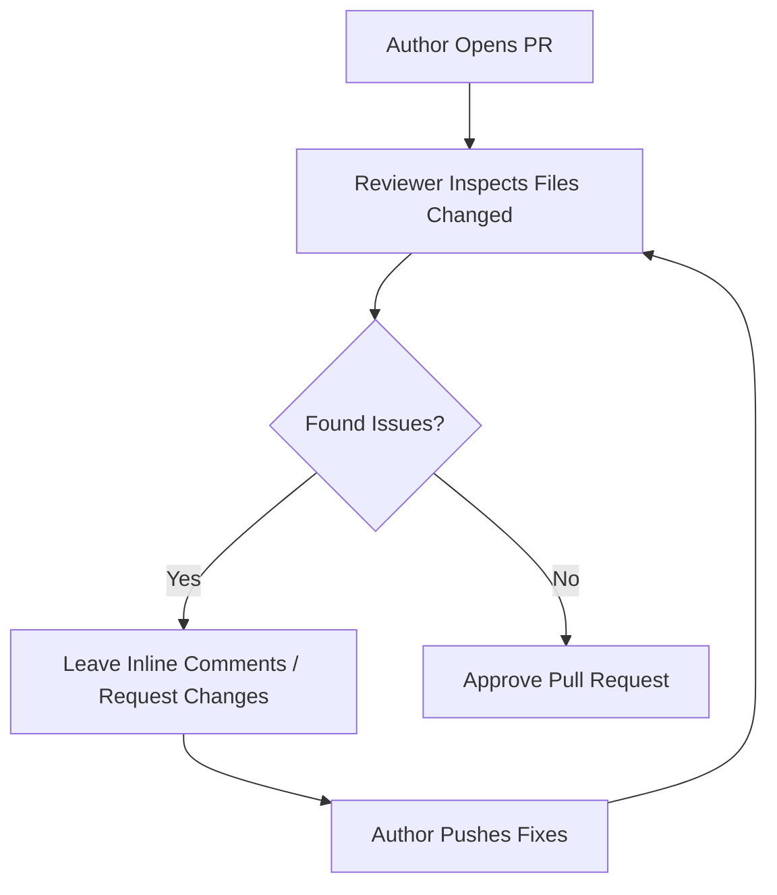

# 👀 Code Review

A **Code Review** is the phase in the development cycle where teammates read
through your pull request line-by-line before it gets merged into the production
codebase. Think of it as a friendly peer-edit session that catches bugs early,
ensures consistent formatting, and shares knowledge across the engineering team.
🧠

---

## 🎯 Why Do Code Reviews Matter?

Code reviews are not about micromanagement or finger-pointing. They serve as a
critical quality assurance step for healthy engineering teams:

- **Catching Bugs Early:** A fresh set of eyes can spot edge cases, security
  vulnerabilities, or logical bugs that you might have missed after staring at
  the same code for hours.
- **Knowledge Sharing:** It helps the entire team stay updated on different
  parts of the application. If you build a new utility function, your team
  learns about it through the review.
- **Maintaining Standards:** It ensures that variables, folder structures, and
  styling guidelines match the team's established formatting rules.

---

## 🛠️ The Code Review Workflow on GitHub

When you review a pull request on GitHub, you use a specialized interface to
inspect the code delta (the difference between the old and new files).

---

## 📝 Best Practices for Reviewers & Authors

To keep code reviews productive and positive, both the author and the reviewer
should follow clear communication guidelines.

### For Reviewers 🔍

- **Be Constructive:** Focus on the code, not the person. Instead of saying
  _"Your logic here is bad,"_ try saying _"Can we refactor this function to
  avoid nested loops and improve performance?"_
- **Ask Questions:** Frame suggestions as questions to encourage collaboration
  rather than giving commands (e.g., _"What happens if the API returns an error
  here?"_).
- **Distinguish Priority:** Use prefixes to help authors prioritize your
  feedback:
- `[Nit]` - A minor styling preference (e.g., variable renaming). It shouldn't
  block the merge.
- `[Blocker]` - A critical bug or architectural issue that must be fixed before
  merging.

### For Authors ✍️

- **Don't Take it Personally:** Code feedback is a tool for professional growth
  and a safer production app, not a reflection of your worth as a developer.
- **Respond to Every Comment:** If a reviewer asks a question or suggests a
  change, either make the adjustment or leave a comment explaining why you chose
  your specific approach.

---

## 🟢 Submitting Your Review Verdict

Once a reviewer finishes checking the code, GitHub provides three explicit
options to close out the review session:

| Verdict             | What it means                                                                                      |
| ------------------- | -------------------------------------------------------------------------------------------------- |
| **Comment**         | Leave general feedback or questions without formally blocking or approving the PR.                 |
| **Approve**         | Give the green light to merge the changes into the main branch.                                    |
| **Request Changes** | Block the PR from being merged until the author resolves specific bugs or requested modifications. |

---
