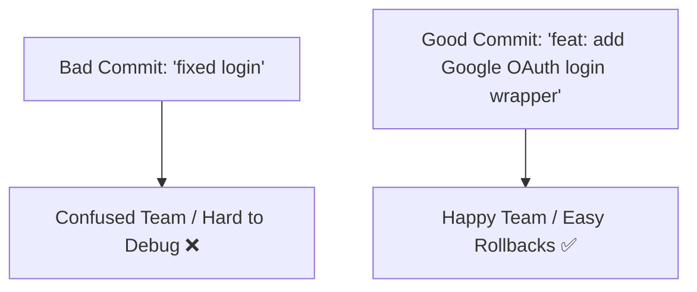

# ✍ Commit Message Best Practices

Take a look at your recent Git history. Do you see messages like `"fixed bug"`,
`"updates"`, `"jsadhgashd"`, or `"should work now"`? While those messages make
sense in the moment, looking at them six months later makes it impossible to
figure out why a line of code was changed.

Writing clean, descriptive commit messages is a gift to your future self and
your engineering team. It transforms your Git log into an easily searchable,
human-readable history book.

### What Makes a Great Commit Message?

Think of a commit message as a **miniature email** to your teammates. The title
should quickly explain _what_ changed, and if the change is complex, the body
should explain _why_ it was done and _how_ it impacts the codebase.

<!-- Visual flow for ✍ Commit Message Best Practices. -->


---

### The Golden Rules of Conventional Commits

Most professional development teams follow a standard specification called
**Conventional Commits**. This pattern adds a simple structural prefix to your
title so developers (and automated release tools) know exactly what the commit
does at a glance.

#### The Standard Structure

// Example demonstrating ✍ Commit Message Best Practices.
```text
type(scope): short summary in imperative mood

Detailed body explaining the technical justification for the change.

#### Common Commit Types

- `feat:` A brand-new feature added to the app (e.g.,
  `feat: add password visibility toggle`).
- `fix:` A bug fix in production or development (e.g.,
  `fix: resolve memory leak in dashboard timeline`).
- `docs:` Documentation changes only, like updating a README (e.g.,
  `docs: fix setup prerequisites`).
- `style:` Formatting updates that don't affect code logic, like white-space,
  semicolons, or linting errors.
- `refactor:` Code changes that neither fix a bug nor add a feature, but
  optimize performance or structure.
- `test:` Adding missing tests or correcting existing test suites.

### Real Runnable Code & Configuration

To prevent bad or messy commit messages from ever entering your codebase, you
can enforce these rules automatically using a tool called **commitlint** paired
with **Husky**.

Here is how you set up automated commit message verification inside your
project's `package.json`:

```javascript
// Install commitlint and configure rules inside package.json
{
  "name": "revisestack-app",
  "version": "1.0.0",
  "devDependencies": {
    "@commitlint/config-conventional": "^19.0.0",
    "commitlint": "^19.0.0",
    "husky": "^9.0.0"
  },
  "commitlint": {
    "extends": ["@commitlint/config-conventional"]
  }
}

Now, if a developer tries to run `git commit -m "fixed stuff"`, the pre-commit
hook will block the action and display a helpful formatting error message.

### 3 Rules for Writing Better Summaries

- **Use the Imperative Mood:** Write your message summary like you are giving a
  command.
- ❌ _Bad:_ `"I fixed the broken navigation button"` or
  `"Fixing navigation button"`
- _Good:_ `"fix: update navigation button click handler"`

- **Keep it Under 50 Characters:** Your title summary should be short and crisp.
  If it wraps to a second line in the terminal, it is too long.
- **Capitalization and Punctuation:** Do not capitalize the first letter of your
  summary text after the prefix, and do not end the line with a period. It saves
  space and looks incredibly clean in logs.

## Quick Reference

| Area | Revision point |
|---|---|
| Definition | State exactly what the topic means. |
| Mechanism | Explain the steps that produce the result. |
| Example | Use a small realistic case. |
| Pitfalls | Know common mistakes and boundary cases. |

## Decision Guide

Connect the definition to a practical decision: what problem does the concept solve, what assumptions does it make, and what evidence tells you it is working? This turns a memorised sentence into a usable mental model.

## Compare Related Ideas

When two concepts look similar, compare their purpose, inputs, guarantees, lifecycle, and trade-offs. A short comparison is often more useful for revision than another paragraph repeating the same definition.

## Self-Check

After reading an example, change one input and predict the result before running it. Then explain what changed and why. This exposes gaps in understanding and gives you a quick test without needing a separate exercise set.
