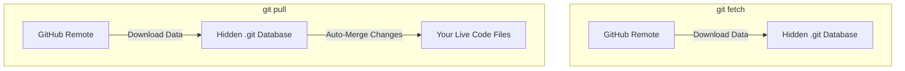

# ⬇️ Fetch, Pull & Push

Once your local repository is linked to a remote host like GitHub, you need a
way to move commits back and forth between your computer and the cloud. This
sync process relies on three essential actions: **fetch**, **pull**, and
**push**. 🔄

---

## ☁️ Sending Code to the Cloud (`git push`)

When you create new commits locally, they only exist on your machine. To publish
those milestones to GitHub so your team can see them, you use the `push`
command.

```bash
// Push your local branch commits up to the remote server
git push origin main

```

> 💡 **The Upstream Flag (`-u`):** The very first time you push a brand-new
> local branch, add the `-u` flag (e.g., `git push -u origin feat-login`). This
> links your local branch directly to the remote branch, allowing you to just
> type a simple `git push` for all future updates on that branch.

---

## 🔍 Checking for Updates Safely (`git fetch`)

Imagine a teammate pushes a new feature to GitHub. Your local project doesn't
automatically know about it.

Running a `fetch` tells Git to talk to GitHub and download any new commits,
branches, or tags your team has added. However, **fetch is completely safe**—it
only downloads the data into your hidden `.git` folder. It will _never_
overwrite or alter any code inside your active working directory. 🛡️

```bash
// Download remote updates without touching your local files
git fetch origin

```

---

## 📥 Downloading and Merging Updates (`git pull`)

If you want to download your teammate's latest changes and immediately mix them
directly into your current working files, you use the `pull` command.

```bash
// Fetch remote changes and instantly merge them into your current branch
git pull origin main

```



> ⚠️ **Under the Hood:** A `git pull` is not a standalone command! It is
> actually just a convenient macro shortcut that runs two commands back-to-back
> automatically:

```Bash
git pull = git fetch + git merge

```

---
