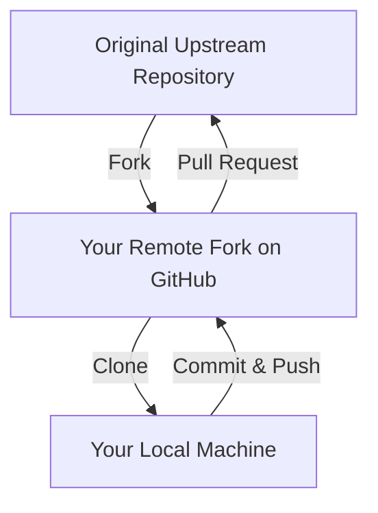

# 🍴 Fork & Open Source Contribution

Contributing to open-source projects can feel intimidating at first, but it
follows a predictable workflow. When you do not have direct write access to a
repository, you use a workflow centered around creating a personal copy and
submitting your changes for review.

### What is a Fork?

Think of a **fork** as photocopying a cookbook. You cannot write in the author's
original book, but you can scribble, modify, and add recipes to your personal
photocopy. If you create an amazing new recipe, you can show it to the author
and ask them to include it in the next official edition.



---

### The Open Source Workflow

Here is how to make your first open-source contribution step-by-step.

#### 1. Fork and Clone

Click the "Fork" button on GitHub to create a copy of the repository under your
own account. Then, clone your fork to your local machine.

```bash
// Clone your personal fork to your computer
git clone https://github.com/your-username/open-source-project.git

```

#### 2. Track the Original Project

You need to keep track of the original repository to pull in new updates. In
Git, the original repository is conventionally named `upstream`, while your fork
is named `origin`.

```bash
// Link your local repository to the original project
git remote add upstream https://github.com/original-author/open-source-project.git

```

#### 3. Create a Feature Branch

Never work directly on the `main` or `master` branch. Creating a dedicated
branch keeps your changes isolated and clean.

```bash
// Create and switch to a new descriptive branch
git checkout -b fix-login-bug

```

#### 4. Make Changes and Sync Updates

While you are working, other developers might merge new code into the original
project. Before submitting your work, grab the latest changes from the
`upstream` repository to avoid conflicts.

```bash
// Fetch the latest changes from the original author and merge them
git pull upstream main

```

#### 5. Push and Open a Pull Request (PR)

Push your feature branch up to your GitHub fork, then head over to the original
repository on GitHub to open a Pull Request.

```bash
// Push your local branch to your GitHub fork
git push origin fix-login-bug

```

---

### 💡 Quick Best Practices for Contributors

- **Read the `CONTRIBUTING.md` file:** Most major projects have specific rules
  about code formatting, testing, and branch naming.
- **Keep PRs small:** A Pull Request that fixes one single bug is much easier
  for maintainers to review and merge than a PR that changes ten different
  things.

---
