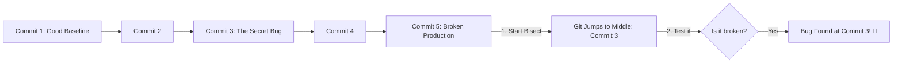

# Git Bisect

Imagine waking up to find a critical bug in production. You know for a fact that
the app worked perfectly two weeks ago, but since then, your team has merged
over 200 commits. Finding the exact line of code that broke everything feels
like searching for a needle in a haystack.

Instead of manually checking out dozens of old commits to find the culprit, you
can use **Git Bisect**. It uses a smart math strategy to hunt down the exact
commit that introduced the bug in just a few clicks.

### What is Git Bisect?

Think of Git Bisect as playing a game of **Higher or Lower** with your commit
history. It uses a **binary search algorithm** to divide your commit timeline
perfectly in half.

Instead of checking all 200 commits one by one, Git jumps straight to commit
number 100 and asks you, _"Is the bug here?"_ If you say yes, it cuts out the
second half of the timeline entirely and splits the remaining 100 commits in
half again. Using this method, you can pinpoint the broken commit out of
hundreds in fewer than 8 steps!

<!-- Visual flow for Git Bisect. -->


---

### Step-by-Step Troubleshooting Guide

Here is how to run an interactive debugging session to trap a bug.

#### 1. Start the Search Engine

First, tell Git you want to start a debugging investigation.

```bash
// Start the automated binary search wizard
git bisect start

```
#### 2. Label Your Markers

You need to give Git two points of reference: where the app is currently broken
(bad) and a point in the past where you know it worked perfectly (good).

```bash
// Tell Git that the current latest version is broken
git bisect bad

// Tell Git that a specific commit hash from last week was safe
git bisect good a1b2c3d

```
#### 3. Test and Answer

Git will instantly check out a commit right in the middle of that timeline. Look
at your code or run your app, and tell Git whether it works or fails.

```bash
// If the app is broken on this commit, run:
git bisect bad

// If the app works fine on this commit, run:
git bisect good

Repeat this simple answering process. Git will keep jumping to the middle of the
remaining possibilities until it prints out the exact commit hash, author, and
date of the change that broke your project.

```
#### 4. Clean Up and Return

Once you have noted the culprit commit and know what to fix, exit the wizard to
return your workspace back to normal.

```bash
// End the search session and return to your original working branch
git bisect reset

```
### Extra Pro Tip: Automated Bisecting

If you have an automated script or a test command (like `npm run test:auth`)
that returns a failure code whenever the bug is present, you can automate this
entire process! Git will test every commit for you without asking questions:

```bash
// Tell Git to run the test script automatically across the timeline
git bisect run npm run test:auth

```
## Quick Reference

| Area | Revision point |
|---|---|
| Definition | State exactly what the topic means. |
| Mechanism | Explain the steps that produce the result. |
| Example | Use a small realistic case. |
| Pitfalls | Know common mistakes and boundary cases. |

## Decision Guide

Connect the definition to a practical decision: what problem does the concept solve, what assumptions does it make, and what evidence tells you it is working? This turns a memorised sentence into a usable mental model.

## Compare Related Ideas

When two concepts look similar, compare their purpose, inputs, guarantees, lifecycle, and trade-offs. A short comparison is often more useful for revision than another paragraph repeating the same definition.
