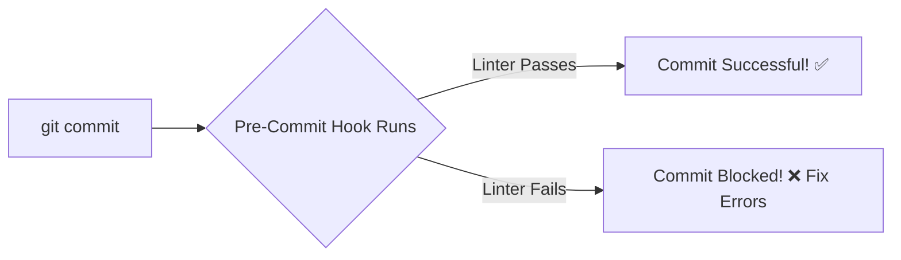

# 🪝 Git Hooks

Have you ever accidentally committed code with a typo, a missing semicolon, or a
broken test, only to realize it after pushing to GitHub? It is frustrating to
make a separate "fix typo" commit just to clean up your history.

**Git Hooks** are built-in automation scripts that fire off automatically
whenever key Git actions happen, blocking bad code before it ever leaves your
machine.

### What is a Git Hook?

Think of Git Hooks as an **automated bouncer** standing outside your repository
door. When you run `git commit`, the bouncer stops you, inspects your code with
a code linter or runs your tests, and says, _"Hold on, you forgot a semicolon on
line 42. Fix that before I let you commit this."_

<!-- Visual flow for 🪝 Git Hooks. -->


---

### Client-Side vs. Server-Side Hooks

Git hooks are split into two categories based on where they run:

- **Client-Side Hooks:** Run locally on your own computer. These handle things
  like checking commit messages (`commit-msg`) or linting code before a commit
  finishes (`pre-commit`).
- **Server-Side Hooks:** Run on a remote server like GitHub or GitLab. These
  handle server tasks like rejecting pushes if they don't match team standards
  (`pre-receive`).

### How to Install and Use a Git Hook

Git hooks live right inside your repository in a hidden folder called
`.git/hooks/`. If you open that folder, you will find a bunch of sample files
ending in `.sample`.

#### 1. Activate a Hook Manually

To turn a sample hook into a live hook, all you have to do is remove the
`.sample` extension from the filename and make the file executable.

```bash
## Rename the sample pre-commit file to make it active
mv .git/hooks/pre-commit.sample .git/hooks/pre-commit

## Make the script executable on Unix systems
chmod +x .git/hooks/pre-commit

#### 2. Writing a Simple Pre-Commit Script

Inside that file, you can write any shell script you want. Here is a practical
example of a script that runs a project linter and blocks the commit if the
linter finds errors:
```

#!/bin/sh
```
## Run the project code linter before completing the commit

echo "🔍 Running code quality checks..."
npm run lint

## Check if the linter failed (returned a non-zero exit code)
if [ $? -ne 0 ]; then
    echo "❌ Linter failed! Please fix your code formatting before committing."
    exit 1
fi

### Making Hooks Easy: Husky 🐾

Managing raw shell scripts inside a hidden `.git` folder is a pain, and those
scripts aren't tracked by Git, meaning your teammates won't get them
automatically.

In the modern JavaScript ecosystem, developers use a popular package called
**Husky** to easily manage and share hooks through your standard `package.json`
file.

```javascript
// Example Husky configuration inside package.json
{
  "husky": {
    "hooks": {
      "pre-commit": "npm run lint",
      "commit-msg": "commitlint -E HUSKY_GIT_PARAMS"
    }
  }
}

```
### Bypassing a Hook

If you are in the middle of a messy experiment and absolutely _must_ commit your
code without waiting for long test suites or linters to finish, you can bypass
client-side hooks by adding the `--no-verify` flag to your command:

```bash
// Force a commit through, completely skipping the pre-commit checks
git commit -m "WIP: Experimental changes" --no-verify

```
## Quick Reference

| Area | Revision point |
|---|---|
| Definition | State exactly what the topic means. |
| Mechanism | Explain the steps that produce the result. |
| Example | Use a small realistic case. |
| Pitfalls | Know common mistakes and boundary cases. |

## Decision Guide

Connect the definition to a practical decision: what problem does the concept solve, what assumptions does it make, and what evidence tells you it is working? This turns a memorised sentence into a usable mental model.

## Compare Related Ideas

When two concepts look similar, compare their purpose, inputs, guarantees, lifecycle, and trade-offs. A short comparison is often more useful for revision than another paragraph repeating the same definition.

## Self-Check

After reading an example, change one input and predict the result before running it. Then explain what changed and why. This exposes gaps in understanding and gives you a quick test without needing a separate exercise set.
