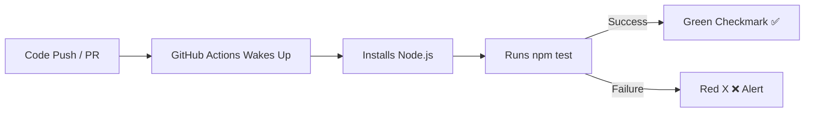

# GitHub Actions Basics

Testing, building, and deploying your code manually every single time you make a
change gets exhausting. **GitHub Actions** is a built-in automation tool that
handles these repetitive tasks for you directly inside your repository.

### What is GitHub Actions?

Think of GitHub Actions as a **digital assembly line**. Whenever you trigger an
event (like pushing code or opening a Pull Request), the assembly line
automatically wakes up, grabs your code, runs your tests, and alerts you if
anything breaks before the code ever reaches production.

<!-- Visual flow for GitHub Actions Basics. -->


---

### Core Concepts You Need to Know

To build an automation pipeline, you only need to understand four basic building
blocks:

- **Workflow:** The automated process file written in YAML format. It lives in
  your project's `.github/workflows/` directory.
- **Event:** The specific trigger that starts the workflow (e.g., `push`,
  `pull_request`).
- **Job:** A set of steps that execute on a fresh virtual machine (called a
  **Runner**).
- **Step:** An individual task within a job, like running a single terminal
  command or using a pre-made script.

### Creating Your First Workflow

Let's look at a practical, runnable example. This configuration file
automatically runs your JavaScript test suite every time code is pushed to the
`main` branch.

Create a file at `.github/workflows/ci.yml`:

# Example configuration for the topic.
```yaml
## Name of the automation pipeline visible on GitHub
name: Node.js CI

## The event triggers that kick off this workflow
on:
  push:
    branches: [main]
  pull_request:
    branches: [main]

## The jobs that run on the GitHub runner
jobs:
  test-project:
    runs-on: ubuntu-latest

steps:
      # Pulls down your repository code onto the runner
      - name: Checkout repository code
        uses: actions/checkout@v4

## Installs the specified version of Node.js
      - name: Setup Node.js environment
        uses: actions/setup-node@v4
        with:
          node-version: '20'

## Installs your project dependencies
      - name: Install dependencies
        run: npm install

## Runs your automated test script from package.json
      - name: Run test suite
        run: npm test
```

### Quick Tips for Beginners

- **Use the Marketplace:** You do not have to write everything from scratch.
  GitHub has a massive Marketplace full of pre-made steps (like
  `actions/setup-node`) built by the community.
- **Check the Actions Tab:** If your workflow fails, head over to the
  **Actions** tab on your GitHub repository. It provides complete terminal logs
  for every step so you can easily debug the failure.

## Quick Reference

| Area | Revision point |
|---|---|
| Definition | State exactly what the topic means. |
| Mechanism | Explain the steps that produce the result. |
| Example | Use a small realistic case. |
| Pitfalls | Know common mistakes and boundary cases. |

## Decision Guide

Connect the definition to a practical decision: what problem does the concept solve, what assumptions does it make, and what evidence tells you it is working? This turns a memorised sentence into a usable mental model.

## Compare Related Ideas

When two concepts look similar, compare their purpose, inputs, guarantees, lifecycle, and trade-offs. A short comparison is often more useful for revision than another paragraph repeating the same definition.

## Self-Check

After reading an example, change one input and predict the result before running it. Then explain what changed and why. This exposes gaps in understanding and gives you a quick test without needing a separate exercise set.

## Practical Decision

A concept becomes easier to revise when it is tied to a decision you may actually make. Identify the problem, the available choices, and the condition that makes one choice appropriate. Then state one case where the concept should not be used. That negative example is useful because it marks the boundary of the idea and reduces confusion with related concepts.
