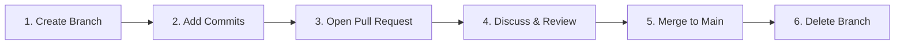

# 🐙 GitHub Workflow

The **GitHub Workflow** (often called the GitHub Flow) is a lightweight,
branch-based workflow used by development teams worldwide. It provides a
structured, safe blueprint for deploying features and fixes to production
without disrupting the main codebase. 🗺️

---

## 🔁 The 6-Step Workflow Cycle

Whether you are working at a massive tech company or contributing to an
open-source project, you will follow this exact lifecycle sequence for almost
every single feature you build.

<!-- Visual flow for 🐙 GitHub Workflow. -->


## 🛠 Walking Through the Workflow in Production

Let's break down exactly how this look in action inside your terminal and on the
GitHub dashboard:

### 1. Create a Feature Branch 🌿

Always keep your `main` branch clean and deployable. Before writing any code,
create a dedicated branch with a descriptive name.

# Basic example showing the core idea.
```bash
// Switch to main and pull latest changes first
git checkout main
git pull origin main

// Create and switch to your feature branch
git checkout -b feat-user-profile

### 2. Make Changes and Commit Locally 💾

Write your code, style your components, and save your progress using small,
focused commits.

```bash
// Stage and save your progress locally
git add components/Profile.jsx
git commit -m "feat: add user profile avatar component"

### 3. Push and Open a Pull Request (PR) 🔃

Push your branch up to GitHub to share it with your team. Once uploaded,
navigate to the GitHub dashboard interface to open a **Pull Request**—a formal
request to merge your branch into `main`.

# Basic example showing the core idea.
```bash
// Push your branch and link it upstream to GitHub
git push -u origin feat-user-profile

### 4. Code Review and Discussion 👀

Your team reviews your code line-by-line, runs automated tests, and leaves
feedback or suggestions directly on your PR. If they request changes, you simply
make the edits on your computer and push new commits to the same branch—the PR
updates automatically!

### 5. Merge to Main 🤝

Once your code is approved by a peer and passes all automated status checks,
click the green "Merge pull request" button on GitHub. Your feature branch
commits are seamlessly integrated into the production timeline.

### 6. Clean Up and Delete 🧹

To prevent your repository from turning into a graveyard of dead feature
branches, delete the remote branch directly on GitHub, then clean up your local
machine:

```bash
// Jump back to main, pull the merge, and delete your local branch
git checkout main
git pull origin main
git branch -d feat-user-profile

## Quick Reference

| Area | Revision point |
|---|---|
| Definition | State exactly what the topic means. |
| Mechanism | Explain the steps that produce the result. |
| Example | Use a small realistic case. |
| Pitfalls | Know common mistakes and boundary cases. |

## Decision Guide

Connect the definition to a practical decision: what problem does the concept solve, what assumptions does it make, and what evidence tells you it is working? This turns a memorised sentence into a usable mental model.

## Compare Related Ideas

When two concepts look similar, compare their purpose, inputs, guarantees, lifecycle, and trade-offs. A short comparison is often more useful for revision than another paragraph repeating the same definition.

## Self-Check

After reading an example, change one input and predict the result before running it. Then explain what changed and why. This exposes gaps in understanding and gives you a quick test without needing a separate exercise set.

## Practical Decision

A concept becomes easier to revise when it is tied to a decision you may actually make. Identify the problem, the available choices, and the condition that makes one choice appropriate. Then state one case where the concept should not be used. That negative example is useful because it marks the boundary of the idea and reduces confusion with related concepts.
