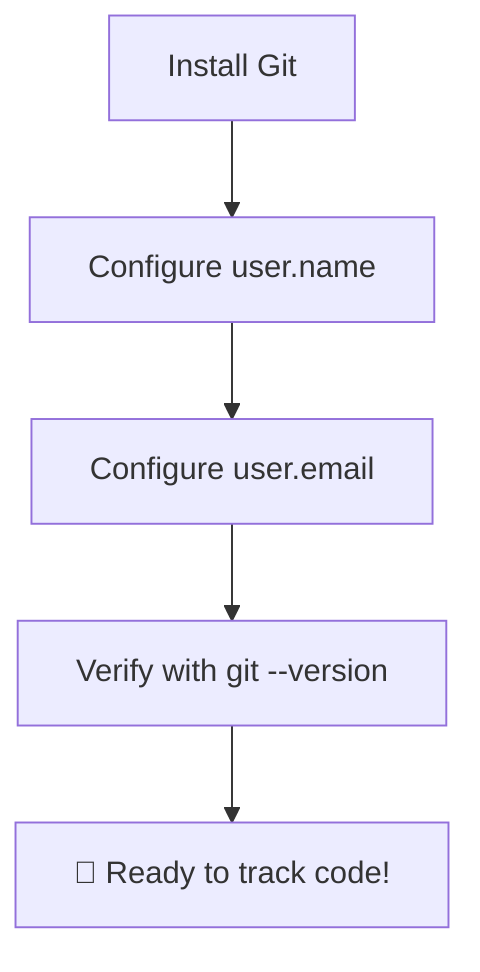

# 🛠️ Git Installation & Setup

Before tracking your project history, you need to install Git on your computer
and introduce yourself to it. Setting up your user identity ensures every change
you save is correctly credited to you. 🧑‍💻

---

## 💾 Installing Git

The installation process depends on your operating system. Follow the steps
below to get it up and running.

### macOS

Open your terminal and run the following command using Homebrew:

```bash
// Install Git on macOS using Homebrew
brew install git

```

### Windows

Download the official standalone installer from the
[Git Website](https://git-scm.com/). Run the `.exe` file and follow the setup
wizard. It is highly recommended to keep the default settings checked during
installation, especially the option to use Git from the command line.

### Linux

Open your terminal and use your distribution's package manager:

```bash
// Install Git on Debian/Ubuntu
sudo apt update && sudo apt install git

```

---

## ⚙️ The First-Time Configuration

Once installed, you must configure your global username and email address. Git
attaches this information to every single snapshot you save so team members know
who made what change. 🏷️

Open your terminal or command prompt and run these commands:

```bash
// Set your global Git username
git config --global user.name "Your Name"

```

```bash
// Set your global Git email address
git config --global user.email "your.email@example.com"

```

> ⚠️ **Note:** If you plan on using GitHub, make sure this email matches the one
> linked to your GitHub account!

---

## 🔍 Verifying the Installation

To verify that Git is installed correctly and your configuration saved, run the
following verification commands:

```bash
// Check the installed Git version
git --version

```

```bash
// List all configured Git settings
git config --list

```



---
