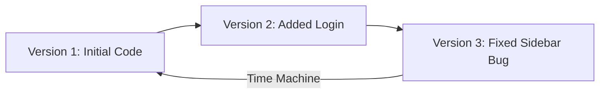

# Introduction to Git

Git is the most popular version control system in the world, used by millions of
developers to track code changes. It acts like a time machine for your project,
letting you save snapshots of your files so you never lose your work. 💡

<!-- Visual flow for Introduction to Git. -->

### Why Do We Need Git? 🤔

Imagine you are building a website. You make a few changes, and suddenly
everything breaks. Without Git, you would have to spam `Ctrl + Z` or keep a
dozen messy backup folders like `project_final_v2_actual_final`.

With Git, you can comfortably experiment with your codebase. If a new feature
breaks your application, you can roll back to a working version with a single
command. It also makes collaborating with other developers seamless, ensuring
two people don't accidentally overwrite each other's work.

### Git vs. GitHub: What's the Difference? ⚖

A common point of confusion for beginners is mixing up Git and GitHub. They work
together, but they are completely different tools:

- **Git:** The local tool installed on your computer. It manages your history,
  takes snapshots, and handles version tracking.
- **GitHub:** A cloud-based hosting platform. It acts as a remote home for the
  Git repositories you create, allowing you to share code and collaborate with
  others online.

Think of **Git** as the camera taking the photos, and **GitHub** as Instagram
where you upload and share them. 📸

---

## Quick Reference

| Area | Revision point |
|---|---|
| Definition | State exactly what the topic means. |
| Mechanism | Explain the steps that produce the result. |
| Example | Use a small realistic case. |
| Pitfalls | Know common mistakes and boundary cases. |

## Decision Guide

Connect the definition to a practical decision: what problem does the concept solve, what assumptions does it make, and what evidence tells you it is working? This turns a memorised sentence into a usable mental model.

## Compare Related Ideas

When two concepts look similar, compare their purpose, inputs, guarantees, lifecycle, and trade-offs. A short comparison is often more useful for revision than another paragraph repeating the same definition.

## Self-Check

After reading an example, change one input and predict the result before running it. Then explain what changed and why. This exposes gaps in understanding and gives you a quick test without needing a separate exercise set.

## Practical Decision

A concept becomes easier to revise when it is tied to a decision you may actually make. Identify the problem, the available choices, and the condition that makes one choice appropriate. Then state one case where the concept should not be used. That negative example is useful because it marks the boundary of the idea and reduces confusion with related concepts.

Connect the definition to a practical decision: what problem does the concept solve, what assumptions does it make, and what evidence tells you it is working? This turns a memorised sentence into a usable mental model.

When two concepts look similar, compare their purpose, inputs, guarantees, lifecycle, and trade-offs. A short comparison is often more useful for revision than another paragraph repeating the same definition.
