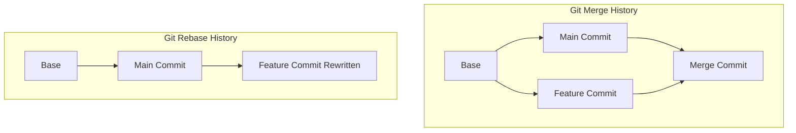

# ⚖️ Merge vs Rebase

Both `git merge` and `git rebase` solve the exact same problem: they integrate
changes from one branch into another. However, they approach this task with
completely different philosophies, and choosing the right one depends on your
team’s workflow goals. 🤝

---

## 🆚 The Core Differences

The choice between merging and rebasing comes down to how you value your
project's history. Do you want an **accurate record of what actually happened**,
or do you want a **clean, easily readable story**? 📖

### Git Merge

- **How it works:** Combines the branches by creating a brand-new "Merge Commit"
  that ties the timelines together.
- **Pros:** Non-destructive. It preserves the exact history of how and when code
  was written without changing existing commits.
- **Cons:** History can quickly become cluttered with dozens of intertwined
  lines and automatic merge commits, making it harder to read the logs.

### Git Rebase

- **How it works:** Lifts your feature branch commits and replays them one by
  one on top of the target branch, creating a perfectly flat timeline.
- **Pros:** Keeps your history completely linear and exceptionally clean. No
  unnecessary merge commits clutter up your project log.
- **Cons:** Rewrites history by generating entirely new commits. If handled
  incorrectly on shared branches, it can cause major sync issues for teammates.

---

## 📊 Side-by-Side Comparison

| Feature            | Git Merge                                  | Git Rebase                                 |
| ------------------ | ------------------------------------------ | ------------------------------------------ |
| **Commit History** | Keeps history authentic and complex        | Makes history completely linear and simple |
| **Commit Hashes**  | Keeps all original hashes exactly the same | Modifies hashes by rewriting commits       |
| **Merge Commits**  | Explicitly creates an extra merge commit   | Never creates an extra merge commit        |
| **When to Use**    | On public/shared branches with your team   | On local branches before sharing your code |

---

## 🛠️ Which One Should You Use?

A fantastic industry best practice used by many engineering teams is to combine
both methods safely:

1. **Use Rebase locally:** Use `git rebase main` to update your local feature
   branch with the latest changes from your team. This keeps your branch clean
   and up to date.
2. **Use Merge for pull requests:** When your feature is completely finished and
   ready to go into the main production line, use a merge (or a squash-and-merge
   on GitHub) to log the official integration of that feature. 🚀

---
