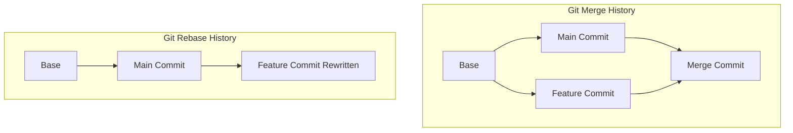

# ⚖ Merge vs Rebase

Both `git merge` and `git rebase` solve the exact same problem: they integrate
changes from one branch into another. However, they approach this task with
completely different philosophies, and choosing the right one depends on your
team’s workflow goals. 🤝

---

## 🆚 The Core Differences

The choice between merging and rebasing comes down to how you value your
project's history. Do you want an **accurate record of what actually happened**,
or do you want a **clean, easily readable story**? 📖

### Git Merge

- **How it works:** Combines the branches by creating a brand-new "Merge Commit"
  that ties the timelines together.
- **Pros:** Non-destructive. It preserves the exact history of how and when code
  was written without changing existing commits.
- **Cons:** History can quickly become cluttered with dozens of intertwined
  lines and automatic merge commits, making it harder to read the logs.

### Git Rebase

- **How it works:** Lifts your feature branch commits and replays them one by
  one on top of the target branch, creating a perfectly flat timeline.
- **Pros:** Keeps your history completely linear and exceptionally clean. No
  unnecessary merge commits clutter up your project log.
- **Cons:** Rewrites history by generating entirely new commits. If handled
  incorrectly on shared branches, it can cause major sync issues for teammates.

<!-- Visual flow for ⚖ Merge vs Rebase. -->

## Side-by-Side Comparison

| Feature            | Git Merge                                  | Git Rebase                                 |
| ------------------ | ------------------------------------------ | ------------------------------------------ |
| **Commit History** | Keeps history authentic and complex        | Makes history completely linear and simple |
| **Commit Hashes**  | Keeps all original hashes exactly the same | Modifies hashes by rewriting commits       |
| **Merge Commits**  | Explicitly creates an extra merge commit   | Never creates an extra merge commit        |
| **When to Use**    | On public/shared branches with your team   | On local branches before sharing your code |

## 🛠 Which One Should You Use?

A fantastic industry best practice used by many engineering teams is to combine
both methods safely:

1. **Use Rebase locally:** Use `git rebase main` to update your local feature
   branch with the latest changes from your team. This keeps your branch clean
   and up to date.
2. **Use Merge for pull requests:** When your feature is completely finished and
   ready to go into the main production line, use a merge (or a squash-and-merge
   on GitHub) to log the official integration of that feature. 🚀

## Quick Reference

| Area | Revision point |
|---|---|
| Definition | State exactly what the topic means. |
| Mechanism | Explain the steps that produce the result. |
| Example | Use a small realistic case. |
| Pitfalls | Know common mistakes and boundary cases. |

## Decision Guide

Connect the definition to a practical decision: what problem does the concept solve, what assumptions does it make, and what evidence tells you it is working? This turns a memorised sentence into a usable mental model.

## Compare Related Ideas

When two concepts look similar, compare their purpose, inputs, guarantees, lifecycle, and trade-offs. A short comparison is often more useful for revision than another paragraph repeating the same definition.

## Self-Check

After reading an example, change one input and predict the result before running it. Then explain what changed and why. This exposes gaps in understanding and gives you a quick test without needing a separate exercise set.

## Practical Decision

A concept becomes easier to revise when it is tied to a decision you may actually make. Identify the problem, the available choices, and the condition that makes one choice appropriate. Then state one case where the concept should not be used. That negative example is useful because it marks the boundary of the idea and reduces confusion with related concepts.

## Final Understanding Check

Before considering **⚖ Merge vs Rebase** revised, make sure you can state the definition without relying on the example, explain the mechanism in the correct order, and predict what happens when one important input or assumption changes. Then check one boundary case and one practical use case. The example should support the explanation rather than replace it. When a result is surprising, inspect the rule that produced it and verify the relevant precondition. This approach is more reliable than memorising a code snippet, formula, command, or interview answer because the same reasoning can be applied to a new problem. For technical topics, also distinguish what is guaranteed by the language, library, protocol, or mathematical rule from what is merely a common convention. That distinction helps you choose the correct solution when the context changes.
