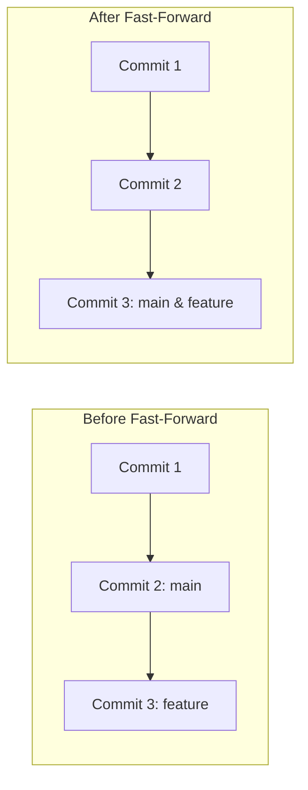
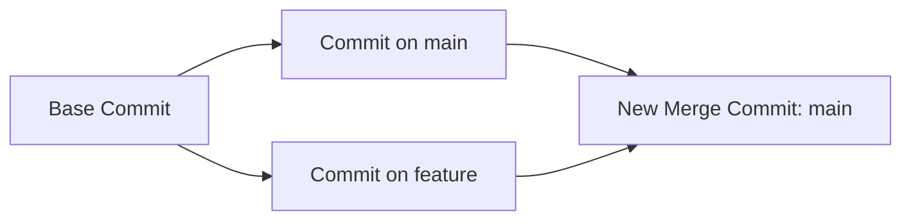

# 🔀 Merging

Once you finish building a feature or fixing a bug on an isolated branch, you
need a way to bring those changes back into your main codebase. In Git, this
process is called **merging**. 🤝

---

## 🏎️ Fast-Forward Merge vs. Three-Way Merge

Depending on how your project timeline has moved since you created your branch,
Git will use one of two merging strategies.

### 1. Fast-Forward Merge

This happens if the `main` branch has **not received any new commits** since you
created your feature branch. Git doesn't need to combine any code—it simply
slides the `main` branch pointer forward to match your feature branch's latest
commit.



### 2. Three-Way Merge (Merge Commit)

This happens if **both** branches have moved forward independently. If a
teammate pushed a fix to `main` while you were working on your feature branch,
Git must combine the changes.

It looks at the common ancestor commit and the tips of both branches to create a
brand-new **Merge Commit** that ties the two timelines together. 🕸️



---

## 🛠️ Merging in Action

To pull changes from a feature branch into `main`, you must always follow this
specific order:

```bash
// 1. Switch over to the branch that is RECEIVING the changes (usually main)
git checkout main

// 2. Pull the changes from your feature branch into your current branch
git merge feat-sidebar

```

---

## 🧹 Cleaning Up After a Merge

Once your feature is safely merged into `main`, keeping the old branch hanging
around cluttering up your repository is bad practice. You can safely delete it
without losing any code history. 🗑️

```bash
// Delete a local branch that has been fully merged
git branch -d feat-sidebar

```

---
