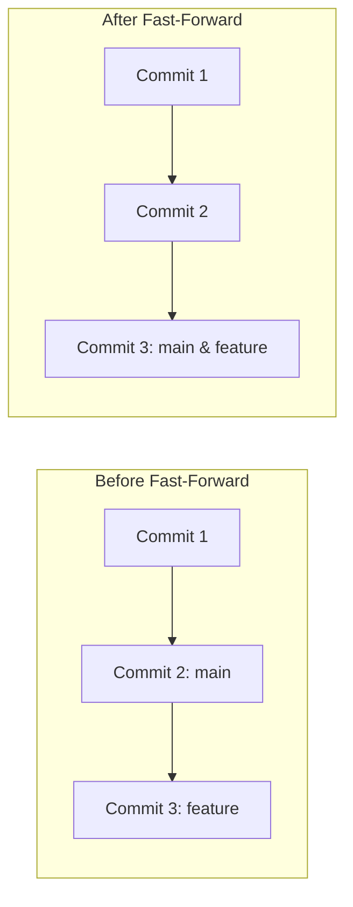
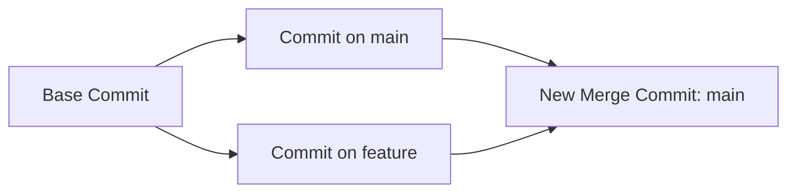

# 🔀 Merging

Once you finish building a feature or fixing a bug on an isolated branch, you
need a way to bring those changes back into your main codebase. In Git, this
process is called **merging**. 🤝

---

## 🏎 Fast-Forward Merge vs. Three-Way Merge

Depending on how your project timeline has moved since you created your branch,
Git will use one of two merging strategies.

### 1. Fast-Forward Merge

This happens if the `main` branch has **not received any new commits** since you
created your feature branch. Git doesn't need to combine any code—it simply
slides the `main` branch pointer forward to match your feature branch's latest
commit.

<!-- Visual flow for 🔀 Merging. -->


### 2. Three-Way Merge (Merge Commit)

This happens if **both** branches have moved forward independently. If a
teammate pushed a fix to `main` while you were working on your feature branch,
Git must combine the changes.

It looks at the common ancestor commit and the tips of both branches to create a
brand-new **Merge Commit** that ties the two timelines together. 🕸️

<!-- Visual flow for 🔀 Merging. -->

## 🛠 Merging in Action

To pull changes from a feature branch into `main`, you must always follow this
specific order:

```bash
// 1. Switch over to the branch that is RECEIVING the changes (usually main)
git checkout main

// 2. Pull the changes from your feature branch into your current branch
git merge feat-sidebar

```
## 🧹 Cleaning Up After a Merge

Once your feature is safely merged into `main`, keeping the old branch hanging
around cluttering up your repository is bad practice. You can safely delete it
without losing any code history. 🗑️

```bash
// Delete a local branch that has been fully merged
git branch -d feat-sidebar

```
## Quick Reference

| Area | Revision point |
|---|---|
| Definition | State exactly what the topic means. |
| Mechanism | Explain the steps that produce the result. |
| Example | Use a small realistic case. |
| Pitfalls | Know common mistakes and boundary cases. |

## Decision Guide

Connect the definition to a practical decision: what problem does the concept solve, what assumptions does it make, and what evidence tells you it is working? This turns a memorised sentence into a usable mental model.

## Compare Related Ideas

When two concepts look similar, compare their purpose, inputs, guarantees, lifecycle, and trade-offs. A short comparison is often more useful for revision than another paragraph repeating the same definition.

## Self-Check

After reading an example, change one input and predict the result before running it. Then explain what changed and why. This exposes gaps in understanding and gives you a quick test without needing a separate exercise set.

## Practical Decision

A concept becomes easier to revise when it is tied to a decision you may actually make. Identify the problem, the available choices, and the condition that makes one choice appropriate. Then state one case where the concept should not be used. That negative example is useful because it marks the boundary of the idea and reduces confusion with related concepts.

## Final Understanding Check

Before considering **🔀 Merging** revised, make sure you can state the definition without relying on the example, explain the mechanism in the correct order, and predict what happens when one important input or assumption changes. Then check one boundary case and one practical use case. The example should support the explanation rather than replace it. When a result is surprising, inspect the rule that produced it and verify the relevant precondition. This approach is more reliable than memorising a code snippet, formula, command, or interview answer because the same reasoning can be applied to a new problem. For technical topics, also distinguish what is guaranteed by the language, library, protocol, or mathematical rule from what is merely a common convention. That distinction helps you choose the correct solution when the context changes.
