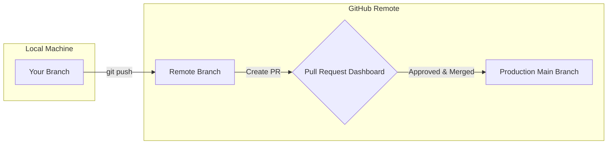

# 🔃 Pull Requests

A **Pull Request (PR)** is a formal request to merge your code changes from one
branch into another. It acts as a collaborative dashboard where developers
review code, discuss design decisions, run automated tests, and ensure quality
before any new feature goes live. 🤝

---

## 🏗️ What is a Pull Request?

Despite the name, a PR isn’t a Git command—it is a feature built by platforms
like GitHub, GitLab, and Bitbucket.

When you open a PR, you are telling your team: _"I have built this feature on my
branch. Please review my code and, if everything looks great, pull it into the
main project line."_



---

## 📝 Anatomy of a Perfect Pull Request

A great PR makes life easier for your code reviewers, leading to faster
approvals and safer merges. A professional PR always includes:

- **A Clear Title:** Summarize the change concisely (e.g.,
  `feat: integrate Stripe checkout overlay`).
- **The Description:** Explain _why_ the change was made, _what_ was altered
  under the hood, and how to manually test it.
- **Visual Evidence:** Add screenshots or screen recordings if your changes
  affect the user interface (UI).
- **Reviewers:** Explicitly tag teammates whose feedback or domain expertise you
  need.

---

## 🛠️ Step-by-Step Pull Request Workflow

Creating and finalizing a PR involves switching between your command line
terminal and the GitHub website interface.

1. **Push your feature branch to GitHub:** git push. Ensure all your local
   progress is saved, then push your isolated feature branch up to the remote
   server.

```bash
// Push your local branch upstream to GitHub
git push -u origin feat-payment-form

```

2. **Open the PR on the dashboard:** GitHub UI. Navigate to your repository page
   on GitHub. You will see a prominent yellow banner that says **"Compare & pull
   request"**. Click it, fill out your description template, and hit **"Create
   pull request"**.

3. **Address feedback and push fixes:** Collaboration. If your team requests
   changes or an automated build test fails, do not close the PR! Make the edits
   directly on your computer, commit them, and push again. The PR updates
   automatically.

```bash
// Make a fix and push - the open PR catches it instantly
git add src/Payment.js && git commit -m "fix: resolve edge-case validation bug"
git push

```

4. **Merge and close out the branch:** Final Step. Once you get the green light
   from your reviewers, click **"Merge pull request"** on GitHub. Switch back to
   your terminal to clean up your workspace.

```bash
// Return to main, sync the merge, and delete your local branch
git checkout main && git pull origin main
git branch -d feat-payment-form

```

---
