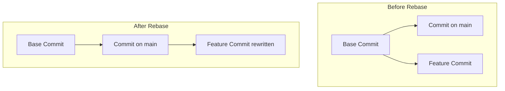

# ♻ Rebasing

**Rebasing** is an alternative way to integrate changes from one branch into
another. While merging ties two distinct timelines together with a new merge
commit, rebasing rewrites history by moving your entire feature branch so it
sits right on top of the latest commit on `main`. ⏳

---

## How Rebasing Works

Imagine you branch off `main` to build a feature. While you are working, a
teammate adds two new commits to `main`. Your branch is now out of date.

Instead of merging `main` into your feature branch (which creates an extra,
messy merge commit), you can **rebase**. Git will temporarily lift your feature
commits, slide the updated `main` branch under them, and then reapply your
feature commits one by one on top.

<!-- Visual flow for ♻ Rebasing. -->


### The Big Benefit:

Your project history looks like a **perfectly straight line**, as if you built
your feature on top of the latest version of the project from the very start. 📏

## 🛠 Rebasing in Action

To update your feature branch with the latest changes from `main` using rebase,
follow these commands:

```bash
// 1. Make sure you are standing on your feature branch
git checkout feat-auth

// 2. Rebase your current branch onto main
git rebase main

```
## ⚠ The Golden Rule of Rebasing

Because rebasing rewrites the project's commit history (it generates brand-new
SHA-1 hashes for your moved commits), you must follow one strict safety rule:

> **Never rebase commits that you have already pushed to a public repository or
> shared with other developers.**

If you rewrite history that others are already using as a baseline, you will
break their local workspaces and cause massive synchronization head-scratching
for your team. Keep rebasing strictly for your **local cleanup** before you
share your work! 🛑

## Quick Reference

| Area | Revision point |
|---|---|
| Definition | State exactly what the topic means. |
| Mechanism | Explain the steps that produce the result. |
| Example | Use a small realistic case. |
| Pitfalls | Know common mistakes and boundary cases. |

## Decision Guide

Connect the definition to a practical decision: what problem does the concept solve, what assumptions does it make, and what evidence tells you it is working? This turns a memorised sentence into a usable mental model.

## Compare Related Ideas

When two concepts look similar, compare their purpose, inputs, guarantees, lifecycle, and trade-offs. A short comparison is often more useful for revision than another paragraph repeating the same definition.

## Self-Check

After reading an example, change one input and predict the result before running it. Then explain what changed and why. This exposes gaps in understanding and gives you a quick test without needing a separate exercise set.

## Practical Decision

A concept becomes easier to revise when it is tied to a decision you may actually make. Identify the problem, the available choices, and the condition that makes one choice appropriate. Then state one case where the concept should not be used. That negative example is useful because it marks the boundary of the idea and reduces confusion with related concepts.
