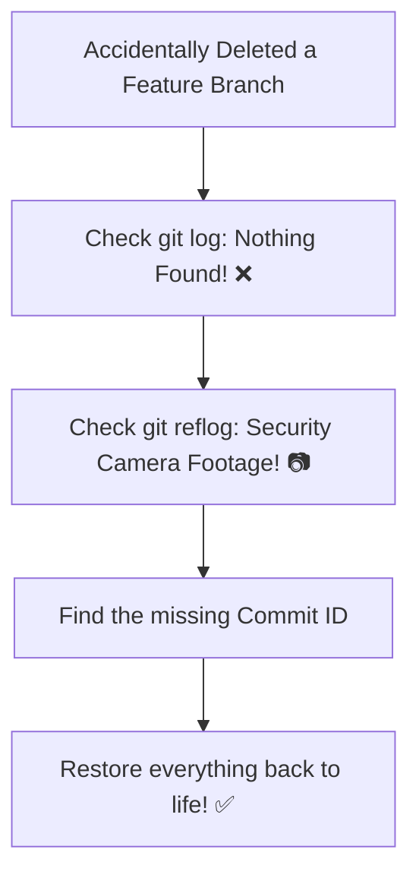

# 📋 Reflog

Every developer has had a moment of pure panic where they think, _"I just
deleted my branch, and all my work from the last three days is gone forever."_
You check your standard commit history using `git log`, and the branch isn't
there anymore.

Before you start re-writing your code from scratch, take a deep breath. Git
rarely deletes anything permanently right away. **Git Reflog** is the ultimate
safety net designed to rescue you from your worst Git mistakes.

### What is Git Reflog?

Think of `git log` as your project's **official public diary**—it only records
the major milestones you explicitly want people to see. **Git Reflog (Reference
Log)** is like a hidden **security camera** sitting in the corner of your local
machine. It captures every single movement your project makes.

Whether you switch branches, pull updates, amend a commit, or accidentally
hard-reset and delete files, the security camera catches it and saves the
record.

<!-- Visual flow for 📋 Reflog. -->


---

### How to Save the Day with Reflog

Here is how to read your local security logs and bring deleted code back from
the dead.

#### 1. Open the Security Tape

To view your complete movement history, run the reflog command.

# Basic example showing the core idea.
```bash
// View a clean history of every local Git action you have taken
git reflog

The output will display a list of events sorted from newest to oldest. It looks
something like this:

> `HEAD@{0}: reset: moving to HEAD~1` _(Oops, this was the mistake!)_ >
> `HEAD@{1}: commit: feat: added stripe checkout integration` _(🎯 This is the
> work we lost!)_ > `HEAD@{2}: checkout: moving from feature-auth to main`

#### 2. Find the Golden Commit ID

Look down the list until you find the action you took right before everything
went wrong. Note the short 7-character commit hash next to it (for example,
`a1b2c3d`).

#### 3. Rewind Time

Now that you have the commit ID of your lost code, you can easily restore it
using one of two methods:

**Method A: Create a safe new branch right at that moment**

This is the safest method because it doesn't modify your current working state.

```bash
// Create a new branch containing all your rescued code
git branch rescued-feature a1b2c3d

**Method B: Hard reset your current branch back in time**

Use this if you just want to immediately undo your last bad command and wipe out
the mistake.

# Basic example showing the core idea.
```bash
// Force your current branch back to the exact state before the error
git reset --hard a1b2c3d

### Things to Keep in Mind

- **Reflog is completely local:** Your reflog history is saved strictly on your
  personal computer. GitHub never sees it, and your teammates cannot view your
  local mistakes.
- **It expires eventually:** Git cleans up untracked data behind the scenes to
  save disk space. Reflog entries generally stick around for **30 to 90 days**
  before being deleted forever, so make your rescues sooner rather than later!

## Quick Reference

| Area | Revision point |
|---|---|
| Definition | State exactly what the topic means. |
| Mechanism | Explain the steps that produce the result. |
| Example | Use a small realistic case. |
| Pitfalls | Know common mistakes and boundary cases. |

## Decision Guide

Connect the definition to a practical decision: what problem does the concept solve, what assumptions does it make, and what evidence tells you it is working? This turns a memorised sentence into a usable mental model.

## Compare Related Ideas

When two concepts look similar, compare their purpose, inputs, guarantees, lifecycle, and trade-offs. A short comparison is often more useful for revision than another paragraph repeating the same definition.

## Self-Check

After reading an example, change one input and predict the result before running it. Then explain what changed and why. This exposes gaps in understanding and gives you a quick test without needing a separate exercise set.
