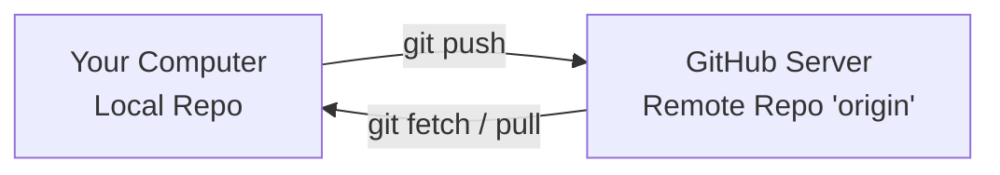

# ☁️ Remote Repositories

Up until now, you have been working completely locally on your own computer's
hard drive. To collaborate with other developers, share your code, or deploy
your applications to production, you need to use a **Remote Repository**. 🌐

---

## 🏗️ What is a Remote Repository?

A remote repository is a copy of your project that lives on an
internet-connected server rather than your local machine. Platforms like
**GitHub**, **GitLab**, or **Bitbucket** act as cloud hosts for these
repositories.

Your local repository links to these cloud hosts using a named connection URL.
By default, Git names your primary remote connection **`origin`**.



---

## 🛠️ Managing Remotes in Action

Managing your cloud connections requires a handful of specific commands to link,
verify, and modify remote URLs:

```bash
// List all remote connections linked to your project (shows names and URLs)
git remote -v

```

```bash
// Link a fresh local repository to a brand new repository on GitHub
git remote add origin https://github.com/your-username/my-cool-app.git

```

```bash
// Change an existing remote URL (useful if you rename a repository)
git remote set-url origin https://github.com/your-username/new-repo-name.git

```

---

## 🏎️ Getting an Existing Remote Project (`git clone`)

If an application already exists on GitHub and you want to work on it locally,
you don't use `git init`. Instead, you download the entire project history down
to your machine using the `clone` command.

```bash
// Download a remote repository and its full history into a new folder
git clone https://github.com/example/open-source-project.git

```

> 💡 **What Clone Actually Does:** When you run a clone, Git automatically
> performs three actions behind the scenes: it creates a new project folder,
> runs a local `git init`, downloads the full commit history, and automatically
> maps your remote link back to that original URL as **`origin`**.

---
