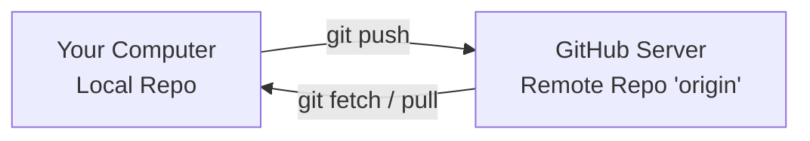

# ☁ Remote Repositories

Up until now, you have been working completely locally on your own computer's
hard drive. To collaborate with other developers, share your code, or deploy
your applications to production, you need to use a **Remote Repository**. 🌐

---

## What is a Remote Repository?

A remote repository is a copy of your project that lives on an
internet-connected server rather than your local machine. Platforms like
**GitHub**, **GitLab**, or **Bitbucket** act as cloud hosts for these
repositories.

Your local repository links to these cloud hosts using a named connection URL.
By default, Git names your primary remote connection **`origin`**.

<!-- Visual flow for ☁ Remote Repositories. -->


## 🛠 Managing Remotes in Action

Managing your cloud connections requires a handful of specific commands to link,
verify, and modify remote URLs:

```bash
// List all remote connections linked to your project (shows names and URLs)
git remote -v

```bash
// Link a fresh local repository to a brand new repository on GitHub
git remote add origin https://github.com/your-username/my-cool-app.git

```bash
// Change an existing remote URL (useful if you rename a repository)
git remote set-url origin https://github.com/your-username/new-repo-name.git

```
## 🏎 Getting an Existing Remote Project (`git clone`)

If an application already exists on GitHub and you want to work on it locally,
you don't use `git init`. Instead, you download the entire project history down
to your machine using the `clone` command.

```bash
// Download a remote repository and its full history into a new folder
git clone https://github.com/example/open-source-project.git

> 💡 **What Clone Actually Does:** When you run a clone, Git automatically
> performs three actions behind the scenes: it creates a new project folder,
> runs a local `git init`, downloads the full commit history, and automatically
> maps your remote link back to that original URL as **`origin`**.

```
## Quick Reference

| Area | Revision point |
|---|---|
| Definition | State exactly what the topic means. |
| Mechanism | Explain the steps that produce the result. |
| Example | Use a small realistic case. |
| Pitfalls | Know common mistakes and boundary cases. |

## Decision Guide

Connect the definition to a practical decision: what problem does the concept solve, what assumptions does it make, and what evidence tells you it is working? This turns a memorised sentence into a usable mental model.

## Compare Related Ideas

When two concepts look similar, compare their purpose, inputs, guarantees, lifecycle, and trade-offs. A short comparison is often more useful for revision than another paragraph repeating the same definition.

## Self-Check

After reading an example, change one input and predict the result before running it. Then explain what changed and why. This exposes gaps in understanding and gives you a quick test without needing a separate exercise set.

## Practical Decision

A concept becomes easier to revise when it is tied to a decision you may actually make. Identify the problem, the available choices, and the condition that makes one choice appropriate. Then state one case where the concept should not be used. That negative example is useful because it marks the boundary of the idea and reduces confusion with related concepts.

## Final Understanding Check

Before considering **☁ Remote Repositories** revised, make sure you can state the definition without relying on the example, explain the mechanism in the correct order, and predict what happens when one important input or assumption changes. Then check one boundary case and one practical use case. The example should support the explanation rather than replace it. When a result is surprising, inspect the rule that produced it and verify the relevant precondition. This approach is more reliable than memorising a code snippet, formula, command, or interview answer because the same reasoning can be applied to a new problem. For technical topics, also distinguish what is guaranteed by the language, library, protocol, or mathematical rule from what is merely a common convention. That distinction helps you choose the correct solution when the context changes.
