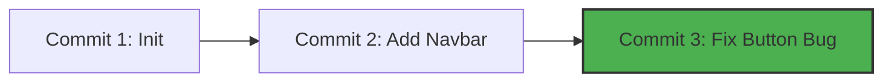

# 📦 Repository & Commits

This is where your code transitions from local changes on your hard drive to
permanent entries in your project history. Let's look at how to create a
repository and save your first formal code snapshots. 💾

---

## 🏗️ Starting a Repository (`git init`)

To give Git control over a folder, you must initialize it. This creates a hidden
folder named `.git` inside your project directory. This hidden folder is your
**Repository**—the database where Git tracks every change.

```bash
// Turn your current directory into a Git repository
git init

```

Once you run this, Git immediately starts watching your folder, waiting for you
to stage and save files.

---

## 📸 What is a Commit?

A **commit** is a permanent snapshot of your project at a specific moment in
time.

Every commit acts like a milestone on a timeline. If you mess up your code
tomorrow, you can roll back your entire codebase to this exact commit. Every
commit contains:

- The exact **snapshot** of your files.
- The **author's name and email**.
- A **timestamp** showing exactly when it was saved.
- A unique 40-character identifier called a **SHA-1 Hash** (e.g., `8f3a9b2...`).
- A **commit message** explaining what changed.



---

## 💾 Saving Your First Commit (`git commit`)

Once you have added files to your staging area, you use the `git commit` command
to save them permanently.

Always append the `-m` flag to write your commit message directly in the
terminal. Keep your messages short, clear, and descriptive! ✍️

```bash
// Commit your staged changes with a descriptive message
git commit -m "feat: add user login form component"

```

If you ever want to check your history of saved commits later, you can view the
chronological timeline by running:

```bash
// View your repository's commit history
git log

```

---
