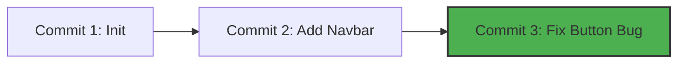

# Repository & Commits

This is where your code transitions from local changes on your hard drive to
permanent entries in your project history. Let's look at how to create a
repository and save your first formal code snapshots. 💾

---

## Starting a Repository (`git init`)

To give Git control over a folder, you must initialize it. This creates a hidden
folder named `.git` inside your project directory. This hidden folder is your
**Repository**—the database where Git tracks every change.

```bash
// Turn your current directory into a Git repository
git init

```

Once you run this, Git immediately starts watching your folder, waiting for you
to stage and save files.

## 📸 What is a Commit?

A **commit** is a permanent snapshot of your project at a specific moment in
time.

Every commit acts like a milestone on a timeline. If you mess up your code
tomorrow, you can roll back your entire codebase to this exact commit. Every
commit contains:

- The exact **snapshot** of your files.
- The **author's name and email**.
- A **timestamp** showing exactly when it was saved.
- A unique 40-character identifier called a **SHA-1 Hash** (e.g., `8f3a9b2...`).
- A **commit message** explaining what changed.

<!-- Visual flow for Repository & Commits. -->

## 💾 Saving Your First Commit (`git commit`)

Once you have added files to your staging area, you use the `git commit` command
to save them permanently.

Always append the `-m` flag to write your commit message directly in the
terminal. Keep your messages short, clear, and descriptive! ✍️

```bash
// Commit your staged changes with a descriptive message
git commit -m "feat: add user login form component"

If you ever want to check your history of saved commits later, you can view the
chronological timeline by running:

```
```bash
// View your repository's commit history
git log

```
## Quick Reference

| Area | Revision point |
|---|---|
| Definition | State exactly what the topic means. |
| Mechanism | Explain the steps that produce the result. |
| Example | Use a small realistic case. |
| Pitfalls | Know common mistakes and boundary cases. |

## Decision Guide

Connect the definition to a practical decision: what problem does the concept solve, what assumptions does it make, and what evidence tells you it is working? This turns a memorised sentence into a usable mental model.

## Compare Related Ideas

When two concepts look similar, compare their purpose, inputs, guarantees, lifecycle, and trade-offs. A short comparison is often more useful for revision than another paragraph repeating the same definition.

## Self-Check

After reading an example, change one input and predict the result before running it. Then explain what changed and why. This exposes gaps in understanding and gives you a quick test without needing a separate exercise set.

## Practical Decision

A concept becomes easier to revise when it is tied to a decision you may actually make. Identify the problem, the available choices, and the condition that makes one choice appropriate. Then state one case where the concept should not be used. That negative example is useful because it marks the boundary of the idea and reduces confusion with related concepts.

## Final Understanding Check

Before considering **Repository & Commits** revised, make sure you can state the definition without relying on the example, explain the mechanism in the correct order, and predict what happens when one important input or assumption changes. Then check one boundary case and one practical use case. The example should support the explanation rather than replace it. When a result is surprising, inspect the rule that produced it and verify the relevant precondition. This approach is more reliable than memorising a code snippet, formula, command, or interview answer because the same reasoning can be applied to a new problem. For technical topics, also distinguish what is guaranteed by the language, library, protocol, or mathematical rule from what is merely a common convention. That distinction helps you choose the correct solution when the context changes.
