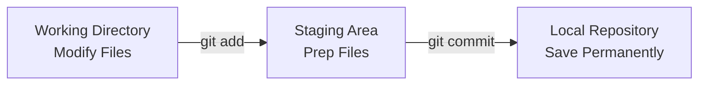

# 📥 Staging Area & Workflow

The **Staging Area** is Git’s unique superpower. While other version control
systems force you to save every single change at once, Git gives you a middle
ground to organize your work before saving it permanently. 🗂️

---

## 🏗️ What is the Staging Area?

Think of the staging area as a packing box before a big move. You don't throw
everything from your house into a single box all at once. Instead, you carefully
pick related items, pack them neatly, seal the box with a label, and ship it
out.

In Git:

- Your **Working Directory** is your messy room.
- The **Staging Area** is the open packing box.
- The **Commit** is the sealed box safely loaded onto the moving truck.

This allows you to separate unrelated changes. If you fix a typo in your header
and add a massive new database feature at the same time, you can stage and
commit them as two separate, clean milestones.



---

## 🛠️ Staging Files in Action

To move files from your working directory into the staging area, you use the
`git add` command.

```bash
// Stage a specific file
git add index.html

```

```bash
// Stage multiple specific files at once
git add styles.css auth.js

```

```bash
// Stage ALL modified and untracked files in the current folder
git add .

```

---

## 🔄 A Real-World Workflow Scenario

Let's look at how a clean, professional staging workflow operates during a
typical coding session:

```bash
// 1. You edit index.html and create a new file called utility.js
// 2. See what Git notices
git status

// 3. Stage only index.html for your first commit
git add index.html

// 4. Commit index.html with a precise message
git commit -m "docs: update homepage meta description"

// 5. Now stage the remaining utility file
git add utility.js

// 6. Commit the utility file separately
git commit -m "feat: add helper function for date formatting"

```

By taking control of your staging area, you keep your project timeline
incredibly neat and easy for your team to read! 📝

---
