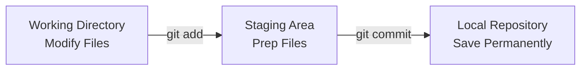

# 📥 Staging Area & Workflow

The **Staging Area** is Git’s unique superpower. While other version control
systems force you to save every single change at once, Git gives you a middle
ground to organize your work before saving it permanently. 🗂️

---

## What is the Staging Area?

Think of the staging area as a packing box before a big move. You don't throw
everything from your house into a single box all at once. Instead, you carefully
pick related items, pack them neatly, seal the box with a label, and ship it
out.

In Git:

- Your **Working Directory** is your messy room.
- The **Staging Area** is the open packing box.
- The **Commit** is the sealed box safely loaded onto the moving truck.

This allows you to separate unrelated changes. If you fix a typo in your header
and add a massive new database feature at the same time, you can stage and
commit them as two separate, clean milestones.

<!-- Visual flow for 📥 Staging Area & Workflow. -->


## 🛠 Staging Files in Action

To move files from your working directory into the staging area, you use the
`git add` command.

# Basic example showing the core idea.
```bash
// Stage a specific file
git add index.html

```bash
// Stage multiple specific files at once
git add styles.css auth.js

# Basic example showing the core idea.
```bash
// Stage ALL modified and untracked files in the current folder
git add .

## A Real-World Workflow Scenario

Let's look at how a clean, professional staging workflow operates during a
typical coding session:

```bash
// 1. You edit index.html and create a new file called utility.js
// 2. See what Git notices
git status

// 3. Stage only index.html for your first commit
git add index.html

// 4. Commit index.html with a precise message
git commit -m "docs: update homepage meta description"

// 5. Now stage the remaining utility file
git add utility.js

// 6. Commit the utility file separately
git commit -m "feat: add helper function for date formatting"

By taking control of your staging area, you keep your project timeline
incredibly neat and easy for your team to read! 📝

## Quick Reference

| Area | Revision point |
|---|---|
| Definition | State exactly what the topic means. |
| Mechanism | Explain the steps that produce the result. |
| Example | Use a small realistic case. |
| Pitfalls | Know common mistakes and boundary cases. |

## Decision Guide

Connect the definition to a practical decision: what problem does the concept solve, what assumptions does it make, and what evidence tells you it is working? This turns a memorised sentence into a usable mental model.

## Compare Related Ideas

When two concepts look similar, compare their purpose, inputs, guarantees, lifecycle, and trade-offs. A short comparison is often more useful for revision than another paragraph repeating the same definition.

## Self-Check

After reading an example, change one input and predict the result before running it. Then explain what changed and why. This exposes gaps in understanding and gives you a quick test without needing a separate exercise set.

## Practical Decision

A concept becomes easier to revise when it is tied to a decision you may actually make. Identify the problem, the available choices, and the condition that makes one choice appropriate. Then state one case where the concept should not be used. That negative example is useful because it marks the boundary of the idea and reduces confusion with related concepts.

## Final Understanding Check

Before considering **📥 Staging Area & Workflow** revised, make sure you can state the definition without relying on the example, explain the mechanism in the correct order, and predict what happens when one important input or assumption changes. Then check one boundary case and one practical use case. The example should support the explanation rather than replace it. When a result is surprising, inspect the rule that produced it and verify the relevant precondition. This approach is more reliable than memorising a code snippet, formula, command, or interview answer because the same reasoning can be applied to a new problem. For technical topics, also distinguish what is guaranteed by the language, library, protocol, or mathematical rule from what is merely a common convention. That distinction helps you choose the correct solution when the context changes.
