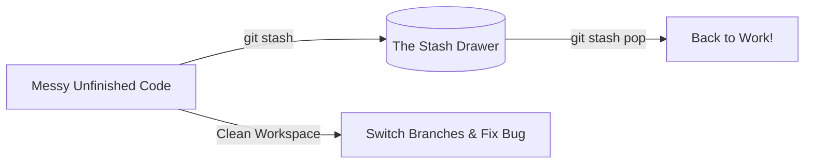

# Stash

Picture this: You are in the middle of writing a complex new feature, and your
code is half-broken. Suddenly, an urgent bug hits production, and you need to
switch branches immediately to fix it.

Git will not let you change branches because your current changes would be
overwritten. You don’t want to make a messy, unfinished commit just to save your
place. This is exactly why **Git Stash** exists.

### What is Git Stash?

Think of Git Stash as a **temporary desk drawer**. When you need to clear your
workspace instantly, you grab all your messy, unfinished papers, shove them into
the drawer, and lock it. Your desk is now perfectly clean so you can work on the
urgent task. When you are done, you open the drawer and pull your messy work
right back out.

<!-- Visual flow for Stash. -->


---

### Essential Stash Commands

Here is how to manage your temporary storage room like a pro.

#### 1. Save Your Work

To quickly hide your modified, tracked files, run the basic stash command.
Adding a message makes it much easier to identify later.

# Basic example showing the core idea.
```bash
// Save your current uncommitted changes with a helpful label
git stash save "Working on login layout"

#### 2. Include New Files

By default, Git Stash ignores brand-new files that you haven't tracked yet. To
safely tuck away everything, use the `--include-untracked` flag.

```bash
// Stash tracked changes AND brand new untracked files
git stash -u

#### 3. Peek Inside Your Drawer

If you have stashed multiple things over time, you can view your entire list of
saved states.

# Basic example showing the core idea.
```bash
// List all of your stashed workspaces
git stash list

_Output looks like this:_

> `stash@{0}: On main: Working on login layout` >
> `stash@{1}: On feature-ui: Experimental button styles`

#### 4. Bring Your Changes Back

Once your urgent hotfix is done, switch back to your feature branch and restore
your work. Using `pop` restores the changes and deletes them from the stash
drawer.

```bash
// Apply the latest stashed changes and remove them from the stash list
git stash pop

If you want to apply the changes but keep a backup copy in the stash list just
in case, use `apply` instead:

# Basic example showing the core idea.
```bash
// Reapply stashed changes but keep them saved in the stash history
git stash apply stash@{0}

#### 5. Clean Out the Drawer

If you decide you no longer need your stashed changes, you can delete a single
item or wipe the entire drawer clean.

```bash
// Discard a specific stash item safely
git stash drop stash@{0}

// Delete every single item in your stash history
git stash clear

### A Friendly Warning

Stashed changes are saved locally on your machine. They are **not** pushed to
GitHub when you run `git push`. If your computer breaks before you run
`git stash pop`, those uncommitted changes are gone forever!

## Quick Reference

| Area | Revision point |
|---|---|
| Definition | State exactly what the topic means. |
| Mechanism | Explain the steps that produce the result. |
| Example | Use a small realistic case. |
| Pitfalls | Know common mistakes and boundary cases. |

## Decision Guide

Connect the definition to a practical decision: what problem does the concept solve, what assumptions does it make, and what evidence tells you it is working? This turns a memorised sentence into a usable mental model.

## Compare Related Ideas

When two concepts look similar, compare their purpose, inputs, guarantees, lifecycle, and trade-offs. A short comparison is often more useful for revision than another paragraph repeating the same definition.

## Self-Check

After reading an example, change one input and predict the result before running it. Then explain what changed and why. This exposes gaps in understanding and gives you a quick test without needing a separate exercise set.

## Practical Decision

A concept becomes easier to revise when it is tied to a decision you may actually make. Identify the problem, the available choices, and the condition that makes one choice appropriate. Then state one case where the concept should not be used. That negative example is useful because it marks the boundary of the idea and reduces confusion with related concepts.
