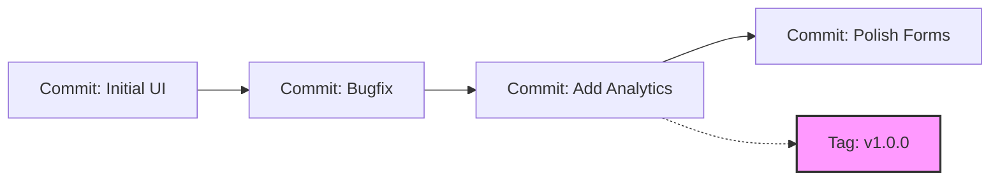

# 🏷️ Tags & Releases

As your project grows, your commit history will quickly accumulate hundreds of
log entries. Amidst all those daily commits, it becomes difficult to point to a
specific moment and say, _"This exact code is version 1.0.0."_

**Git Tags** act as permanent markers that point to a single, specific moment in
your repository's timeline, typically used to track software versions.

### What is a Git Tag?

Think of your Git commit history as a long, continuous **movie reel**. Commits
are individual frames passing by every second. A **tag** is like sticking a
bright physical post-it note directly onto a single frame of that reel. No
matter how much more film you add to the reel later, you can instantly rewind
straight back to that exact post-it note.



---

### Lightweight vs. Annotated Tags

Git supports two different types of tags depending on how much metadata you need
to store:

- **Lightweight Tags:** A bare-minimum pointer to a commit. It is literally just
  a name attached to a commit ID.
- **Annotated Tags:** A full object stored in the Git database. It includes the
  tagger’s name, email, date, and a descriptive message. **This is the
  recommended approach for public releases.**

---

### Working with Tags

Here are the essential commands for creating, viewing, and sharing tags.

#### 1. Create a Tag

To mark your current position with an annotated tag, use the `-a` flag along
with a message descriptive flag `-m`.

```bash
// Create an annotated tag for version 1.0.0
git tag -a v1.0.0 -m "First stable production release"

```

#### 2. View Existing Tags

You can list all tags currently available in your local repository to verify
your version history.

```bash
// List all tags in alphabetical order
git tag

```

To see the specific details and metadata of an annotated tag, use the `show`
command:

```bash
// View the author details, date, and commit connected to a tag
git show v1.0.0

```

#### 3. Share Your Tags

By default, running `git push` does **not** send tags to remote servers like
GitHub. You have to explicitly tell Git to push them up.

```bash
// Push a single specific tag up to GitHub
git push origin v1.0.0

// Push every single local tag up to GitHub at once
git push origin --tags

```

---

### What is a GitHub Release?

While Git handles the underlying tags, platforms like GitHub introduce a wrapper
concept called **Releases**.

A GitHub Release is a user-friendly download page built directly on top of your
Git tag. It lets you bundle release notes, changelogs, and production-ready
compiled binaries (like an `.apk`, `.exe`, or `.zip` file) so non-technical
users can download your software without interacting with a terminal.

---

### 💡 Quick Best Practice: Semantic Versioning

When naming your tags, stick to **Semantic Versioning (SemVer)** patterns like
`vMAJOR.MINOR.PATCH` (e.g., `v2.1.4`):

- **MAJOR:** Breaking changes that aren't backwards compatible.
- **MINOR:** New features added that don't break existing setups.
- **PATCH:** Small bug fixes and optimizations.

---
