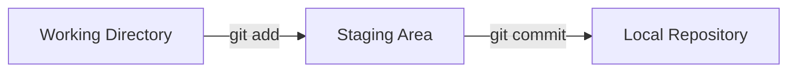
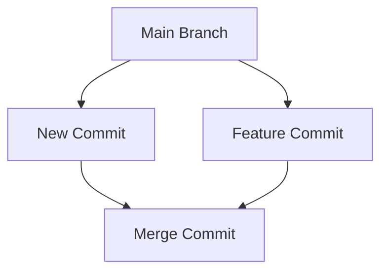
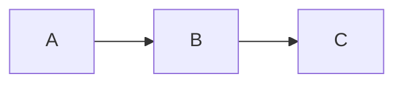
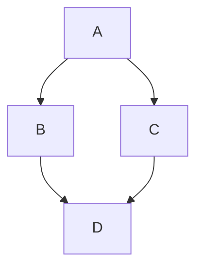
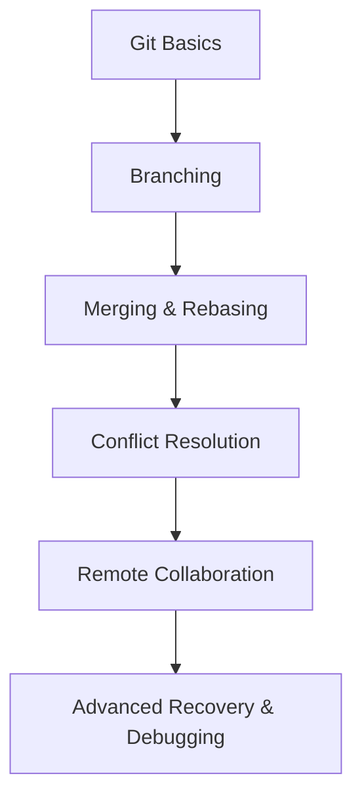

# 📌 Top 25 Interview Questions

---

# 1. Core Git Fundamentals

## Q1. What is the difference between Git and GitHub?

| Git                                      | GitHub                                                              |
| ---------------------------------------- | ------------------------------------------------------------------- |
| Distributed Version Control System (VCS) | Cloud platform for hosting Git repositories                         |
| Works locally on your machine            | Works online for collaboration                                      |
| Tracks file changes and commit history   | Adds pull requests, issues, CI/CD, reviews, and collaboration tools |
| Command-line based by default            | Web-based interface with Git integration                            |

### Short Answer

Git is a version control tool used to track source code changes locally. GitHub
is a hosting platform that stores Git repositories online and enables team
collaboration.

---

## Q2. What is the difference between `git clone` and `git fork`?

| `git clone`                          | `git fork`                                                   |
| ------------------------------------ | ------------------------------------------------------------ |
| Git command                          | GitHub/GitLab platform feature                               |
| Creates a local copy                 | Creates a personal remote copy                               |
| Used to work on repositories locally | Commonly used to contribute to external/open-source projects |
| No ownership change                  | Fork belongs to your account                                 |

### Example Workflow

```bash
# Clone repository locally
git clone https://github.com/user/project.git
```

---

## Q3. What does `git init` do internally?

When you run:

```bash
git init
```

Git creates a hidden `.git` directory containing:

- Commit history
- Object database
- Branch references
- Configuration files
- Hooks
- Staging/index information

### Important Internal Folders

| Folder/File    | Purpose                          |
| -------------- | -------------------------------- |
| `.git/objects` | Stores Git objects               |
| `.git/refs`    | Stores branch and tag references |
| `.git/config`  | Repository configuration         |
| `.git/index`   | Staging area data                |
| `.git/HEAD`    | Points to current branch         |

---

## Q4. Explain the three core Git stages.

Git mainly works with three stages:

| Stage                | Purpose                      |
| -------------------- | ---------------------------- |
| Working Directory    | Files you edit locally       |
| Staging Area (Index) | Temporary area before commit |
| Local Repository     | Permanent commit history     |

### Workflow Diagram



### Common Commands

```bash
# Add changes to staging
git add .

# Commit staged changes
git commit -m "feat: add authentication"
```

---

## Q5. What is the purpose of `.gitignore`?

`.gitignore` prevents unnecessary or sensitive files from being tracked.

### Commonly Ignored Files

```gitignore
node_modules/
.env
dist/
coverage/
*.log
```

### Why It Matters

- Reduces repository size
- Prevents secret leaks
- Avoids committing generated files
- Keeps commits clean

---

## Q6. What is the default branch name in Git?

Modern repositories generally use `main` as the default branch instead of
`master`.

### Rename Current Branch

```bash
git branch -M main
```

### Rename Existing Branch

```bash
git branch -m old-name new-name
```

---

## Q7. What is a detached HEAD state?

A detached HEAD happens when `HEAD` points directly to a commit instead of a
branch.

### Example

```bash
git checkout a1b2c3d
```

You are now viewing an older commit directly.

### Why It Can Be Risky

New commits created here can become unreachable later.

### Fix

```bash
git checkout -b rescue-branch
```

---

# 2. Daily Git Workflows

## Q8. What is the difference between `git pull` and `git fetch`?

| `git fetch`                   | `git pull`                         |
| ----------------------------- | ---------------------------------- |
| Downloads remote changes only | Downloads and merges changes       |
| Does not modify working files | Updates current branch immediately |
| Safer for review workflows    | Faster for quick syncing           |

### Internal Behavior

```bash
git pull
```

is equivalent to:

```bash
git fetch
git merge
```

---

## Q9. What is the difference between `git merge` and `git rebase`?

| Merge                     | Rebase                             |
| ------------------------- | ---------------------------------- |
| Preserves commit history  | Rewrites commit history            |
| Creates merge commit      | Produces linear history            |
| Safer for shared branches | Cleaner for local feature branches |

### Merge Example

```bash
git merge feature-branch
```

### Rebase Example

```bash
git rebase main
```

### Visualization



---

## Q10. How do you fix the latest commit message?

```bash
git commit --amend -m "feat: correct auth validation"
```

### Important Note

Avoid amending commits that were already pushed to shared branches unless your
team allows force pushes.

---

## Q11. What is the difference between `git reset` and `git revert`?

| `git reset`                  | `git revert`                             |
| ---------------------------- | ---------------------------------------- |
| Removes commits from history | Creates new commit that reverses changes |
| Rewrites history             | Preserves history                        |
| Best for local work          | Best for shared/public branches          |

### Example

```bash
# Remove latest commit locally
git reset --hard HEAD~1
```

```bash
# Safely reverse commit
git revert a1b2c3d
```

---

## Q12. What is a merge conflict?

A merge conflict happens when Git cannot automatically combine changes.

### Common Causes

- Same line edited in multiple branches
- File deleted in one branch but modified in another
- Simultaneous configuration changes

### Conflict Markers Example

```txt
<<<<<<< HEAD
Current branch code
=======
Incoming branch code
>>>>>>> feature-branch
```

### Resolution Process

1. Open conflicted file
2. Choose correct code
3. Remove conflict markers
4. Stage resolved file
5. Complete merge/rebase

---

## Q13. How do you temporarily save uncommitted work?

```bash
git stash
```

### Useful Commands

```bash
# View stashes
git stash list

# Restore latest stash
git stash pop
```

### Use Cases

- Switching branches quickly
- Pulling urgent hotfixes
- Testing another feature temporarily

---

## Q14. How do you view history for a specific file?

```bash
git log --oneline src/components/Button.jsx
```

### Additional Useful Flags

```bash
# Show line-level modifications
git log -p src/components/Button.jsx
```

```bash
# Show author information
git blame src/components/Button.jsx
```

---

## Q15. Fast-forward merge vs three-way merge

| Fast-Forward Merge           | Three-Way Merge                     |
| ---------------------------- | ----------------------------------- |
| No divergent commits         | Both branches changed independently |
| Moves branch pointer forward | Creates merge commit                |
| Cleaner history              | Preserves branch structure          |

### Fast-Forward Example



### Three-Way Merge Example



---

# 3. Advanced Git Concepts

## Q16. What is `git reflog`?

`git reflog` tracks every movement of `HEAD` locally.

### Difference from `git log`

| `git log`             | `git reflog`                               |
| --------------------- | ------------------------------------------ |
| Shows commit history  | Shows HEAD movement history                |
| Shared branch history | Local-only recovery history                |
| Visible commits only  | Includes resets, rebases, deleted branches |

### Example

```bash
git reflog
```

### Common Recovery Use Case

Recover accidentally deleted commits.

---

## Q17. How does `git bisect` help find bugs?

`git bisect` uses binary search to identify the commit that introduced a bug.

### Workflow

```bash
git bisect start
git bisect bad
git bisect good a1b2c3d
```

Git automatically jumps through commits until the problematic commit is found.

### Why It Is Powerful

Instead of checking 100 commits manually, binary search drastically reduces
checks.

---

## Q18. What is a dangling commit?

A dangling commit is a commit not referenced by:

- Branches
- Tags
- HEAD
- Other references

### Common Causes

- Deleted branches
- Hard resets
- Amended commits

### Cleanup

Git eventually removes them using garbage collection:

```bash
git gc
```

---

## Q19. What is `git cherry-pick` used for?

`git cherry-pick` copies a specific commit into another branch.

### Example

```bash
git cherry-pick a1b2c3d
```

### Common Use Cases

- Moving hotfixes between branches
- Copying isolated features
- Avoiding full merges

---

## Q20. How do you delete branches locally and remotely?

### Delete Local Branch

```bash
git branch -d feature-login
```

### Force Delete Local Branch

```bash
git branch -D feature-login
```

### Delete Remote Branch

```bash
git push origin --delete feature-login
```

---

## Q21. What are Git Hooks?

Git Hooks are scripts that run automatically during Git events.

### Common Hooks

| Hook         | Trigger                      |
| ------------ | ---------------------------- |
| `pre-commit` | Before commit                |
| `commit-msg` | Before saving commit message |
| `pre-push`   | Before push                  |
| `post-merge` | After merge                  |

### Common Use Cases

- Running ESLint
- Running tests
- Enforcing commit conventions
- Preventing broken code pushes

---

## Q22. What is Git squashing?

Squashing combines multiple commits into one.

### Example

Before squashing:

```txt
fix typo
fix typo again
update styles
final fix
```

After squashing:

```txt
feat: complete navbar implementation
```

### Benefits

- Cleaner history
- Easier code reviews
- Better release tracking

### Common Command

```bash
git rebase -i HEAD~4
```

---

## Q23. How do you recover a deleted file?

```bash
git checkout HEAD -- src/config/app.json
```

### Modern Alternative

```bash
git restore src/config/app.json
```

---

## Q24. What is `.gitmodules`?

`.gitmodules` stores configuration for Git submodules.

### Example

```ini
[submodule "ui-library"]
    path = libs/ui-library
    url = https://github.com/company/ui-library.git
```

### Purpose

Allows one Git repository to include another repository as a dependency.

---

## Q25. How do you force local branch to match remote exactly?

### Warning

This removes all local uncommitted and divergent commits.

### Commands

```bash
git fetch origin
git reset --hard origin/main
```

### Typical Use Cases

- Reset broken local branches
- Discard experimental work
- Match CI/CD deployment state

---

# Common Git Commands Cheat Sheet

| Command               | Purpose                         |
| --------------------- | ------------------------------- |
| `git init`            | Initialize repository           |
| `git clone`           | Clone remote repository         |
| `git status`          | View repository state           |
| `git add .`           | Stage changes                   |
| `git commit -m "msg"` | Create commit                   |
| `git push`            | Upload commits                  |
| `git pull`            | Download and merge updates      |
| `git fetch`           | Download updates only           |
| `git branch`          | Manage branches                 |
| `git checkout`        | Switch branches/commits         |
| `git merge`           | Merge branches                  |
| `git rebase`          | Reapply commits on another base |
| `git stash`           | Temporarily save work           |
| `git log`             | View commit history             |
| `git reflog`          | View HEAD history               |
| `git revert`          | Reverse commit safely           |
| `git reset`           | Move branch pointer             |

---

# Interview Tips

## What Interviewers Usually Expect

Interviewers generally care more about:

- Understanding workflows
- Collaboration safety
- Conflict handling
- Clean commit history
- Real-world debugging skills

than memorizing obscure Git flags.

## Good Practices to Mention

- Use feature branches
- Write meaningful commit messages
- Avoid force-pushing shared branches
- Rebase local branches before PRs
- Squash unnecessary commits
- Pull frequently to avoid large conflicts
- Use hooks for linting/testing automation

---

# Recommended Learning Path



---

# Summary

Git is more than just a tool for saving code. It is a collaboration system that
enables:

- Safe teamwork
- Reliable version tracking
- Controlled deployments
- Easier debugging
- Structured development workflows

Strong Git knowledge is one of the most important practical skills for modern
software developers.
