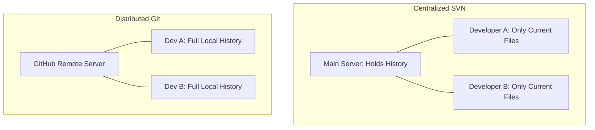

# 📚 Version Control Concepts

To truly understand Git, we need to look under the hood at how it thinks. Git is
a **Distributed Version Control System (DVCS)**, which fundamentally changes how
developers share and track code compared to older systems. 🧠

---

## 🌎 Centralized vs. Distributed

Older version control systems like SVN use a **Centralized** model. There is
only one main server holding the project history. If you lose internet access or
the server crashes, nobody can commit code or view history.

Git uses a **Distributed** model. When you copy a project, you do not just get
the latest files—you download the **entire history** of the project onto your
local machine.

### Why Distributed is Better:

- **Speed:** Almost every Git operation is instant because it happens directly
  on your hard drive, not over the internet.
- **Offline Work:** You can commit code, create branches, and view past history
  while completely offline.
- **Safety:** Every single developer's machine acts as a full backup. If the
  main server fries itself, any developer can restore it instantly.

---

## 🕒 The Three States of Git

Git manages your files across three distinct virtual zones. Understanding these
zones is the secret to mastering the Git workflow. 🧱

| Zone                           | What it represents                                                                |
| ------------------------------ | --------------------------------------------------------------------------------- |
| **Working Directory**          | The actual files you are currently editing on your computer.                      |
| **Staging Area**               | A prep zone. You pick which modified files you want to include in your next save. |
| **Git Directory (Repository)** | The official database where Git permanently stores your project snapshots.        |

---

## 📸 Snapshots, Not Differences

Older systems track history by storing a base file and a list of continuous file
modifications (deltas).

Git does not think in deltas. Every time you save your work, Git takes a literal
picture (**snapshot**) of what all your files look like at that exact
millisecond. If a file has not changed, Git does not copy it again—it simply
links back to the previous version to save space. ⚡

---
